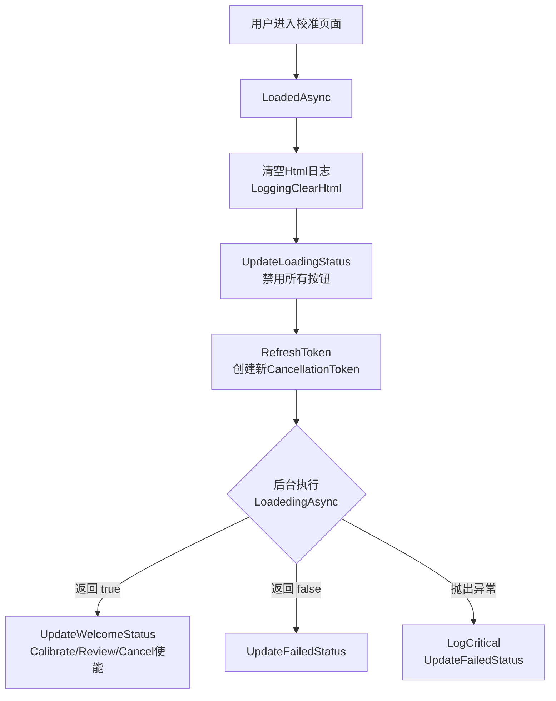
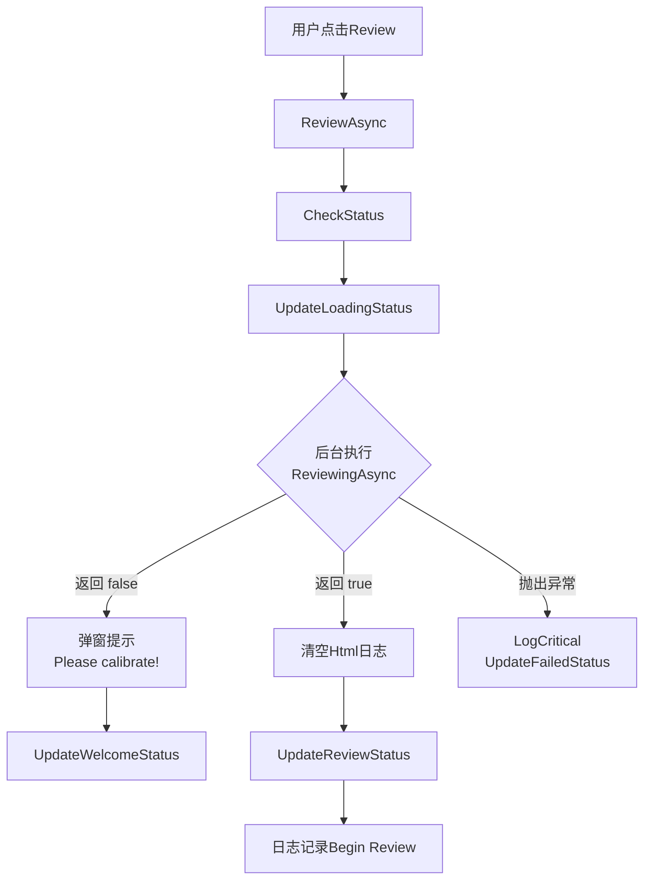
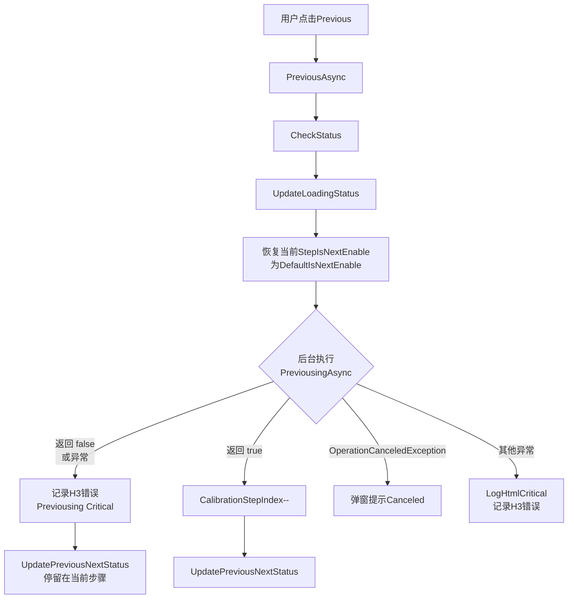
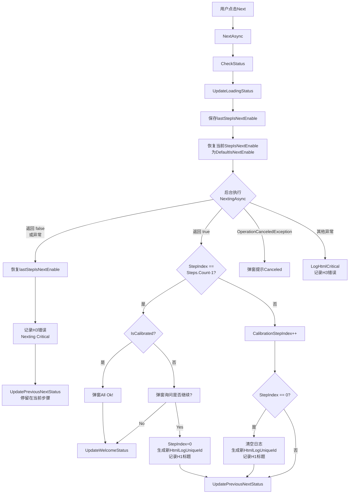
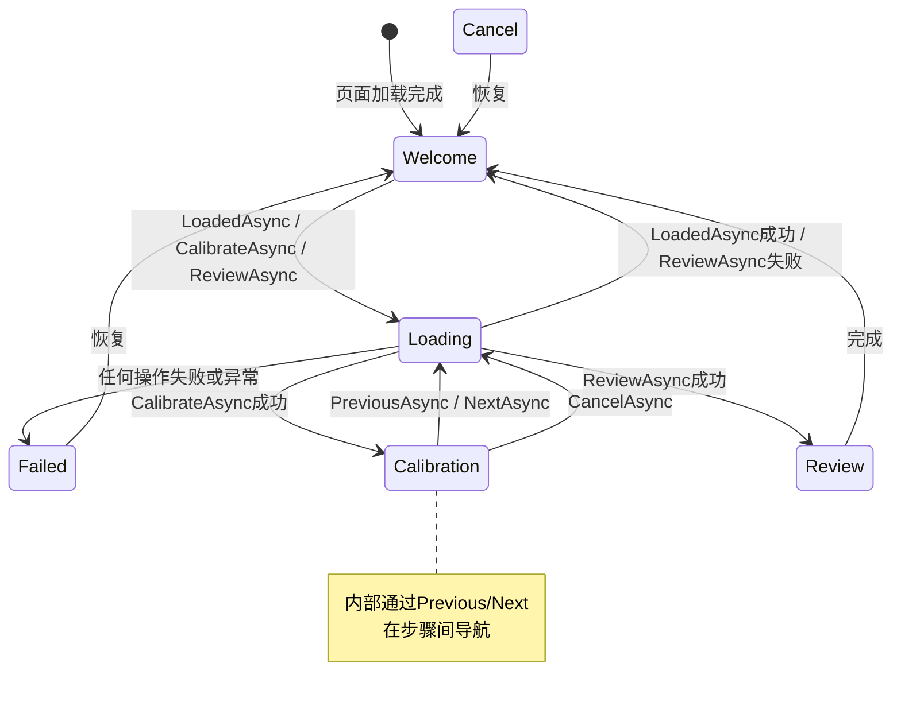
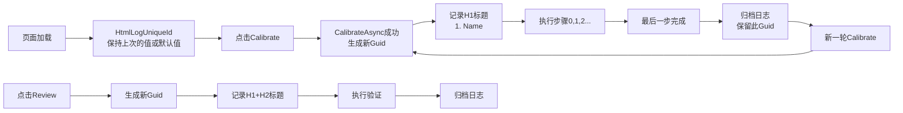
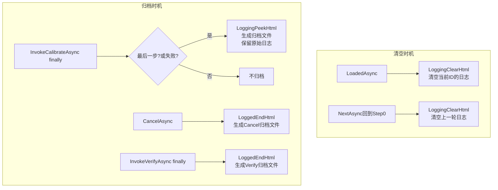

# CalibrationViewModelBase 使用说明

## 1. 概述

`CalibrationViewModelBase` 是 Cuga 校准系统中所有校准模块 ViewModel 的抽象基类，采用 **partial 分部类** 设计，分布在以下四个文件中：

| 文件 | 职责 |
|---|---|
| `CalibrationViewModelBase.cs` | 核心命令（加载、校准、复核、取消、上一步、下一步）与校准/验证执行框架 |
| `CalibrationViewModelBase.Status.cs` | 状态机管理、UI 事件广播（按钮使能、弹窗）、进度计算 |
| `CalibrationViewModelBase.Token.cs` | `CancellationTokenSource` 生命周期管理，支持取消长时间运行的校准任务 |
| `CalibrationViewModelBase.ReadOnly.cs` | IOC 依赖注入、配置属性（目录路径、文件名、设备 ViewModel 引用） |

该基类基于 **CommunityToolkit.Mvvm** 的 `ObservableProperty` 和 `RelayCommand`，并通过 **Messenger** 向主界面广播状态变更事件，驱动按钮使能与视图切换。

---

## 2. 核心命令与使用方式

基类公开了 6 个 `RelayCommand`，对应界面上的主要操作按钮。

---

### 2.1 LoadedAsync —— 初始化加载

```csharp
[RelayCommand]
public async Task LoadedAsync()
```

**调用时机**：校准页面加载时（通常绑定到 View 的 `Loaded` 事件）。

**执行流程**：
1. 清空当前 Html 日志。
2. 切换到 `Loading` 状态。
3. 在后台线程执行 `LoadedingAsync(cancellationToken)`。
4. 若成功 → 切换到 `Welcome` 状态；若失败 → 切换到 `Failed` 状态。

**流程图**：



**子类重写**：
```csharp
protected override async Task<bool> LoadedingAsync(CancellationToken cancellationToken)
{
    // 执行模块特定的初始化逻辑
    return true;
}
```

---

### 2.2 CalibrateAsync —— 开始校准

```csharp
[RelayCommand]
public async Task CalibrateAsync()
```

**调用时机**：用户点击"Calibrate"按钮。

**执行流程**：
1. 切换到 `Loading` 状态。
2. 在后台线程执行 `CalibratingAsync(cancellationToken)`。
3. 若成功 → 生成新的 `HtmlLogUniqueId`，切换到 `Calibration` 状态，并将 `CalibrationStepIndex` 置为 `0`。
4. 所有步骤的 `StepIsNextEnable` 恢复为默认值。

**流程图**：

```mermaid
flowchart TD
    A[用户点击Calibrate] --> B[CalibrateAsync]
    B --> C[CheckStatus<br/>确保Token有效]
    C --> D[UpdateLoadingStatus]
    D --> E{后台执行<br/>CalibratingAsync}
    E -->|返回 false| F[UpdateWelcomeStatus<br/>日志记录Failed]
    E -->|返回 true| G[生成新HtmlLogUniqueId<br/>Guid.NewGuid]
    G --> H[清空旧日志]
    H --> I[记录H1标题<br/>1. {Name}]
    I --> J[UpdateCalibrateStatus<br/>StepIndex=0<br/>所有StepIsNextEnable恢复默认]
    E -->|抛出异常| K[LogCritical<br/>UpdateFailedStatus]
```

**子类重写**：
```csharp
protected override async Task<bool> CalibratingAsync(CancellationToken cancellationToken)
{
    // 校准前的预处理（如移动Stage、设置硬件参数）
    return true;
}
```

---

### 2.3 ReviewAsync —— 复核验证

```csharp
[RelayCommand]
public async Task ReviewAsync()
```

**调用时机**：用户点击"Review"按钮。

**执行流程**：
1. 切换到 `Loading` 状态。
2. 在后台线程执行 `ReviewingAsync(cancellationToken)`。
3. 若成功 → 切换到 `Review` 状态，界面显示验证视图。
4. 若失败 → 弹窗提示 "Please calibrate!"，回到 `Welcome` 状态。

**流程图**：



---

### 2.4 CancelAsync —— 取消校准

```csharp
[RelayCommand]
public async Task CancelAsync()
```

**调用时机**：用户点击"Cancel"按钮。

**执行流程**：
1. 切换到 `Loading` 状态。
2. **取消当前 CancellationToken**（中断正在执行的步骤）。
3. 若已执行到某一步，生成中断状态的 Html 日志文件名（标记为 `Cancel`）。
4. 执行 `CancelingAsync()`，默认将 Stage 移回绝对原点 `Point.Origin`。
5. 切换到 `Cancel` 状态。

**流程图**：

```mermaid
flowchart TD
    A[用户点击Cancel] --> B[CancelAsync]
    B --> C[CheckStatus]
    C --> D[UpdateCancelLoadingStatus]
    D --> E[CancelToken<br/>取消并释放旧Token]
    E --> F{0 <= StepIndex<br/><= Steps.Count-1?}
    F -->|是| G[生成Cancel日志归档<br/>Step1-Step{N+1}_Cancel]
    F -->|否| H
    G --> H{后台执行<br/>CancelingAsync}
    H -->|默认行为| I[StageViewModel.SetBrightFieldAbsoluteStageXy<br/>移回原点Point.Origin]
    H -->|返回 false| J[UpdateFailedStatus<br/>日志记录Canceling Failed]
    H -->|返回 true| K[UpdateCancelStatus<br/>StepIndex=int.MinValue]
    H -->|抛出异常| L[LogCritical<br/>UpdateFailedStatus]
```

---

### 2.5 PreviousAsync —— 上一步

```csharp
[RelayCommand]
public async Task PreviousAsync()
```

**调用时机**：用户点击"Previous"按钮（仅在 `Calibration` 状态下使能）。

**执行流程**：
1. 恢复当前步骤的 `StepIsNextEnable` 为默认值。
2. 在后台线程执行 `PreviousingAsync(cancellationToken)`。
3. 若成功 → `CalibrationStepIndex--`。
4. 更新按钮状态（Previous/Next 使能）。

**流程图**：



---

### 2.6 NextAsync —— 下一步

```csharp
[RelayCommand]
public async Task NextAsync()
```

**调用时机**：用户点击"Next"按钮。

**执行流程**：
1. 保存当前步骤的 `StepIsNextEnable`，然后恢复为默认值。
2. 在后台线程执行 `NextingAsync(cancellationToken)`。
3. 若失败 → 恢复之前保存的 `StepIsNextEnable`，停留在当前步骤。
4. 若成功且当前是**最后一步**：
   - 如果 `IsCalibrated == true` → 弹窗 "Calibration All Ok!"，回到 `Welcome`。
   - 否则 → 弹窗询问是否继续校准：
     - **Yes** → `CalibrationStepIndex = 0`，从头开始，生成新 `HtmlLogUniqueId`。
     - **No** → 回到 `Welcome`。
5. 若成功且不是最后一步 → `CalibrationStepIndex++`。
6. 当回到第 0 步时，会生成新的 `HtmlLogUniqueId`，表示新一轮校准开始。

**流程图**：



---

## 3. 状态机

### 3.1 视图状态枚举

```csharp
public enum CalibrationItemViewEnum
{
    Welcome,      // 欢迎/待机界面
    Loading,      // 加载中（所有按钮禁用，显示loading）
    Calibration,  // 校准流程中（显示步骤导航）
    Review,       // 复核验证界面
    Failed,       // 失败界面
    Cancel        // 取消界面
}
```

### 3.2 状态流转图



### 3.3 各状态下按钮使能规则

基类通过 `Messenger.Send(ToggleCalibrateEventFactory...)` 向主界面广播按钮状态：

| 状态 | Calibrate | Review | Cancel | Previous | Next |
|---|---|---|---|---|---|
| Welcome | ✅ | ✅ | ✅ | ❌ | ❌ |
| Loading | ❌ | ❌ | ❌ | ❌ | ❌ |
| Calibration | ❌ | ❌ | ✅ | `index > 0` | `StepIsNextEnable` |
| Review | ❌ | ❌ | ✅ | ❌ | ❌ |
| Failed | ❌ | ❌ | ✅ | ❌ | ❌ |
| Cancel | ❌ | ❌ | ❌ | ❌ | ❌ |

---

## 4. 校准步骤的定义与导航

### 4.1 定义校准步骤

子类通过重写 `CalibrationSteps` 属性来定义步骤列表：

```csharp
public override IReadOnlyList<CalibrationItemStep> CalibrationSteps { get; } =
[
    new() { StepName = "Move to Center", DefaultIsNextEnable = false },
    new() { StepName = "Capture Image",  DefaultIsNextEnable = false },
    new() { StepName = "Calculate Params", DefaultIsNextEnable = false },
];
```

每个 `CalibrationItemStep` 包含：
- `StepName`：步骤名称（显示在界面上）。
- `DefaultIsNextEnable`：默认是否允许下一步。
- `StepIsNextEnable`：当前步骤是否通过（执行后由业务逻辑设置）。

### 4.2 进度计算

```csharp
public double CalibrationProgress => 
    CalibrationSteps[CalibrationStepIndex].StepIsNextEnable
        ? (CalibrationStepIndex + 1d) / CalibrationSteps.Count * 100d
        : (CalibrationStepIndex + 0d) / CalibrationSteps.Count * 100d;
```

- 当前步骤未通过 → 进度条显示 `(index / count) * 100%`
- 当前步骤已通过 → 进度条显示 `((index + 1) / count) * 100%`

---

## 5. 校准与验证的执行框架

### 5.1 InvokeCalibrateAsync —— 执行单个校准步骤

子类在 `NextingAsync` 中调用此方法执行实际的校准逻辑：

```csharp
protected async Task<bool> InvokeCalibrateAsync(Func<Task<bool>> func, string comment = "")
```

**内部流程图**：

```mermaid
flowchart TD
    A[InvokeCalibrateAsync<br/>传入func和comment] --> B[记录H2步骤日志<br/>StepIndex+1. StepName[comment]]
    B --> C[CheckStatus]
    C --> D[UpdateDisableAll<br/>禁用所有按钮]
    D --> E{后台执行 func}
    E -->|返回 true| F[StepIsNextEnable = true]
    E -->|返回 false| G[StepIsNextEnable = false]
    E -->|OperationCanceledException| H[弹窗Canceled<br/>记录H3 Warning]
    H --> I[StepIsNextEnable = false]
    E -->|其他异常| J[记录H3 Error<br/>Calibrate Critical]
    J --> K[StepIsNextEnable = false]
    F --> L[finally]
    G --> L
    I --> L
    K --> L
    L --> M[UpdatePreviousNextStatus]
    M --> N{最后一步? 或 result==false?}
    N -->|是| O[生成归档日志<br/>Calibrate_..._OK/Failed]
    N -->|否| P[返回result]
    O --> P
```

**自动处理的行为**：
1. 在 Html 日志中记录当前步骤名称（带可选注释）。
2. 禁用所有 UI 按钮（`UpdateDisableAll`）。
3. 在后台线程执行 `func`。
4. 将 `func` 的返回值赋给 `CalibrationSteps[index].StepIsNextEnable`。
5. 捕获异常：
   - `OperationCanceledException` → 弹窗提示取消，日志记录 Warning。
   - 其他异常 → 日志记录 Error，返回 `false`。
6. `finally` 中恢复 Previous/Next 按钮状态。
7. 若是最后一步或执行失败，生成校准结果日志（标记 `OK` 或 `Failed`）。

**典型用法**：
```csharp
protected override async Task<bool> NextingAsync(CancellationToken cancellationToken)
{
    return CalibrationStepIndex switch
    {
        0 => await InvokeCalibrateAsync(async () => await Step1MoveToPositionAsync(cancellationToken)),
        1 => await InvokeCalibrateAsync(async () => await Step2CaptureAndAnalyzeAsync(cancellationToken), "OptionalComment"),
        2 => await InvokeCalibrateAsync(async () => await Step3SaveResultAsync(cancellationToken)),
        _ => false
    };
}
```

---

### 5.2 InvokeVerifyAsync —— 执行验证

```csharp
protected async Task<bool> InvokeVerifyAsync(Func<Task<bool>> func)
```

**内部流程图**：

```mermaid
flowchart TD
    A[InvokeVerifyAsync<br/>传入func] --> B[生成新HtmlLogUniqueId]
    B --> C[记录H1标题<br/>1. {Name}]
    C --> D[记录H2标题<br/>Verify]
    D --> E[保存lastVerifyFileName]
    E --> F[CheckStatus]
    F --> G[UpdateDisableAll]
    G --> H{后台执行 func}
    H -->|OperationCanceledException| I[弹窗Canceled<br/>记录H3 Warning]
    H -->|其他异常| J[记录H3 Error<br/>Verify Critical]
    J --> K[result = false]
    H -->|正常返回| L[result = func返回值]
    I --> M[finally]
    K --> M
    L --> M
    M --> N[UpdateReviewStatus]
    N --> O[生成归档日志<br/>Verify_..._OK/Failed]
    O --> P[恢复VerifyFileName]
    P --> Q[返回result]
```

**自动处理的行为**：
1. 生成新的 `HtmlLogUniqueId`。
2. 在 Html 日志中记录 "Verify" 标题。
3. 禁用所有 UI 按钮。
4. 在后台线程执行 `func`。
5. 捕获异常并记录。
6. `finally` 中切换到 `Review` 状态，生成验证结果日志，恢复 `VerifyFileName`。

---

### 5.3 InvokeSave —— 带重试的数据保存

```csharp
protected bool InvokeSave(Action<Action<ICacheItem>> action)
```

**自动处理的行为**：
1. 执行 `action`，自动注入 `UpdateIsInsert` 回调设置 `Id=0`、`CreatedTime=Now`、`IsDeleted=false`。
2. 若发生异常 → 弹窗 "Save Failed!"，提供 **Retry / Cancel** 选项。
3. 用户选择 Retry 则循环重试，Cancel 则返回 `false`。

**典型用法**：
```csharp
InvokeSave(saveAction =>
{
    saveAction(cacheItem =>
    {
        // cacheItem 已被自动设置 Id=0, CreatedTime, IsDeleted
    });
    CacheProvider.Insert(myCacheEntity);
});
```

---

## 6. 取消机制

### 6.1 CancellationTokenSource 生命周期

```csharp
private CancellationTokenSource? _cancellationTokenSource;

private void RefreshToken()
{
    CancelToken(); // 取消旧的并释放
    _cancellationTokenSource = new CancellationTokenSource();
}

private void CancelToken()
{
    _cancellationTokenSource?.Cancel();
    _cancellationTokenSource?.Dispose();
    _cancellationTokenSource = null;
}
```

### 6.2 使用方式

- 每个公开命令都会调用 `CheckStatus()`，确保 Token 未取消且已初始化。
- 长时间运行的任务通过 `_cancellationTokenSource.Token` 传入 `Task.Run`。
- 用户点击 Cancel 时，`CancelToken()` 被调用，所有使用此 Token 的后台任务收到 `OperationCanceledException`。
- 基类实现了 `IDisposable`，页面卸载时会自动释放 `CancellationTokenSource`。

### 6.3 子类注意事项

子类中若启动额外的后台任务，必须接受 `CancellationToken` 参数并正确响应取消请求：

```csharp
protected override async Task<bool> NextingAsync(CancellationToken cancellationToken)
{
    cancellationToken.ThrowIfCancellationRequested();
    await SomeLongRunningOperationAsync(cancellationToken);
    return true;
}
```

---

## 7. 可扩展点（子类必须/可选重写）

### 7.1 必须定义的属性

| 属性 | 说明 |
|---|---|
| `CalibrateDirectoryName` | 校准目录名称（用于生成文件路径） |
| `CalibrateFileName` | 校准文件名标识 |
| `VerifyFileName` | 验证文件名标识 |
| `CalibrationSteps` | 校准步骤列表 |

### 7.2 可选重写的方法

| 方法 | 默认行为 | 用途 |
|---|---|---|
| `LoadedingAsync` | 直接返回 `true` | 页面初始化逻辑 |
| `CalibratingAsync` | 直接返回 `true` | 点击 Calibrate 后的预处理 |
| `ReviewingAsync` | 直接返回 `true` | 点击 Review 后的验证准备 |
| `CancelingAsync` | Stage 移回原点 | 取消后的清理逻辑 |
| `PreviousingAsync` | 直接返回 `true` | 上一步的业务逻辑 |
| `NextingAsync` | 直接返回 `true` | **最核心的方法**，执行当前步骤的校准逻辑 |
| `UpdateEntryStatus` | 空方法 | 更新入口状态（如标记载体已校准） |

---

## 8. 依赖注入（IOC）

基类通过构造函数和属性注入了大量服务，子类可直接使用：

### 8.1 核心服务

| 属性 | 类型 | 用途 |
|---|---|---|
| `Logger` | `ILogger<CalibrationViewModelBase>` | 日志记录（NLog + HtmlLog） |
| `Messenger` | `IMessenger` | UI 事件广播（按钮状态、弹窗） |
| `DialogWindowProvider` | `IDialogWindowProvider` | 弹窗对话框 |
| `WindowManagerService` | `IWindowManagerService` | 窗口管理 |
| `SynchronizationContextProvider` | `ISynchronizationContextProvider` | 同步上下文 |
| `CacheProvider` | `ICacheProvider` | 默认数据库缓存 |
| `RecipeCacheProvider` | `ICacheProvider` | Recipe 数据库缓存（带 Key） |
| `ApplicationCookieService` | `IApplicationCookieService` | 应用 Cookie 服务 |
| `CalibrationRecipeService` | `ICalibrationRecipeService` | 校准配方服务 |

### 8.2 设备控制 ViewModel（可直接操作硬件）

| 属性 | 类型 | 用途 |
|---|---|---|
| `StageViewModel` | `StageViewModel` | Stage 运动控制 |
| `LaserViewModel` | `LaserViewModel` | 激光器控制 |
| `AfViewModel` | `AfViewModel` | 自动聚焦控制 |
| `MicroscopeViewModel` | `MicroscopeViewModel` | 显微镜控制 |
| `EfemViewModel` | `EFEMViewModel` | EFEM 上下料控制 |
| `AdsViewModel` | `AdsViewModel` | 缓震平台控制 |
| `FourierViewModel` | `FourierViewModel` | 傅里叶控制 |
| `OpticsViewModel` | `OpticsViewModel` | 光学系统控制 |
| `CIBViewModel` | `CIBViewModel` | CIB 控制 |
| `ConfigureViewModel` | `ConfigViewModel` | 配置管理 |
| `MonitorViewModel` | `MonitorViewModel` | 监控 |

### 8.3 配置属性

| 属性 | 说明 |
|---|---|
| `Name` | 校准模块名称（来自 `CalibrationViewModelEntry`） |
| `AppHomeDirectory` | 应用主目录 |
| `CalibrationRecipeDto` | 当前校准配方 DTO |
| `ImageFileDirectory` | 图片保存目录（自动按类型/名称/日期分层） |
| `TemplateFileDirectory` | 模板文件保存目录 |
| `CsvFileDirectory` | CSV 数据保存目录 |
| `AODWaveformDirectoryPath` | AOD 波形文件目录 |
| `ResultAODWaveformDirectoryPath` | AOD 波形结果目录 |
| `CalibrateHtmlLogFileName` | 校准日志文件名 |
| `VerifyHtmlFileLogName` | 验证日志文件名 |
| `IsCalibrated` | 当前模块是否已完成校准 |

---

## 9. Html 日志系统详解

基类集成了 NLog 的 Html 日志扩展，每个校准/验证过程都有独立的日志分组。日志系统贯穿整个校准生命周期，是问题追溯的关键依据。

### 9.1 HtmlLogUniqueId 生命周期

`HtmlLogUniqueId` 是 Guid 类型，作为一轮校准/验证的唯一标识，所有相关日志条目都关联到此 ID。



**关键时机**：

| 时机 | HtmlLogUniqueId 行为 | 说明 |
|---|---|---|
| `LoadedAsync` | `LoggingClearHtml()` | 清空当前 ID 关联的日志（页面刷新时清理旧日志） |
| `CalibrateAsync` 成功 | `Guid.NewGuid()` + `LoggingHtml()` | 生成新 ID，记录 H1 标题 |
| `NextAsync` 回到 Step 0 | `Guid.NewGuid()` + `LoggingClearHtml()` | 新一轮校准开始，清空旧日志并生成新 ID |
| `ReviewAsync` / `InvokeVerifyAsync` | `Guid.NewGuid()` + `LoggingHtml()` | 验证使用独立的 ID |
| `CancelAsync` | `LoggedEndHtml(...)` | 用当前 ID 生成取消归档日志 |
| `InvokeCalibrateAsync` finally | `LoggingPeekHtml(...)` | 用当前 ID 生成完成/失败归档日志 |

### 9.2 日志标题层级规范

基类统一使用三级标题结构：

| 层级 | 枚举值 | 使用场景 | 示例 |
|---|---|---|---|
| **H1** | `Header1` | 校准/验证的顶层标题 | `1. MicroscopeFocus` |
| **H2** | `Header2` | 具体步骤标题 | `2. Capture Image[50X]` |
| **H3** | `Header3` | 异常/结果标题 | `Calibrate Critical` / `Nexting Critical` |

**代码示例**：
```csharp
// CalibrateAsync 中记录模块标题
Logger.LogHtmlInformation($"1. {Name}", HtmlHeaderLevelEnum.Header1, HtmlLogUniqueId.LoggingHtml());

// InvokeCalibrateAsync 中记录步骤标题
Logger.LogHtmlInformation(
    $"{CalibrationStepIndex + 1}. {CalibrationSteps[CalibrationStepIndex].StepName}{(comment)}", 
    HtmlHeaderLevelEnum.Header2, 
    HtmlLogUniqueId.LoggingHtml());

// 异常时记录错误标题
Logger.LogHtmlError(ex, "Calibrate Critical", HtmlHeaderLevelEnum.Header3, HtmlLogUniqueId.LoggingHtml());
Logger.LogHtmlWarning("Canceled", HtmlHeaderLevelEnum.Header3, HtmlLogUniqueId.LoggingHtml());
```

### 9.3 日志文件命名规则

日志文件名由多个部分组成，使用 `FileHelper.RemoveInvalidFileName` 清理非法字符：

```
Calibrate_{DeviceCode}_{Name}_{FileName}_Step1-Step{Index}_{Result}.html
Verify_{DeviceCode}_{Name}_{FileName}_{Result}.html
```

**文件名组件说明**：

| 组件 | 来源 | 示例 |
|---|---|---|
| `DeviceCode` | `ApplicationCookie.DeviceCode` | `Cuga-001` |
| `Name` | `Entry.Name` / 属性 | `MicroscopeFocus` |
| `FileName` | `CalibrateFileName` 或 `VerifyFileName` | `Calibrate-Focus50X` |
| `Step1-Step{N}` | 执行到的步骤范围 | `Step1-Step3` |
| `Result` | `OK` / `Failed` / `Cancel` | `OK` |

**具体生成位置**：

```csharp
// 校准完成或失败时（InvokeCalibrateAsync finally）
HtmlLogUniqueId.LoggingPeekHtml("Calibrate"
    + $"_{FileHelper.RemoveInvalidFileName(ApplicationCookie.DeviceCode)}"
    + $"_{FileHelper.RemoveInvalidFileName(Name)}"
    + $"_{FileHelper.RemoveInvalidFileName(CalibrateHtmlLogFileName)}"
    + $"_{(result ? "OK" : "Failed")}");

// 取消时（CancelAsync）
HtmlLogUniqueId.LoggedEndHtml("Calibrate"
    + $"_{FileHelper.RemoveInvalidFileName(ApplicationCookie.DeviceCode)}"
    + $"_{FileHelper.RemoveInvalidFileName(Name)}"
    + $"_{FileHelper.RemoveInvalidFileName(CalibrateHtmlLogFileName)}"
    + $"_Step1-Step{CalibrationStepIndex + 1}"
    + "_Cancel");

// 验证完成时（InvokeVerifyAsync finally）
HtmlLogUniqueId.LoggedEndHtml("Verify"
    + $"_{FileHelper.RemoveInvalidFileName(ApplicationCookie.DeviceCode)}"
    + $"_{FileHelper.RemoveInvalidFileName(Name)}"
    + $"_{FileHelper.RemoveInvalidFileName(VerifyHtmlFileLogName)}"
    + $"_{(result ? "OK" : "Failed")}");
```

### 9.4 日志清空与归档



**关键区别**：
- `LoggingClearHtml()`：仅清空当前 `HtmlLogUniqueId` 关联的日志内容，不产生文件。
- `LoggingPeekHtml(fileName)`：用指定文件名生成归档日志，**保留**原始日志供继续查看。
- `LoggedEndHtml(fileName)`：用指定文件名生成归档日志，**结束**当前日志会话。

### 9.5 完整日志场景示例

假设一个包含 3 步的校准模块 `MicroscopeFocus`，步骤为：
1. Move to Center
2. Capture Image
3. Calculate Params

#### 场景 A：正常完成校准

```
[点击 Calibrate]
  → 生成新 Guid: A1B2C3D4...
  → 记录 H1: 1. MicroscopeFocus

[点击 Next - Step 0]
  → 记录 H2: 1. Move to Center
  → 执行成功
  → StepIndex = 1

[点击 Next - Step 1]
  → 记录 H2: 2. Capture Image
  → 执行成功
  → StepIndex = 2

[点击 Next - Step 2]
  → 记录 H2: 3. Calculate Params
  → 执行成功
  → 是最后一步
  → LoggingPeekHtml("Calibrate_Cuga-001_MicroscopeFocus_Calibrate_OK")
  → 弹窗 "Calibration MicroscopeFocus All Ok!"
  → 回到 Welcome
```

#### 场景 B：第 2 步失败

```
[点击 Calibrate]
  → 生成新 Guid: E5F6G7H8...
  → 记录 H1: 1. MicroscopeFocus

[点击 Next - Step 0] → 成功 → StepIndex = 1
[点击 Next - Step 1] → 成功 → StepIndex = 2

[点击 Next - Step 2]
  → 记录 H2: 3. Calculate Params
  → 执行失败
  → 记录 H3: Calibrate Critical
  → StepIsNextEnable = false
  → 是最后一步（虽然失败了）
  → LoggingPeekHtml("Calibrate_Cuga-001_MicroscopeFocus_Calibrate_Failed")
  → 停留在 Step 2，Next 按钮禁用
```

#### 场景 C：用户取消

```
[点击 Calibrate]
  → 生成新 Guid: I9J0K1L2...
  → 记录 H1: 1. MicroscopeFocus

[点击 Next - Step 0] → 成功 → StepIndex = 1
[点击 Next - Step 1] → 成功 → StepIndex = 2

[点击 Cancel]
  → CancelToken（中断后台任务）
  → LoggedEndHtml("Calibrate_Cuga-001_MicroscopeFocus_Calibrate_Step1-Step3_Cancel")
  → CancelingAsync: Stage 移回原点
  → 回到 Cancel 状态
```

#### 场景 D：验证流程

```
[点击 Review]
  → ReviewingAsync 成功
  
[InvokeVerifyAsync]
  → 生成新 Guid: M3N4O5P6...
  → 记录 H1: 1. MicroscopeFocus
  → 记录 H2: Verify
  → 执行验证逻辑
  → LoggedEndHtml("Verify_Cuga-001_MicroscopeFocus_Verify_OK")
  → 回到 Review 状态
```

---

## 10. 完整子类示例

```csharp
public partial class MyCalibrationViewModel : CalibrationViewModelBase
{
    public override string CalibrateDirectoryName => "MyCalibration";
    public override string CalibrateFileName => "MyCal";
    public override string VerifyFileName => "MyVerify";

    public override IReadOnlyList<CalibrationItemStep> CalibrationSteps { get; } =
    [
        new() { StepName = "初始化硬件", DefaultIsNextEnable = false },
        new() { StepName = "采集数据",   DefaultIsNextEnable = false },
        new() { StepName = "计算并保存", DefaultIsNextEnable = false },
    ];

    protected override async Task<bool> CalibratingAsync(CancellationToken cancellationToken)
    {
        // 校准前的硬件初始化
        await StageViewModel.SetBrightFieldAbsoluteStageXyAsync(new Point(100, 100), cancellationToken);
        return true;
    }

    protected override async Task<bool> NextingAsync(CancellationToken cancellationToken)
    {
        return CalibrationStepIndex switch
        {
            0 => await InvokeCalibrateAsync(async () => await InitializeHardwareAsync(cancellationToken)),
            1 => await InvokeCalibrateAsync(async () => await CaptureDataAsync(cancellationToken)),
            2 => await InvokeCalibrateAsync(async () => await CalculateAndSaveAsync(cancellationToken)),
            _ => false
        };
    }

    private async Task<bool> InitializeHardwareAsync(CancellationToken cancellationToken)
    {
        cancellationToken.ThrowIfCancellationRequested();
        // 实际硬件操作...
        await Task.Delay(100, cancellationToken);
        return true;
    }

    private async Task<bool> CaptureDataAsync(CancellationToken cancellationToken)
    {
        cancellationToken.ThrowIfCancellationRequested();
        // 图像采集...
        return true;
    }

    private async Task<bool> CalculateAndSaveAsync(CancellationToken cancellationToken)
    {
        cancellationToken.ThrowIfCancellationRequested();
        
        var result = PerformCalculation();
        if (!result.IsValid) return false;

        return InvokeSave(saveAction =>
        {
            saveAction(item => { });
            CacheProvider.Insert(new MyCacheEntity { Data = result.Data });
        });
    }
}
```

---

## 11. 关键注意事项

1. **线程安全**：所有耗时操作都在 `Task.Run` 中执行，UI 更新通过 Messenger 事件驱动，子类无需关心线程切换。
2. **异常处理**：基类已包装了通用的 try-catch，子类只需正常抛出异常，基类会自动记录并切换状态。
3. **取消响应**：子类的异步方法必须接受 `CancellationToken` 并正确传递，避免取消后任务仍在后台运行。
4. **状态一致性**：`NextingAsync` 中若需修改 `CalibrationSteps` 的 `StepIsNextEnable`，应通过 `InvokeCalibrateAsync` 的返回值自动设置，不要手动修改。
5. **目录自动创建**：`ImageFileDirectory` 等路径属性基于 `DateTime.Now` 动态生成，使用时需确保目录存在。
6. **日志归档时机**：只有最后一步完成/失败、取消、验证完成时才会生成归档日志，中间步骤不会生成独立文件。
7. **HtmlLogUniqueId 重置时机**：仅在 `CalibrateAsync` 成功和 `NextAsync` 回到 Step 0 时生成新 ID，确保同一轮校准的所有步骤共享同一组日志。
