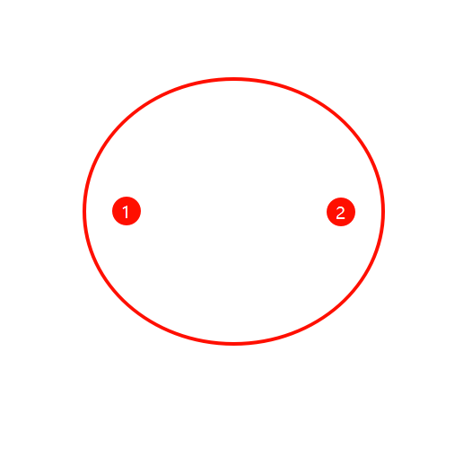

# 对准

---

> 【前提条件我们对准都是以：标准的CCD和标准的XY平移台】
> 

## 1. 为什么需要对准

---

<aside>
💡 主要目的

1. X轴或者Y轴对准方便去定位：需要让物料与我们的坐标系$X$（也可以与$Y$）轴平行，使得相机可以拍正我们的物料，才能方便定位，否则定位就会涉及到旋转很麻烦
    - 对于晶圆来说，是让街道和我们的坐标系$X$（也可以与$Y$）轴平行，就能使得晶圆的街道横平竖直，达到上述目的
2. 寻找中心具体定位位置：中心对准后就可以方便我们确认物料的所有位置
    - 对于晶圆来说
        - 如果有标准的CAD图纸，那么我们只需要做X轴或者Y轴对准就OK，通过对准后这两个mark点的位置（再对比CAD中两个mark点的位置推算出晶圆的中心位置），就可以根据CAD反推出所有DIE的位置
        - 如果没有标准的CAD图纸，那么我们还需要寻找中心，这样就能直接确定晶圆的中心位置，再去量测一个Die的大小以及位置，就可以反推出所有DIE的位置
3. 上述对准结束后：设备就可以有了所有位置，进行各种作业
</aside>

## 2. X轴或者Y轴对准

---

> 以下都已X轴对准为例，也介绍了y轴对准的数学公式
> 

### 数学原理（P2【2点】）

---

1. 找出两个足够远的两个mark点坐标$P_{1}(x_{1}, y_{1}), \quad P_{2}(x_{2}, y_{2})$
   
    <aside>
    💡 以X轴对准为例：找晶圆最左边的mark点，最右边的mark点位置
    
    - 为啥最远呢 $\Delta y=\Delta x * \tan \theta=\Delta x * \theta \quad(\tan \theta \sim \theta,\quad \theta \to 0 )$，当$\theta$足够小的时候$\Delta y$也足够小, 所以很大的$\Delta x$就能放大$\theta$
    </aside>
    
    
    
2. 计算角度，如果角度小于我们的误差允许范围内结束 (DF70误差[0.00028])
   
    <aside>
    💡 如何自动寻找mark点呢
    
    - 都是通过算法：模板匹配
    
    [http://192.168.0.28:8099/cougar/cuga2.0/-/blob/feature/dev-calibration/Calibration/Calibration.Wpf/Utilities/Net.Utilities/Algorithm/Halcon/Helper/HalconHelper.cs#:~:text=TrySharpeTemplateMathToOffset](http://192.168.0.28:8099/cougar/cuga2.0/-/blob/feature/dev-calibration/Calibration/Calibration.Wpf/Utilities/Net.Utilities/Algorithm/Halcon/Helper/HalconHelper.cs#:~:text=TrySharpeTemplateMathToOffset)
    
    [http://192.168.0.28:8099/cougar/cuga2.0/-/blob/feature/dev-calibration/Calibration/Calibration.Wpf/Cuga-Calibration-Solution/ViewModels/Common/ReviewViewModel.cs#:~:text=222-,AlgorithmTemplateTypeEnum,-algorithmTemplateTypeEnum%2C](http://192.168.0.28:8099/cougar/cuga2.0/-/blob/feature/dev-calibration/Calibration/Calibration.Wpf/Cuga-Calibration-Solution/ViewModels/Common/ReviewViewModel.cs#:~:text=222-,AlgorithmTemplateTypeEnum,-algorithmTemplateTypeEnum%2C)
    
    </aside>
    
    <aside>
    💡 与X轴夹角的计算公式如下
    
    $$
    \theta=\arctan \left(\frac{y_{2}-y_{1}}{x_{2}-x_{1}}\right)
    $$
    
    </aside>
    
    <aside>
    💡 与Y轴夹角的计算公式如下
    
    $$
    \theta=\arctan \left(\frac{x_{2}-x_{1}}{y_{2}-y_{1}}\right)
    $$
    
    </aside>
    
3. 旋转角度，得到新的两个mark点$P_{1}^{'}(x_{1}^{'}, y_{1}^{'}), \quad P_{2}^{'}(x_{2}^{'}, y_{2}^{'})$
   
    [http://192.168.0.28:8099/cougar/cuga2.0/-/blob/feature/dev-calibration/Calibration/Calibration.Wpf/Utilities/Net.Utilities/Extensions/PointExtension.cs#:~:text=36-,public static Point RadianAngleByOrigin](http://192.168.0.28:8099/cougar/cuga2.0/-/blob/feature/dev-calibration/Calibration/Calibration.Wpf/Utilities/Net.Utilities/Extensions/PointExtension.cs#:~:text=36-,public%20static%20Point%20RadianAngleByOrigin)(this%20Point%20point%2C%20double%20radianAngle,%7D,-55
    
    <aside>
    💡 **二维旋转Rotation**
    
    - 旋转后的$P_{1}^{'}(x_{1}^{'}, y_{1}^{'}), \quad P_{2}^{'}(x_{2}^{'}, y_{2}^{'})$如何寻找呢
    - 以原点时，点位置$P$进行旋转的变换方程
    
    
    
    $$
    用极坐标表示旅转前点坐标：\\
    
    x=r \cos \Phi, y=r \sin \Phi\\
    
    族转后点坐标:\\
    
    \begin{aligned}
    x^{\prime}=r \cos (\Phi+\theta) & =r \cos \Phi \cos \theta-r \sin \Phi \sin \theta \\
    y^{\prime}=r \sin (\Phi+\theta) & =r \cos \Phi \sin \theta+r \sin \Phi \cos \theta
    \end{aligned}\\
    
    由上述可得，\\
    
    \begin{aligned}
    x^{\prime} & =x \cos \theta-y \sin \theta \\
    y^{\prime} & =x \sin \theta+y \cos \theta
    \end{aligned}\\
    
    用列向量表示坐标位置，那么族转方程可写成矩阵形式:\\
    
    P^{\prime}=R \cdot P\\
    
    其中，旋转矧阵:\\
    
    R=\left[\begin{array}{cc}
    \cos \theta & -\sin \theta \\
    \sin \theta & \cos \theta
    \end{array}\right]
    $$
    
    </aside>
    
4. 跳到2，继续重复

### P5【5点】

---

<aside>
💡 其实和P2原理一致的，但是他不是手动标记最远端的两个mark点

- 因为晶圆die是重复的，所以会有很多重复mark点图案，所以找两个相邻的die的mark点图案
- 通过相邻的第一个mark点和第二个mark点的长度，计算出右边的第三个mark点和第四个mark点，然后根据长度计算出第五个mark点：最右边的第四个mark点关于第一个mark点对称的点
- 根据最右边的第四个点和最左边的第五个点作为P2对准的两个点

- 接下来同上述的P2
</aside>

<aside>
💡 P5实际上是可以兼容P3、P4

- 原因：因为晶圆的Die大小尺寸限制：不一定能找出右边第四个mark点和最左边第五个mark点
- 改为P4

- 改为P3

</aside>

### 对于DF70中因为有显微镜，所以寻找点有些许不同

---

<aside>
💡 寻找mark点的时候肯定放大倍率约高，寻找的位置精度越准确，因为相机是由分辨率误差的，（倍率越高$um/pixel$越小，所以误差约小，精度越高）

- 但是高倍率的缺点是能看见的视野越小,所以有可能会没有出现mark点
- 所以方案如下：先用低倍镜寻找mark点5X，在切换高倍镜取寻找mark点50X
    - 手动标记 确认低倍镜下mark点的位置
    - 手动标记 确认高倍镜下mark点的位置
    - 确认好高倍镜和低倍镜的offset
    - 低倍镜寻找到后，切换高倍镜的时候移动offset就能在高倍镜下寻找到mark点位置

[http://192.168.0.28:8099/cougar/cuga2.0/-/blob/feature/dev-calibration/Calibration/Calibration.Wpf/Cuga-Calibration-Solution/ViewModels/Chuck/ChuckGantryCalibrationViewModel.cs#:~:text=private bool-,MatchTemplate,-](http://192.168.0.28:8099/cougar/cuga2.0/-/blob/feature/dev-calibration/Calibration/Calibration.Wpf/Cuga-Calibration-Solution/ViewModels/Chuck/ChuckGantryCalibrationViewModel.cs#:~:text=private%20bool-,MatchTemplate,-)(Guid%20guid

</aside>

## 3. 寻找中心

---

### 数学原理

---

<aside>
💡 如果给出的是三点坐标$(x_1, y_1)$$(x_2, y_2)$$(x_3, y_3)$，那么可以使用以下步骤计算圆心的坐标$(h, k)$

- **步骤 1：设定方程**
    - 那么圆的方程可以表示为：$(x - h)^2 + (y - k)^2 = r^2$
    - 对于每一个点 ($x_i, y_i)$都有以下关系：

$$
(x_1 - h)^2 + (y_1 - k)^2 = r^2\\

(x_2 - h)^2 + (y_2 - k)^2 = r^2\\

(x_3 - h)^2 + (y_3 - k)^2 = r^2\\
$$

- **步骤 2：解线性方程组**

$$
h=\frac{\left[\left(x_{2}^{2}-x_{1}^{2}+y_{2}^{2}-y_{1}^{2}\right)\left(y_{3}-y_{2}\right)-\left(x_{3}^{2}-x_{2}^{2}+y_{3}^{2}-y_{2}^{2}\right)\left(y_{2}-y_{1}\right)\right]}{2\left[\left(x_{2}-x_{1}\right)\left(y_{3}-y_{2}\right)-\left(x_{3}-x_{2}\right)\left(y_{2}-y_{1}\right)\right]} \\
k=\frac{\left[\left(x_{3}^{2}-x_{2}^{2}+y_{3}^{2}-y_{2}^{2}\right)\left(x_{2}-x_{1}\right)-\left(x_{2}^{2}-x_{1}^{2}+y_{2}^{2}-y_{1}^{2}\right)\left(x_{3}-x_{2}\right)\right]}{2\left[\left(x_{2}-x_{1}\right)\left(y_{3}-y_{2}\right)-\left(x_{3}-x_{2}\right)\left(y_{2}-y_{1}\right)\right]}
$$

</aside>

### DF70中使用的是P8【8点】

---

> **三点确认圆心要确定一个圆的圆心，那么8个点就是**$\binom{8}{3}$**个结果，取平均值**
1. 去到晶圆的大致中心中心（手动标记，或者DF70使用的明场中心【chuck中心】）
2. 计算中心的等分的8个点的位置(实际上就是圆的内接8边形的顶点坐标)
3. 算法根据8个点计算出边缘的点
4. 在经过上述数学原理拟合出圆心

## **4. 对准在配方上中的意义**

---

<aside>
💡 **二维平移（translation）**

- 原始坐标  $(x, y)$  平移距高  $(t_{x},t_{y})$ =>  新坐标  $\left(x^{\prime} ， y^{\prime}\right)$

$$
x^{\prime}=x+t_{x}, \\y^{\prime}=y+t_{y}
$$

</aside>

1. 计算出晶圆的中心位置，那么可以以此点为零点，然后建立晶圆中心的笛卡尔坐标系，然后晶圆上任意一点都可以分布在4个象限中
2. 记录晶圆中心坐标$O$，mark点$P_{1}$，mark点$P_{2}$，以此建立配方后
3. 再次上下料，会得到Mark点$P_{1}^{'}$，Mark点$P_{2}^{'}$，就可以算出与建立的配方的$Offset = P_{1}^{'}-P_{1}$, 这样新的圆心$O^{'} = O + Offset$就可以定位晶圆的任何位置

## 5. 讲解Cuga代码

---

[http://192.168.0.28:8099/cougar/cuga2.0/-/blob/feature/dev-calibration/Domain/Coordinator/Cuga.Domain.Coordinator.Aligner/CgBrightFeildWaferAlignment.cs](http://192.168.0.28:8099/cougar/cuga2.0/-/blob/feature/dev-calibration/Domain/Coordinator/Cuga.Domain.Coordinator.Aligner/CgBrightFeildWaferAlignment.cs)

[http://192.168.0.28:8099/cougar/cuga2.0/-/blob/feature/dev-calibration/Domain/Coordinator/Cuga.Domain.Coordinator.Aligner/CgWaferCenterFinder.cs](http://192.168.0.28:8099/cougar/cuga2.0/-/blob/feature/dev-calibration/Domain/Coordinator/Cuga.Domain.Coordinator.Aligner/CgWaferCenterFinder.cs)