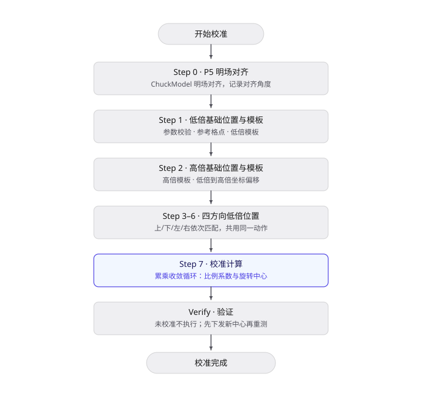
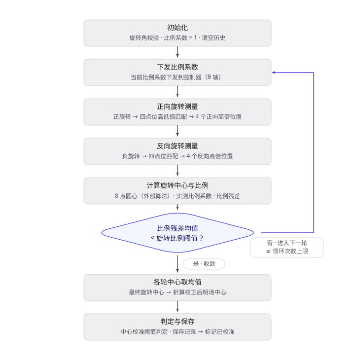
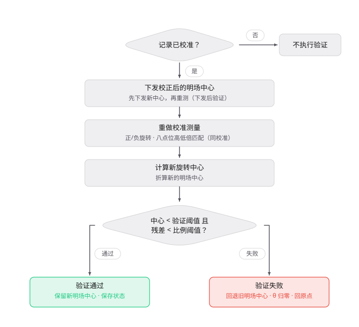

# Chuck Center And Theta Scale 校准方案

## 1. 校准的目的

Chuck 承片台绕 θ 轴旋转存在两类误差：一是指令旋转角与实际旋转角的比例偏差（θ 轴比例误差），二是实际旋转中心相对明场成像中心的偏移。两类误差共同导致绕 θ 轴旋转后，标记点的实际位置偏离按指令计算的预期位置。

本校准在一次流程中同时测量并保存两个结果：

- θ 轴旋转比例系数（指令转角与实际转角之比），用于补偿 θ 轴旋转的比例误差；
- 明场旋转中心（明场坐标系中旋转中心相对明场中心的偏移），并折算为校正后的明场中心载台位置。

两个结果一并保存为 Chuck Center And Theta Scale 校准记录，供设备在 θ 轴运动坐标换算与明场中心定位时使用。

校准对象不是单个位置坐标，而是由四个方向（上、下、左、右）的晶圆图案在正、负旋转后共同确定的旋转中心与 θ 轴比例。结果按所使用的高倍镜记录。各输出值的正负方向由设备明场坐标与载台坐标的方向修正共同决定。

## 2. 校准方法

### 2.1 校准原理

以晶圆上重复排列的 die 图案作为位置标记，无需外部标准器。先在低倍镜下建立低倍基础模板，随后在高倍镜下建立高倍基础模板，并在以 θ 轴为中心的上、下、左、右四个方向各确定一个测量点位：

- 对每个方向的点位先后做低倍、高倍两级模板匹配，把图案中心的像素位移按当前倍镜的像素尺寸（PixelSize，单位 μm/pixel）换算成载台位移，读取该点位的实际物理坐标。
- θ 轴分别正向旋转、反向旋转一个旋转角，在正、负两个旋转状态下对上述四个点位分别重新匹配，得到 4 个方向 × 正/负旋转共 8 个高倍精确定位坐标。

旋转中心的求取基于这一几何关系：同一标记在正、负旋转后的两个位置构成一条弦，该弦的垂直平分线必过旋转中心。四个方向的标记给出四条弦，其垂直平分线两两相交即得圆心坐标。8 个点的坐标交予圆心算法计算，得到本次的旋转中心。

θ 轴比例的计算基于正负旋转的实际夹角：对每个方向，取正、负旋转后两个位置相对旋转中心的夹角，四个方向的夹角均值即为实际转角均值。指令转角为旋转角的 2 倍，二者之比即为当次实测比例系数：

$$
\text{实测比例系数}=\frac{2\times\text{旋转角}}{\text{实际转角均值}}
$$

比例残差按晶圆直径折算成弧长（μm）：

$$
\text{比例残差}=2\times\text{晶圆半径}\times 2\times\text{旋转角}\times\left(1-\text{实测比例系数}\right)\times\frac{\pi}{180}
$$

校准以累乘方式收敛：比例系数初始为 1，每轮把当前比例系数下发到控制器后重测；若当次比例残差仍超过旋转比例阈值，则令比例系数乘以当次实测比例系数再进入下一轮，最多达到循环次数上限。收敛后的比例系数即为最终比例系数。

旋转中心的圆心计算与模板匹配由外部算法库完成。

本校准所用已知量如下：

- 晶圆上重复的 die 图案作为位置识别基准；低倍模板与高倍模板分别用于对应倍镜的定位。
- 像素尺寸（PixelSize，单位 μm/pixel）作为图像位移到载台位移的换算基准；当前倍镜没有已验证的像素尺寸时，回退到相机像元尺寸除以物方放大倍率的理论值。
- 旋转角是指令给出的已知转角（默认 1°），作为 θ 轴比例计算的已知量。
- 晶圆半径作为比例残差到弧长的换算基准，默认 150 mm。

### 2.2 前置条件

- ChuckModel 的明场对齐参数可用；当前没有可用的对齐结果时，P5 步骤会先完成明场对齐。
- 当前低倍镜的像素尺寸（PixelSize）已完成并验证；缺失时允许以理论值继续，但位置换算精度受限。
- 晶圆格点间距、参考格点数和晶圆半径设置后，同一列与同一行内至少能生成 3 个有效参考格点。
- 低倍基础位置到原点（晶圆中心）的距离须小于晶圆直径（2 倍晶圆半径），否则判定基础位置超出晶圆。

## 3. 校准步骤与数据处理

校准流程共 8 步：**P5 → 低倍基础位置与模板 → 高倍基础位置与模板 → 上/下/左/右低倍位置 → 校准计算**。其中上、下、左、右四个低倍位置共用同一套匹配动作，按点位方向依次执行。完成校准并保存后，在 Verify（验证）流程中复核结果。

### 3.1 Step 0：P5

以 ChuckModel 为对象在明场模式下完成对齐，记录对齐得到的 P5 对齐角度与当前 θ 轴角度。进入下一步时，切换到低倍镜并移动到低倍基础位置。

### 3.2 Step 1：低倍基础位置与模板

1. 校验高倍镜倍率代码大于低倍镜，并校验晶圆半径、晶圆格点间距等参数合法。
2. 读取当前低倍明场坐标，记录为低倍基础位置，并校验其到原点距离小于晶圆直径，超出则本步失败。
3. 按晶圆格点间距、参考格点数与晶圆半径生成参考格点：取列索引为 0 的同一列按 Y 排序，最上、最下两个作为上方位置与下方位置；取行索引为 0 的同一行按 X 排序，最左、最右两个作为左方位置与右方位置。
4. 在当前低倍视场中心生成低倍基础模板并保存模板图片。

### 3.3 Step 2：高倍基础位置与模板

读取当前高倍明场坐标，记录为高倍基础位置，并在高倍视场中心生成高倍基础模板并保存图片。低倍基础位置到高倍基础位置的坐标差记为低倍到高倍坐标偏移，用于后续在低倍定位点上预测高倍位置。

### 3.4 Step 3–6：上/下/左/右低倍位置

按上、下、左、右的顺序依次设置点位方向，移动到对应低倍位置，用低倍基础模板做一次模板匹配，把匹配到的像素位移按当前倍镜的像素尺寸换算成载台位移（μm），并移动到图案实际位置后读取坐标，更新该方向的低倍位置；匹配失败则本步失败。

### 3.5 Step 7：校准计算

1. 校验旋转角合法（介于 0° 与 1° 之间），清空历史结果数据，初始化比例系数为 1。
2. 循环执行，最多达到循环次数上限：
   - 把当前比例系数下发到控制器作为 θ 轴比例系数；
   - θ 轴正向旋转一个旋转角，对上、下、左、右四个点位依次做低倍、高倍两级匹配，得到 4 个正向高倍位置；
   - θ 轴反向旋转一个旋转角，得到 4 个反向高倍位置；
   - 用 8 个高倍位置计算旋转中心；
   - 计算当次实测比例系数、实际转角均值与比例残差均值；
   - 若比例残差均值的绝对值小于旋转比例阈值，则比例收敛成功，结束循环；否则令比例系数乘以当次实测比例系数，进入下一轮。
3. 循环结束后，取各轮的旋转中心 X、Y 坐标均值作为最终旋转中心。
4. 读取明场中心载台位置，按载台方向把旋转中心偏移折算为校正后的明场中心。
5. 中心判定：旋转中心非原点且 X、Y 绝对值均小于中心校准阈值；比例判定为上述收敛结果。两者均满足才标记校准成功。
6. 保存校准记录并标记为已校准；保存失败则不标记，本步失败。

### 3.6 Verify（验证）

1. 对已校准记录执行验证；记录未校准时不执行。
2. 先把已保存的校正后明场中心下发到控制器，再以已保存的比例系数重做一次与校准计算相同的测量（正负旋转 + 八个点位匹配）。
3. 计算新的旋转中心并折算新的明场中心。
4. 判定：旋转中心非原点且 X、Y 绝对值均小于中心验证阈值；同时比例残差均值绝对值小于旋转比例阈值。两者均满足则验证通过。
5. 保存验证状态；验证通过时保留新明场中心，验证失败时把明场中心回退到验证前的旧值，θ 轴恢复到 0° 并把明场载台移回原点。

### 3.7 校准结果

| 内容 | 说明 |
| ---- | ---- |
| P5 对齐结果 | P5 对齐角度、θ 轴角度 |
| 基础位置 | 低倍基础位置、高倍基础位置 |
| 四方向低倍位置 | 上/下/左/右低倍位置；Step 3–6 后为匹配得到的实际位置 |
| 低倍到高倍偏移 | 低倍到高倍坐标偏移 |
| 八个高倍匹配位置 | 正/负旋转 × 上/下/左/右四个方向的高倍定位坐标 |
| 旋转中心 | 各轮旋转中心均值 |
| θ 轴比例 | 比例系数（下发值）、当次实测比例系数、实际转角均值、比例残差均值 |
| 明场中心 | 校正后的明场中心 |
| 校验状态 | 已校准标志、已验证标志 |

## 4. 验收判定与异常处理

### 4.1 验收判据

| 项目 | 判据 |
| ---- | ---- |
| 前置校验 | P5 对齐成功；高倍镜倍率代码大于低倍镜；低倍基础位置到原点距离小于晶圆直径；同列、同行内有效参考格点数均大于 2 |
| 模板建立 | 低倍和高倍基础模板及模板图片均生成成功 |
| 匹配 | Step 3–6 的四次低倍匹配与正、负旋转下八个点位的高低倍匹配全部成功 |
| 校准判定 | 旋转中心非原点且 X、Y 绝对值均小于中心校准阈值；某轮比例残差均值绝对值小于旋转比例阈值 |
| 校准保存 | 校准记录保存成功 |
| Verify | 旋转中心非原点且 X、Y 绝对值均小于中心验证阈值；比例残差均值绝对值小于旋转比例阈值；验证状态保存成功 |

中心校准阈值、中心验证阈值与旋转比例阈值均为运行时参数。旋转比例阈值默认 1.4661 μm，对应按 300 mm 直径折算约 0.00028° 的角度残差。

### 4.2 异常处理

| 异常 | 行为与结果 |
| ---- | ---- |
| 前置校验失败（基础位置超出晶圆/参考格点不足/参数非法） | 记录错误，当前步骤失败并停止 |
| 模板生成失败 | 仅提醒，本步不中止；模板文件不完整时，切换到高倍镜的检查失败 |
| 模板匹配失败 | 当前校准或验证失败 |
| 像素尺寸缺失或未验证 | 不阻止匹配，使用理论像素尺寸并记录警告 |
| 校准判定失败（比例非法/比例不收敛/中心超阈值） | 校准结果为失败；比例非法时防止异常值下发 |
| 校准保存失败 | 校准结果不入库，保持未校准 |
| Verify 判定或保存失败 | 判定超阈值时保存失败状态并回退明场中心；保存失败时状态不入库、不回退（θ 轴不归零、载台不回原点） |
| Verify 匹配或设备异常 | 不完成判定；匹配失败时已下发结果保持生效并停在测量结束位置，设备异常时仅回退明场中心（θ 轴不归零、载台不回原点） |
| 中途取消 | 报告标记为取消，流程停止；明场位置回到原点 |

## 5. 记录与周期

### 5.1 记录内容

- 校准记录：低倍/高倍镜信息、P5 对齐结果、基础位置、四方向低倍位置、低倍到高倍偏移、八个高倍匹配位置、旋转中心、比例系数（下发值、当次实测比例系数、比例残差均值）、校正后明场中心。
- 执行参数：模板匹配类型、模板掩膜类型、晶圆格点间距、参考格点数、晶圆半径、旋转角、测量循环次数、中心校准阈值、旋转比例阈值。（中心验证阈值参与验证判定，但当前未写入报告，历史验证记录无法据此重建判定配置。）
- 图像文件：低倍/高倍基础模板、各点位低倍与高倍匹配原图和结果图；匹配失败时记录失败原因与相关图像。
- 校验状态：已校准标志、已验证标志。

### 5.2 复校时机

未定义固定的日历周期，按设备状态和事件触发复校：

- Chuck 承片台、θ 轴、编码器、驱动或相关机械结构拆装、维修、调整后；
- 明场相机、低倍镜或高倍镜更换、调校后；
- ChuckModel 明场对齐参数、像素尺寸或明场成像条件发生变化后；
- θ 轴旋转出现角度偏差、旋转中心漂移或明场中心定位异常时；
- Verify 失败，且已排除对焦、模板、图案位置和设备通信问题。

每次复校应完成“校准保存 + Verify”闭环。仅完成校准计算而未保存校准记录，不能作为有效校准记录使用。

## 6. 当前状态与未来优化方向

- **当前状态**：已release，多次使用无异常。
- **优化方向**：
  - 校准失败或取消时 θ 轴比例系数不回退，控制器可能残留测量循环中间值；建议在异常退出时明确回退策略或增加控制器回读。
  - 匹配得分阈值、对齐角度限值等未写入报告，建议补充以便区分图像识别失败与机械误差超限。
  - 中心验证阈值参与 Verify 判定但未写入报告，历史 Verify 记录无法重建判定配置；建议在 Verify 报告中补记该阈值。
