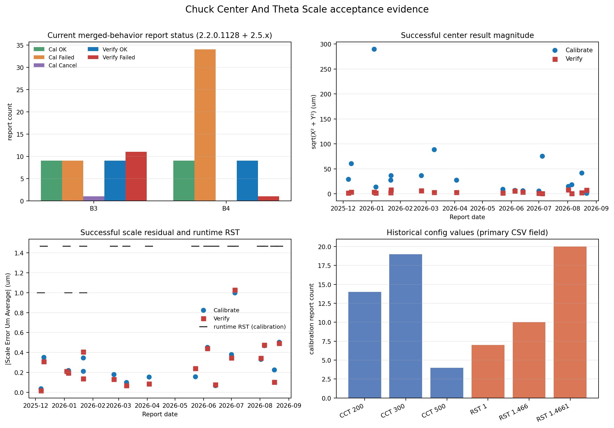

# Chuck Center And Theta Scale 校准方案验收

## 统计口径

本报告验收对象为[《Chuck Center And Theta Scale 校准方案》](校准方案.md)。

- **验收日期**：2026-09-01。
- **日志范围**：项目内全量 95 份 HTML 报告，B3 41 份、B4 54 份，日期为 2025-12-06 至 2026-08-21。统计优先使用已完成的结构化提取结果，原始 HTML 保持不变。
- **版本口径**：本方案的当前行为以合并模块为准：chuck center 与 theta scale 合二为一、global/theta 改为累乘（#78，2025-12-05 提交）。
  - 2.2.0.1128 版本串自 2025-12-06 起的日志，经步骤结构（`Chuck Center and Theta` 八步，无旧模块「Find Low Base Position」与「Applied Times」标记）与逐轮累乘数值核实，确认由合并模块生成，与 2.5.x 同属当前行为。
  - 当前行为证据范围 = 2.2.0.1128（2025-12-06 起）51 份 + 2.5.x 41 份，共 92 份。其中 2.5.3.x（2.5.3.511、2.5.3.603）39 份为主要直接证据，2.2.0.1128（早期合并构建）与 2.5.1.327 为合并后补充证据；另有 3 份版本未标识报告（均为 Step1 失败、未记录版本）仅作历史观察。
  - 验收结论以 2.5.3.x 直接证据为基础，补充范围只作佐证，不改变判定。
- **分析单位**：以单份 Calibrate 或 Verify 报告为主要单位；按设备、日期和时间配对形成 Calibrate–Verify 闭环。失败重试报告保留原始粒度，不将多次重试相加解释为多次独立运行。
- **数值口径**：中心使用报告中的 Chuck Center Position 计算二维模长；比例使用 Scale Error Um Average 的绝对值。校准报告的逐轮 Get Result OK 中心与最终 Calibration Result OK 中心另行核对均值关系；B4 2026-01-03、2026-02-23 两份 2.2.0.1128 OK 报告内部结构重复/累积，逐轮均值不作核对。Verify 的 CenterVerifyThreshold 未写入报告，不以代码默认值替代实际运行配置。

## 日志统计与失败分析

全量报告状态与当前行为范围如下：

| 范围 | Calibrate OK | Calibrate Failed | Calibrate Cancel | Verify OK | Verify Failed |
| --- | ---: | ---: | ---: | ---: | ---: |
| 全量 95 份 | 18 | 46 | 1 | 18 | 12 |
| 合并后行为 92 份 | 18 | 43 | 1 | 18 | 12 |
| 其中 2.5.x 41 份 | 10 | 9 | 1 | 10 | 11 |
| 直接 2.5.3.x 39 份 | 9 | 9 | 1 | 9 | 11 |

**直接 2.5.3.x 的失败。** 9 份 Calibrate Failed 均在测量结果获取阶段出现 Get Calibration Result Failed：B3 的 2.5.3.511 记录 8 份、2.5.3.603 记录 1 份。11 份 Verify Failed 均为 B3、2.5.3.603 的 Get Calibration Result Failed，其中 2026-08-16 1 份、2026-08-21 10 份。上述失败记录均未形成最终的中心和比例数值，不能作为失败测量值样本；也未发现把失败状态写成 Verify OK 的证据。

**2.2.0.1128 早期构建的失败。** 该构建另有 34 份 Calibrate Failed 与 1 份 Verify Failed，失败模式与 2.5.3.x 不同：模板匹配失败 11 份、模板生成或读取失败 11 份、参数校验失败 5 份、测量结果获取失败 5 份、设备或流程异常 1 份、未记录具体原因 1 份，集中发生在 B4 2026-01-03、2026-02-23 两个会话；Verify Failed 1 份为测量结果获取失败。

**全量失败分类。** 按每份报告的主异常文本归类：

- Calibrate Failed 46 份：测量结果获取失败 14 份、模板匹配失败 11 份、模板生成或读取失败 11 份、参数校验失败 5 份、设备或流程异常 1 份、未记录具体原因 4 份；
- Verify Failed 12 份：均为测量结果获取失败。

该归类保留报告级粒度，重试记录不合并为独立运行，分类数量也不等同于设备故障次数。另有 1 份 Calibrate Cancel（B3 2026-06-13 的 Step1 取消记录），报告状态与步骤可确认，但无法从现有日志确定取消由用户操作还是上层流程触发。

**带有效数值的历史失败。** 2.2.0.1128 早期构建中仍有少量带有效数值的失败报告：B4 2026-01-03 有 1 份 Calibrate Failed 记录中心约为 (114.248, 264.870) μm，中心判定为 false；B4 2026-02-23 有 9 份 Calibrate Failed 记录比例残差约为 −41.1161～−40.6962 μm，其中 8 份比例判定为 false。这些记录属于该早期构建的异常边界（部分为同一会话内重试），本次不将其混入 2.5.3.x 成功/失败分布，也不据此批准新的运行阈值。

**历史配置值。** 合并后行为范围内实际出现过的 Center Calibration Threshold 为 200、300、500 μm；Rotate Scale Threshold 为 1、1.466、1.4661 μm；Calibration Times 为 1、2。它们是历史运行配置或报告字段，不是独立测量样本；失败或重试报告可能包含多个参数块。本次不根据这些配置值的出现次数重新计算或替换既有推荐值，推荐值及适用范围见下节。

图 1 左上按设备展示合并后行为报告状态；右上展示成功 Calibrate/Verify 的中心模长；左下展示比例残差及 Calibrate 报告中的运行时 Rotate Scale Threshold；右下展示历史配置值。各子图统计口径与本节一致。

## 推荐值与适用范围

本次验收沿用既有阈值规格中的推荐值，不依据本批日志中历史配置值的出现次数重新计算或替换。以下推荐值均为执行参考，不表述为本次日志重新推导出的统计最优值。

| 项目 | 沿用的推荐值 | 适用范围与证据状态 |
| --- | ---: | --- |
| 校准中心阈值 | 300 μm | 适用于本方案合并后行为下 B3/B4 的 Chuck Center And Theta 校准中心判定，作为既有执行参考。2.5.3.x 中 300 μm 为主要历史取值，成功校准中心模长均低于该值；早期合并构建中也有约 290 μm 的成功记录。历史失败记录中曾出现约 288.5 μm 的中心模长，因此现有日志不能证明该值与所有异常数据存在充分间隔。 |
| 比例残差阈值 | 1.466 μm | 适用于校准和 Verify 的比例残差判定，作为既有执行参考。成功 Calibrate/Verify 记录的比例残差均低于该值，历史异常失败值约为 40 μm 量级；日志中还出现过 1 μm 和 1.4661 μm 的实际配置，本次不将它们改写为新的推荐值。 |
| Verify 中心阈值 | 50 μm（X/Y） | 适用于 Verify 中心判定，作为既有执行参考。全量报告均未记录该参数，历史 Verify 的实际配置无法重建，故该推荐值未被本批日志直接确认；后续应先补充报告字段。 |

既有推荐中的 1°为指令旋转角；0.00028°是 1.466 μm 在 300 mm 尺度下的等效角度表达，不是独立的 Verify 阈值配置。

## 当前版本闭环与实测值

合并后行为范围（2.2.0.1128 2025-12-06 起 + 2.5.x）内共有 18 次 Calibrate–Verify 成功闭环，B3 9 次、B4 9 次，每次校准与其后的 Verify 均为 OK。按版本细分：2.5.x 10 次（含 2.5.1.327 的 B4 2026-04-02 1 次、2.5.3.x 9 次）；2.2.0.1128 早期构建 8 次（B3 2025-12-09、2026-01-21、2026-03-09 共 3 次；B4 2025-12-06、2026-01-03、2026-01-05、2026-01-21、2026-02-23 共 5 次）。

对合并后行为范围的 18 份 Calibrate OK 与 18 份 Verify OK，按版本子集统计如下：

| 成功报告类型 | 中心模长（μm） | 比例残差绝对值（μm） | 报告判定 |
| --- | ---: | ---: | --- |
| Calibrate OK，2.5.x 10 份 | 1.274～75.710，中位数 12.202 | 0.0678～0.9980，中位数 0.356 | Chuck Center Is OK、Theta Scale Is OK 均为 true |
| Calibrate OK，2.2.0.1128 8 份 | 13.574～289.948，中位数 36.567 | 0.0368～0.353，中位数 0.211 | 同上（最大值 289.9 μm 为 B4 2026-01-03 调高中心阈值至 300 后判定 OK） |
| Verify OK，2.5.x 10 份 | 0.435～7.838，中位数 2.610 | 0.0786～1.0284，中位数 0.345 | Chuck Center Is OK、Theta Scale Is OK 均为 true |
| Verify OK，2.2.0.1128 8 份 | 1.836～7.824，中位数 3.261 | 0.0167～0.408，中位数 0.167 | 同上 |

**中心均值核对。** 合并后行为范围内的 18 份成功 Calibrate 报告中，16 份为干净的两轮测量：逐轮 Get Result OK 中心的算术均值与最终 Calibration Result OK 中心逐份核对，两个分量的最大差异为 0.0005 μm，处于报告三位小数显示精度内，与方案中“各轮均值”的描述一致。B4 2026-01-03、2026-02-23 两份 2.2.0.1128 报告内部结构重复/累积，逐轮均值不作核对，其中心与比例判定标志仍为 true。

**代表性记录。** B4 2026-08-05 的最终中心为 (-1.791, 18.583) μm、Applied Scale T=1.0030958、比例残差 0.4689 μm；随后 Verify 中心为 (-0.607, 0.330) μm、比例残差 0.4742 μm，两个判定标志均为 true。

**累乘收敛。** 2.2.0.1128 早期构建同样可复核，如 B4 2025-12-06：轮 1 Applied=1、轮 2 Applied=1.004013（等于轮 1 累乘值），比例残差由 −41.47 μm 收敛到 −0.037 μm。

## 优点

1. **当前行为有两台设备、跨早期构建与当前版本的闭环证据。** 合并后行为范围在 B3、B4 各有 9 次完整 Calibrate–Verify 闭环，覆盖 2.2.0.1128（2025-12-06 起）与 2.5.x 两个合并后阶段，以及 P5、四方向低倍位置、正负旋转八点测量、中心均值、比例累乘收敛、保存及 Verify；其中 2.5.3.x 9 次为主要直接证据。

2. **中心均值和比例收敛结果可由日志复核。** 合并后行为范围内 16 份干净的两轮成功校准报告，最终中心与逐轮实测均值的差异不超过 0.0005 μm；2.2.0.1128 早期构建也展示与当前一致的累乘收敛（如 B4 2025-12-06），成功报告的中心和比例状态均为 true。

3. **失败记录保持了可识别的失败状态。** 合并后行为范围内没有把失败写成成功状态的证据；2.5.3.x 的校准失败、取消和 Verify 失败均未形成可误用的最终成功结果，2.2.0.1128 早期构建的模板/参数类失败同样未混入成功分布。

## 缺点及改进

1. **Verify 失败较集中，且缺少更细的测量原因。** B3 2026-08-16 和 2026-08-21 共 11 份 2.5.3.603 Verify Failed 均记录为 Get Calibration Result Failed，没有中心或比例数值。应继续记录失败发生的方向/阶段、匹配得分、异常类型和重试关联，便于区分图像匹配、设备运动和外部算法失败。

2. **2.2.0.1128 早期构建失败模式与当前版本不同，样本边界需在配置变更时重评。** B4 2026-01-03、2026-02-23 两个会话集中出现模板匹配/生成、参数校验类失败，而 2.5.3.x 未再现；早期构建成功记录的中心可达约 290 μm（B4 2026-01-03，调高阈值后判定 OK）。合并后行为虽同属累乘算法，早期构建与当前版本的失败/阈值行为仍有差异，配置、设备、模板或算法库变化时应追加闭环。

3. **CenterVerifyThreshold 未写入任何报告。** 全量 95 份提取报告均未找到该字段，因此历史 Verify 中心判定的实际配置不能重建；本次沿用 50 μm（X/Y）作为既有执行参考，但不把它表述为日志确认的历史实际值。应在 Verify 报告中同时记录 CenterVerifyThreshold、RotateScaleThreshold、单位和配置来源。

4. **控制器与计量学证据未在本次验收中闭环。** 现有日志不能独立证明 θ 比例和明场中心的控制器掉电保持、下游实际加载、长期稳定性、重复性、测量不确定度及外部中心算法的内部精度。本次继续使用结论的已验证范围仅限日志可复核的流程、判定与保存；如发生控制器复位、机械维修、算法库升级或质量异常，应补充核查。

## 结论

**结论：通过（限定范围）。**

在 DF70-B03、DF70-B04、合并后行为日志（2025-12-06 至 2026-08-21）以及当前源码对应的 2.5.3.x 主要直接证据范围内，Chuck Center And Theta Scale 的校准、结果保存和 Verify 主流程具备继续使用的日志依据。

结论依据包括：

- 2.5.3.x 有 9 次 Calibrate–Verify 成功闭环，中心和比例判定标志均为 `true`；
- 16 份两轮成功校准报告，最终中心与逐轮实测均值的最大分量差异为 0.0005 μm；
- 成功记录处于既有推荐值范围内，失败和取消记录保持可识别状态。

本次沿用既有推荐值：校准中心阈值 300 μm、比例残差阈值 1.466 μm、Verify 中心阈值 50 μm（X/Y）。这些值作为后续执行参考，不因本批日志中的历史配置统计而替换；其中 Verify 中心阈值因报告未记录该字段，当前只能确认推荐口径，不能重建每次运行的实际配置。
