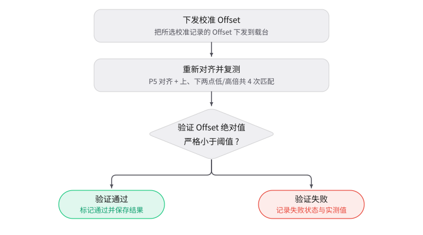

# Chuck Gantry Offset 校准方案

## 1. 校准的目的

本校准用于测量明场载台双 Y 龙门机构相对于 X 轴的非正交误差，计算并保存 Gantry Offset（龙门补偿量，单位 μm）。该补偿量用于补偿主、从龙门在长距离 Y 向运动中的相对偏差，使载台运动保持正交。

校准对象不是单个位置的坐标，而是由两个相距较远的明场标记位置共同确定的龙门几何误差。校准结果包含两处高倍匹配位置、模板匹配得分与角度、固定测量跨度 H 以及 Gantry Offset，按高倍镜记录并保存为 Chuck Gantry 校准记录。

本校准以 Chuck 明场对齐下可重复识别的晶圆图案作为测量目标。输出的 Offset 为带符号的补偿量，单位 μm；正负方向由设备坐标系和设备服务的 Gantry 补偿定义共同决定。

## 2. 校准方法

### 2.1 校准原理

校准先在低倍镜下建立同一列参考图案的上、下两个测量位置，再在高倍镜下分别定位这两个位置的图案中心。理想情况下，两处高倍定位点的 X 坐标相同；若 X 坐标随 Y 坐标发生变化，说明两条 Y 龙门的运动方向存在夹角。

流程先在低倍镜下生成基础模板，再在高倍镜下生成高倍模板。每次模板匹配时，图像像素位移按当前倍镜的像素尺寸（PixelSize，单位 μm/pixel）换算成载台位移，载台移动到图案实际位置后读取物理坐标。两处高倍定位位置用于计算龙门倾斜量：

$$
\tan\theta = \frac{X_2-X_1}{Y_2-Y_1}
$$

按固定机械跨度 H（测量跨度，1,130,000 μm）换算补偿量：

$$
\text{Offset}=-H\times\tan\theta
$$

负号用于匹配设备机械坐标方向与图像几何方向。Offset 越接近零，说明两处定位点在 X 方向的相对变化越小。

### 2.2 前置条件

- Chuck 的明场对齐参数可用；若当前没有可用的对齐结果，P5 步会先完成明场对齐设置。
- 低倍镜与高倍镜的像素尺寸 PixelSize 均已完成并验证；缺失时允许用理论值继续（相机像元尺寸 3.45 μm 除以物方放大倍率），但对应倍镜的定位精度受限。
- 晶圆格点间距、参考格点行数和晶圆半径设置后，有效半径内至少能生成 3 个同列参考格点。

## 3. 校准步骤与数据处理

校准流程共 6 步：**P5 → 低倍基础位置 → 高倍基础位置 → 低倍上方位置 → 低倍下方位置 → Offset**。完成校准并保存后，在验证（Verify）流程中复核结果。

### 3.1 Step 0：P5 对齐（双倍率对准）

P5 对齐：在相邻 die 的同一图案上分别取低倍与高倍标记点，由标记点位置关系解算对准角度。

1. 以 Chuck 为对齐对象，在明场模式下完成该对准（不使用暗场对齐）。
2. 对齐得到 P5 结果，记录 P5 对齐角度以及结果中的角度和两个标记点。
3. 进入下一步时，把当前 Gantry Offset 置为 0，切换到低倍镜，并移动到低倍基础位置。

### 3.2 Step 1：低倍基础位置

1. 按晶圆格点间距、参考格点行数和晶圆半径生成参考格点，并把当前低倍明场位置记录为低倍基础位置。
2. 筛出同一列的有效格点，按 Y 坐标排序后取最上方和最下方两个，作为低倍上方位置和低倍下方位置。
3. 在当前低倍视场中心截取图像，生成低倍基础模板并保存模板图片。
4. 低倍模板文件生成成功且低倍/高倍选择关系有效时，本步才结束；随后切到高倍镜，载台保持原位不自动移动，由 Step 2 记录当前载台位置为高倍基础位置。

### 3.3 Step 2：高倍基础位置

1. 读取当前高倍明场坐标，记录为高倍基础位置。
2. 在高倍视场中心生成高倍基础模板，并保存模板图片。
3. 进入下一步时，先切回低倍镜并移动至低倍上方位置，再检查高倍模板与对应图片是否存在；检查失败时，镜头与载台已完成切换与移动。

### 3.4 Step 3：低倍上方位置

1. 在低倍上方位置用低倍基础模板做一次模板匹配。
2. 按当前倍镜的像素尺寸 PixelSize 把匹配得到的像素位移换算成 μm，并把载台移动到图案实际位置。
3. 读取移动后的明场坐标，用它更新上方位置；匹配失败则本步失败，不产生有效的上方测量位置。
4. 进入下一步时，移动到低倍下方位置。

### 3.5 Step 4：低倍下方位置

1. 在低倍下方位置用同一个低倍基础模板再做一次模板匹配。
2. 按与 Step 3 相同的方式完成像素换算、载台移动和坐标读取。
3. 用匹配后的实际坐标更新下方位置；匹配失败则本步失败，不产生有效的下方测量位置。

### 3.6 Step 5：Offset（计算龙门补偿量）

按上、下两个位置依次完成 4 次匹配：

1. 在低倍上方位置匹配低倍模板，得到上方低倍实际位置。
2. 在该位置加上基础位置的坐标差（低倍到高倍坐标差），得到高倍预测位置，再匹配高倍模板，结果保存为高倍位置 1。
3. 在低倍下方位置匹配低倍模板，得到下方低倍实际位置。
4. 按同样的坐标差得到下方高倍预测位置，再匹配高倍模板，结果保存为高倍位置 2。
5. 记录两处高倍匹配的模板得分、模板角度和结果图像路径。
6. 用高倍位置 1、高倍位置 2 的坐标差计算 Offset，并把固定跨度 H=1,130,000 μm 写入结果。

### 3.7 Verify（验证）

验证流程如下图所示：

1. 对一条已校准记录执行验证。
2. 验证按验证阈值（μm）判定。
3. 先把校准得到的 Offset 下发到载台，再重新执行 Chuck 明场 P5 对齐。
4. 随后按 Step 5 的顺序完成上、下两个位置的低倍与高倍模板匹配，计算验证结果偏移。
5. 比较验证阶段 Offset 的绝对值与验证阈值：绝对值严格小于验证阈值时标记验证通过，否则标记失败。
6. 验证状态写入校准记录；验证结果偏移和验证阈值记入 Verify 结果，不写入校准记录。验证中实际下发的是校准阶段的 Offset，验证阶段测得的 Offset 仅用于判定和记录，不替换控制器当前的补偿量。

### 3.8 校准结果

| 内容 | 说明 |
| ---- | ---- |
| P5 对齐结果 | P5 对齐角度、结果中的角度和两个标记点 |
| 基础位置 | 低倍基础位置、高倍基础位置 |
| 两处低倍位置 | 低倍上方位置、低倍下方位置；Step 3/4 后为匹配得到的实际位置 |
| 两处高倍位置 | 高倍位置 1、高倍位置 2，单位 μm |
| 模板匹配结果 | 两处的模板得分、模板角度 |
| 校准结果 | Offset、H、低倍/高倍镜信息、已校准、已验证 |
| Verify 结果 | 校准阶段 Offset、验证阶段 Offset、验证结果偏移、验证阈值和判定状态 |

上表中，仅两处高倍位置、模板匹配结果（得分与角度）、Offset、H、镜头信息和校准/验证状态写入校准记录。P5 对齐结果、基础位置、两处低倍位置，以及 Verify 的验证结果偏移、验证阈值，均为当次运行的过程数据，不写入校准记录。

## 4. 验收判定与异常处理

### 4.1 验收判据

| 项目 | 判据 |
| ---- | ---- |
| P5 对齐 | ChuckModel 明场对齐成功 |
| 镜头选择 | 高倍镜倍率代码大于低倍镜 |
| 参考位置 | 有效参考格点数量大于 2 |
| 模板建立 | 低倍和高倍基础模板及模板图片均生成成功 |
| 校准匹配 | Step 5 的四次模板匹配全部成功 |
| 校准保存 | 校准记录保存成功 |
| Verify 匹配 | 上、下两个位置的四次模板匹配全部成功 |
| Verify 判定 | 验证阶段 Offset 的绝对值严格小于验证阈值 |
| Verify 保存 | 验证状态和验证结果偏移保存成功 |

### 4.2 异常处理

| 异常 | 行为与结果 |
| ---- | ---- |
| 参考格点不足 | 产生异常并停止当前步骤 |
| 模板生成或读取失败 | 模板 ROI 超出图像区域时仅给出提醒、本步不中止，失败在离开本步时暴露；算法服务生成失败时本步失败 |
| 模板匹配失败 | 当前校准/验证失败 |
| 像素尺寸缺失或未验证 | 不阻止匹配，使用理论像素尺寸并记录警告 |
| 镜头切换、载台移动或 P5 对齐异常 | 流程进入 Critical Error 或失败状态 |
| 校准保存失败 | 放弃后校准结果不入库，保持未校准 |
| Verify 数值超出验证阈值 | 保存验证失败状态和测得的验证阶段 Offset；所选记录的校准阶段 Offset 仍保持为本次已下发的补偿值 |
| Verify 匹配或设备异常 | 不完成数值判定，不标记为验证通过；已下发的校准阶段 Offset 不由该异常路径自动替换 |
| Verify 保存失败 | 保存失败，验证状态置为失败并记录错误，本次验证返回失败；判定结果不入库 |
| 中途取消 | 报告标记为取消，流程停止；通用取消处理把明场位置回到原点，但不主动重置已下发的 Gantry Offset |

## 5. 记录与周期

### 5.1 记录内容

- 校准记录：低倍/高倍镜信息、两处高倍位置、模板得分与角度、Offset、H、已校准和已验证状态。
- 执行参数：模板匹配类型、模板掩膜类型、晶圆格点间距、参考格点行数、晶圆半径、验证阈值。
- 图像文件：低倍/高倍基础模板、Step 5 与 Verify 的匹配原图和结果图；匹配失败时保存错误图像及诊断信息。
- Verify 结果：校准阶段 Offset、验证阶段 Offset、验证结果偏移、验证阈值、判定结果及设备温度信息。

### 5.2 复校时机

未定义固定的日历周期，按设备状态和事件触发复校：

- Y 龙门、载台、编码器、驱动或相关机械结构拆装、维修、调整后；
- 明场相机、低倍镜或高倍镜更换、调校后；
- ChuckModel 明场对齐参数、像素尺寸或明场成像条件发生变化后；
- 载台长距离 Y 向运动出现位置偏差、龙门正交性异常或 Gantry Offset 发生明显变化时；
- Verify 失败，且已排除对焦、模板、图案位置和设备通信问题。

## 6. 当前状态与未来优化方向

- **当前状态**：已 release。
- **优化方向**：暂无。
