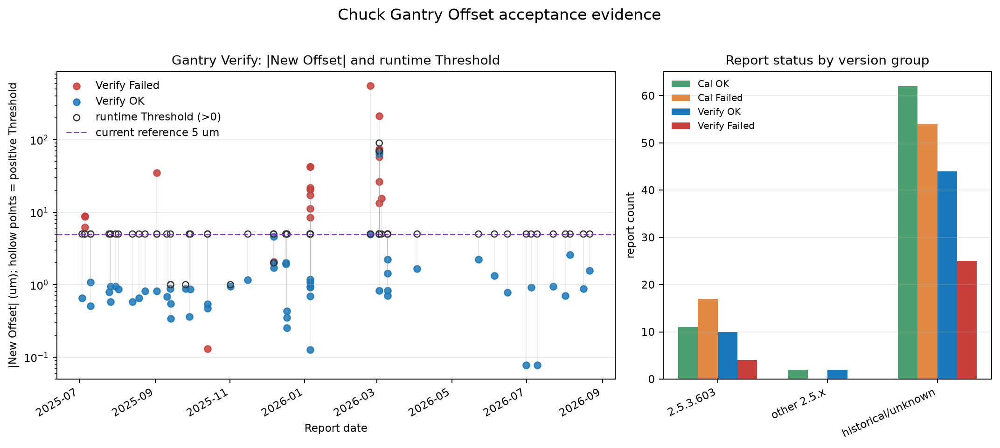
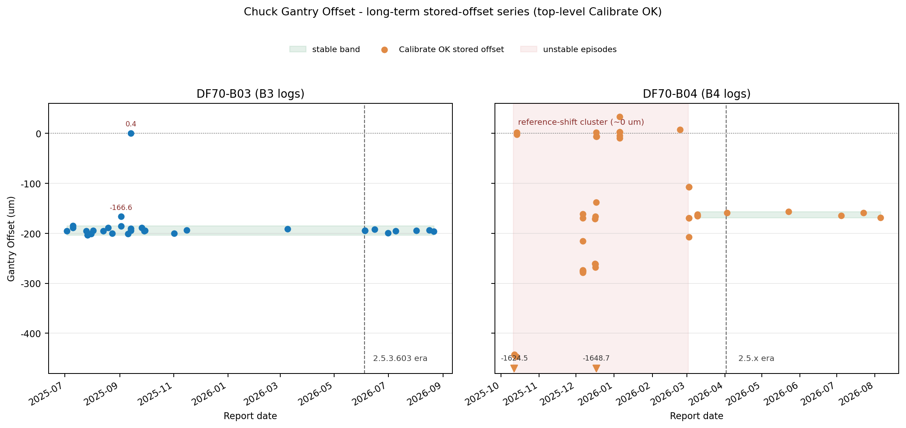

# Chuck Gantry Offset 校准方案验收

## 统计口径

- **验收日期**：2026-08-29。
- **日志范围**：项目内全量 321 份 HTML 报告，B3 143 份、B4 178 份，日期为 2025-07-03 至 2026-08-21。统计优先使用 B3、B4 日志的提取结果，原始日志报告保持不变。
- **版本口径**：按软件版本与校准更新的对应关系区分当前行为与历史行为。当前源码快照为 f31195d6；与当前方案直接对应的运行证据以 2.5.3.603 为主，2.5.1.327、2.5.3.511 作为相邻 2.5.x 补充记录，更早版本仅用于历史失败和配置观察。
- **分析单位**：以单份报告为主要统计单位；Step 报告是流程中间失败片段，可能与同一轮顶层 Calibrate 报告重复，不计为独立运行。配对闭环时按设备目录、日期、时间和 Verify 的 Old Offset 与此前 Calibrate 的 Offset 进行核对。
- **数值口径**：Verify 的 New Offset 与 Threshold 均来自同一份报告；按方案判据使用 abs(New Offset) < Threshold，并保留报告最终状态。阈值是运行时配置，不把历史出现次数当作独立测量样本。

## 日志统计与失败分析

全量报告状态如下：

| 报告类型 | OK | Failed | Cancel | 说明 |
|---|---:|---:|---:|---|
| 顶层 Calibrate | 75 | 71 | — | 顶层校准报告 |
| Step | — | 85 | 5 | 中间步骤报告，可能与顶层报告重叠 |
| Verify | 56 | 29 | — | Verify 报告 |

对 71 份顶层 Calibrate Failed 按报告中首个可识别的主要错误归类：P5 对齐/模板匹配 40 份、模板生成或读取 6 份、镜头切换/设备等待超时 7 份、其他设备或流程异常 18 份。该分类用于说明失败覆盖，不替代同一报告内可能同时存在的多条异常根因。

29 份 Verify Failed 中，22 份明确因 abs(New Offset) >= Threshold 未通过；1 份在数值上满足阈值但随后出现 Save Failed（New Offset=69.851 μm、Threshold=70 μm），因此最终状态仍为失败；其余 6 份未形成数值判定，其中 2 份为 P5/模板匹配问题、1 份为模板读取问题、3 份为镜头切换等待超时。没有把无判定的失败报告当作数值失败样本。

图 1 的左图仅绘制包含 New Offset 和 Threshold 的 79 个 Verify 判定块，Y 轴采用对数坐标；实心点为 abs(New Offset)，空心点为同一报告的正值运行时 Threshold，紫色虚线为 5 μm 当前生产执行参考。1 个 Threshold=0 的记录因对数轴无法表示 0 μm 未绘制，但仍计入正文统计。右图按提取结果中的报告状态分组，historical/unknown 包含更早版本和版本未标识记录。图表由可复现程序生成。

## 历史实测值与 Threshold 分析

按验收规范，对同一 Verify 测量阶段的有效 abs(New Offset) 数值，将 OK 与因数值超限而 Failed 的记录合并统计，同时保留保存失败这一非阈值失败状态：

| 数据组 | 数量 | abs(New Offset) 范围（μm） | 中位数（μm） | 说明 |
|---|---:|---:|---:|---|
| Verify OK | 56 | 0.078～64.260 | 0.873 | 报告最终状态为 OK |
| 数值超 Threshold 的 Verify Failed | 22 | 0.130～558.753 | 21.148 | 按实际运行 Threshold 判定失败 |
| 数值达标但 Save Failed | 1 | 69.851 | 69.851 | New Offset < 运行时 Threshold，但保存失败 |

历史实际配置出现过 0、1、2、5、70、90 μm。按严格的 abs(New Offset) < 候选值复算，取历史出现过的正值进行对比（0 μm 不作为候选，因为非负测量值不可能严格小于 0）：

| 候选 Threshold（μm） | 历史 Verify OK 保留 | 数值超限 Failed 被该值拦截 |
|---:|---:|---:|
| 1 | 38/56（67.9%） | 21/22（95.5%） |
| 2 | 48/56（85.7%） | 21/22（95.5%） |
| 5 | 55/56（98.2%） | 20/22（90.9%） |
| 70 | 56/56（100.0%） | 3/22（13.6%） |
| 90 | 56/56（100.0%） | 2/22（9.1%） |

当前 2.5.x 的 12 份数值 Verify OK（其中 2.5.3.603 为 10 份）全部小于 2.587 μm，5 μm 可保留 12/12 份当前成功测量；全量历史 OK 中仅有 1 份旧版本 B4 2026-03-02 的 64.260 μm 记录会被 5 μm 拒绝。

历史失败值与成功值并非完全分离：有 2 份旧版本数值失败分别为 0.130 μm（运行时 Threshold=0）和 2.069 μm（运行时 Threshold=2）。

因此，本次将 5 μm 作为当前生产执行参考值，依据是当前 2.5.x 正常值覆盖和历史数据中的保留率/失败拦截折中；它不是已经完成物理计量学验证的固定限值。

当前 2.5.3.603 的 4 份 Verify Failed 均在生成 New Offset 前失败，不能用于估计当前版本异常值的分布，后续需继续观察新的 Failed 数值是否低于 5 μm。

**执行参考：Verify Threshold = 5 μm。** 本次验收推荐以 5 μm 作为当前生产 Verify 判定的执行参考值：可保留当前 2.5.x 全部 12/12 份成功测量及历史 55/56 份 Verify OK，并拦截 20/22 份数值超限 Failed。它属于执行参考而非已完成物理计量学验证的固定限值，出现新失败值低于 5 μm、正常值接近 5 μm 或配置变更时重新评估。

## 当前版本闭环与实测值

2.5.3.603 共 47 份报告：顶层 Calibrate OK 11 份、Failed 17 份、Step Cancel 5 份，Verify OK 10 份、Failed 4 份。按日期和旧 Offset 配对得到 10 次 Calibrate–Verify 成功闭环：

| 设备 | 成功闭环日期 | 数量 |
|---|---|---:|
| DF70-B03 | 2026-06-04、06-15、06-30、07-09、08-01、08-16、08-21 | 7 |
| DF70-B04 | 2026-07-04、07-22、08-05 | 3 |

10 份当前版本 Verify OK 均使用 Threshold=5 μm，abs(New Offset) 为 0.078～2.587 μm；对应的 Calibrate OK Offset 为 −199.451～−159.327 μm，固定跨度 H=1,130,000 μm 在成功报告中均有记录。全量 79 个带判定数值的 Verify 报告中，运行时 Threshold 分布为 5 μm×71、1 μm×4、2 μm×1、70 μm×1、90 μm×1、0 μm×1。

图 2 按设备绘制全量 75 份顶层 Calibrate OK 的末态 Offset，用于观察存储值的长期稳定性与可重复性。

B3 的 31 份记录中，29 份在 13.5 个月内保持在 −203.24～−185.16 μm 主带（均值 −194.76 μm、标准差 4.68 μm），首末净变化 −0.45 μm；2 个离群点中，2025-09-02 的 −166.57 μm 已被当日 Verify 拦截。

B4 自 2026-03-09 起的 8 份记录保持在 −168.33～−156.22 μm（标准差 4.02 μm）；图中同时以红色底纹标出 B4 2025-10-11～2026-03-02 的不稳定期。

正常日期同日重复校准极差仅 0.07～4.0 μm；2.5.3.603 时期相邻校准日变化 ≤7.22 μm 且方向不固定，78 天净变化 −1.05 μm，与同日 Verify OK 残差 ≤2.587 μm 相互印证。

运行日志范围内的稳定性与可重复性侧面印证了当前校准方案在限定范围内的可行性，但不构成计量学意义的稳定性鉴定。

## 优点

1. **两台设备均有当前版本完整闭环。** B3 有 7 次、B4 有 3 次 2.5.3.603 Calibrate OK–Verify OK 配对；每次 Verify 均形成了新 Offset、旧 Offset、Threshold 和最终结果，支持六步校准流程在限定范围内继续使用。

2. **测量值与判定规则基本一致。** 79 个 Verify 判定块中，按 abs(New Offset) < Threshold 复算与报告状态有 78 个一致；唯一不一致是数值已达标但保存失败，报告最终状态为 Failed，体现了“结果保存成功”是独立的验收条件，没有发现数值超限被错误放行为 OK 的记录。

3. **失败路径覆盖了实际生产异常。** 当前版本既有 P5/模板匹配失败、镜头切换等待超时，也有取消和无数值判定的 Verify 失败；这些记录均未产生可误用的成功 Verify 数值，能够支持对失败结果保持 fail-closed 的使用要求。

## 缺点及改进

1. **当前版本仍有多次中途失败或取消。** 2.5.3.603 的 17 份顶层 Calibrate Failed 主要分布在 P5/模板匹配、模板生成读取和镜头切换等待；4 份 Verify Failed 均未形成数值判定。应继续保留失败阶段、异常文本、重试次数和最终状态，并在镜头/设备服务变更后补充完整闭环记录。

2. **Threshold 为运行时配置且历史实测值存在重叠。** 全量判定块同时出现 0、1、2、5、70、90 μm；历史统计显示 5 μm 可保留 55/56 份 Verify OK、拦截 20/22 份数值超限 Failed，但有 2 份旧版本 Failed 数值低于 5 μm，另有 1 份旧版本 OK 数值高于 5 μm。5 μm 因此仅作为当前生产执行参考，不作为固定物理限值；应以实际生效配置为准，当正常值接近 5 μm、出现低于 5 μm 的新 Failed 数值或配置发生变更时重新评估。

3. **保存失败与控制器实际状态仍不能完全由日志闭环。** 已发现 1 份数值达标但 Save Failed 的 Verify 报告；现有报告也不能独立确认 Gantry Offset 的控制器回读、掉电保持和下游加载状态。应补记保存返回状态、控制器回读和异常退出后的实际残留状态，出现保存失败、控制器复位或机械维修后重新核查。

4. **历史日志不具备完整当前行为覆盖。** 321 份报告中包含多个版本、部分版本未标识，且 Step 片段与顶层报告粒度不同。更早版本仅用于历史边界观察，其适用边界限定在所观察的版本与配置。

## 结论

**结论：通过（限定范围）。**

通过依据：2.5.3.603 下 B3 7 次、B4 3 次 Calibrate–Verify 成功闭环均形成完整可追溯的新旧 Offset、Threshold 与最终结果；79 个带数值的 Verify 判定块中 78 个与 abs(New Offset) < Threshold 复算一致，未发现数值超限被误放行为 OK；失败与取消记录均保持 fail-closed，未产生可误用的成功数值。上述日志证据支持六步校准流程在限定范围内继续使用。

适用范围：DF70-B03、DF70-B04、当前源码快照 f31195d6 对应的 2.5.3.603 运行记录，以及 2025-07-03 至 2026-08-21 项目留存日志范围；结论覆盖 P5 对齐、双点模板匹配、Offset 计算、保存和 Verify 判定的日志表现，不把 Step 失败片段当作独立运行。Verify 判定执行参考为 Threshold = 5 μm。
