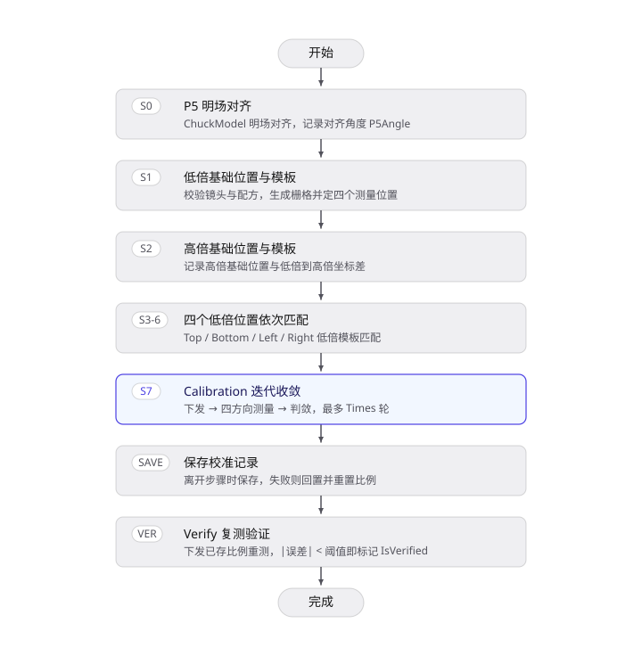
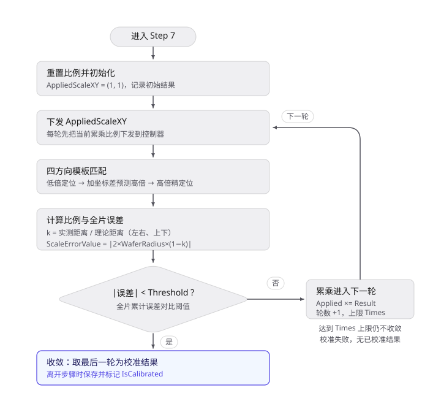

# Chuck Global Scale Error 校准方案

## 1. 校准的目的

本校准测量明场载台 X、Y 两轴实际移动距离与指令移动距离之间的全局比例误差（scale error），并计算、保存两轴的全局比例系数。比例系数用于补偿载台长距离移动中的比例偏差，使载台在整个行程内移动到目标位置时保持预期精度。

载台移动时，实际移动距离与目标移动距离之间通常存在固定的比例偏差：目标距离为 L 时，实际移动为 k×L（k 不为 1），即实际移动距离被整体缩放。本校准不针对某个单点坐标，而是分别确定 X、Y 两轴的比例系数 k_x、k_y，作为全局缩放补偿量下发给载台控制器；控制器据此对后续所有移动指令按比例反向修正，消除这一系统误差。

校准的测量目标是 ChuckModel 明场对齐下、晶圆上按已知 die 间距规则排布的重复图案。输出为两轴应用比例系数（含 X、Y 两个分量）及对应的全片累计误差，按高倍镜记录并保存为 Chuck Global Scale Error 校准记录；比例系数同时下发到载台控制器生效。

## 2. 校准方法

### 2.1 校准原理

载台两轴的比例误差通过「以已知 die 间距为内部标准量、以模板匹配测得实际位移」的方式自洽测出。设载台沿某轴移动到两处测量位置的指令距离为 D，实测距离为 D'，则该轴比例系数为：

$$
k = \frac{D'}{D}
$$

理想情况下 k=1，k 偏离 1 即表示该轴存在比例误差。把这一偏差换算到整片晶圆直径（2×晶圆半径，通常约 300 mm）范围内可累计的位置误差，记为全片累计误差：

$$
\text{全片累计误差} = 2 \times \text{晶圆半径} \times |1 - k|
$$

该值表示若不补偿、从晶圆一侧移动到另一侧会累积的位置误差（单位 μm），是判定补偿是否达标的度量，也是 Verify 的判据来源。

比例系数的测量需消除载台旋转、偏移与对准残差的影响，测量位置按如下方式布置：

- 以当前低倍基础位置所在 die 列与 die 行为基准，生成覆盖晶圆的 reticle 栅格；取该列最上、最下两个格点作为测量 Y 轴比例的上、下位置，取该行最左、最右两个格点作为测量 X 轴比例的左、右位置。X 向测量跨度近似横贯晶圆直径、Y 向近似纵贯晶圆直径，使比例误差的测量最灵敏。
- 上、下、左、右的理论距离按 die 间距量化：左右格点横跨的 die 列数取整后乘以 X 向 die 间距，得到 X 向理论距离；上下格点纵跨的 die 行数取整后乘以 Y 向 die 间距，得到 Y 向理论距离。die 间距来自晶圆设计、是精确已知的内部标准量，取其整数倍可避免晶圆旋转与局部偏移对理论距离的污染。
- 每个测量位置先用低倍镜模板匹配定位图案，再加低倍到高倍坐标偏移得到高倍预测位置，最后用高倍镜模板匹配得到高精度实际坐标。比例系数由高倍匹配坐标差除以理论距离求得。

设左右高倍匹配位置为 X_L、X_R，上下高倍匹配位置为 Y_B、Y_T，则：

$$
k_x = \frac{|X_R - X_L|}{\text{X 向理论距离}},\quad k_y = \frac{|Y_T - Y_B|}{\text{Y 向理论距离}}
$$

取绝对值后，X、Y 两轴各得到一个无量纲的比例系数（纯幅值，不区分方向）。

由于比例系数需要下发到控制器、且下发后移动行为会改变，采用「迭代累乘收敛」的策略：从 (1, 1) 起步，每轮先把当前比例系数下发到控制器，再重做四位置测量，得到本轮测量比例系数；若本轮全片累计误差仍不小于对应阈值，则把当前比例系数与本轮测量比例系数相乘后进入下一轮，最多执行迭代次数上限（默认 3 次），直到全片累计误差小于对应阈值时收敛停止。最终下发生效的比例系数为收敛时的累乘值：

$$
\text{应用比例系数} \leftarrow \text{应用比例系数} \times \text{测量比例系数}
$$

本校准以晶圆内在的重复图案与 die 间距为测量基准。位置识别依靠明场图像模板匹配：图像像素位移按当前倍镜的像素尺寸（PixelSize，单位 μm/pixel）换算为载台位移，当前倍镜没有已验证的像素尺寸时，回退到相机像元尺寸（3.45 μm）除以物方放大倍率的理论值并记录警告。低倍与高倍视场的坐标换算依靠低倍到高倍坐标偏移，即低倍基础位置与高倍基础位置的坐标差。

### 2.2 前置条件

- 明场载台、相机、低倍镜和高倍镜可正常通信、切换和采图。
- ChuckModel 的明场对齐参数可用；当前没有可用的对齐结果时，P5 步会先完成明场对齐并记录对齐角度。
- 晶圆 die 间距（X/Y 向）、reticle 包含的 die 列/行数、晶圆半径等配方参数有效，能生成足够的参考格点；低倍基础位置需落在晶圆有效半径内。
- 测量图案在低倍与高倍视场中均可清晰识别，模板区域内无遮挡、过曝或失焦。
- 低倍镜与高倍镜的像素尺寸（PixelSize）均已完成并验证；缺失时允许以理论值继续，但对应倍镜的定位精度受限。

## 3. 校准步骤与数据处理

校准流程共 8 步：**P5 → 低倍基础位置与模板 → 高倍基础位置与模板 → 上/下/左/右低倍位置 → 校准计算**。其中上、下、左、右四个低倍位置共用同一套匹配动作，按点位方向依次执行。完成校准并保存后，在 Verify（验证）流程中复核结果。

### 3.1 Step 0：P5 对齐

以 ChuckModel 为对齐对象，在明场模式下完成对齐（不使用暗场对齐），记录对齐得到的 P5 对齐角度与标记点。

### 3.2 Step 1：低倍基础位置与模板

1. 校验高倍镜倍率代码严格大于低倍镜，并校验配方参数（die 间距、reticle 包含的 die 列/行数、晶圆半径）是否满足约束。
2. 读取当前低倍明场坐标，记录为低倍基础位置；若该位置到晶圆中心的距离不小于晶圆半径，判定基础位置超出晶圆范围并使本步失败。
3. 按 die 间距、reticle 包含的 die 列/行数与晶圆半径生成覆盖晶圆的 reticle 栅格，取基础位置所在 die 列的最上/最下格点、所在 die 行的最左/最右格点，作为上、下、左、右四个测量位置。
4. 在当前低倍视场截取图案，生成低倍基础模板并保存模板图片。

### 3.3 Step 2：高倍基础位置与模板

读取当前高倍明场坐标，记录为高倍基础位置；在高倍视场生成高倍基础模板并保存模板图片。低倍基础位置与高倍基础位置的坐标差记为低倍到高倍坐标偏移，供后续由低倍定位点预测高倍位置。

### 3.4 Step 3–6：上/下/左/右低倍位置

按上、下、左、右的顺序依次处理四个测量位置，每步逻辑相同：

1. 移动到对应的测量位置（上/下/左/右测量位置）。
2. 在该位置用低倍基础模板做一次模板匹配，得到图案实际位置。
3. 按当前倍镜的像素尺寸把匹配像素位移换算为载台位移，用图案实际位置更新对应测量位置；匹配失败则本步失败，不产生有效的测量位置。

### 3.5 Step 7：校准计算

本步按迭代累乘策略测量比例系数，具体为：

1. 把载台 X/Y 全局比例系数重置为 (1, 1)，并初始化校准记录（记录低倍/高倍镜信息，以及四个测量位置作为高倍匹配结果的初值）。
2. 开始迭代，最多执行迭代次数上限（默认 3 次）：
   - 每轮先把当前应用比例系数下发到控制器；
   - 依次对四个方向做匹配定位：先移动到该方向测量位置，用低倍模板匹配得到低倍实际位置，再加低倍到高倍坐标偏移得到高倍预测位置，最后用高倍模板匹配得到高倍实际位置；
   - 用左右高倍位置差除以 X 向理论距离、上下高倍位置差除以 Y 向理论距离，得到本轮测量比例系数与全片累计误差；
   - 若两轴全片累计误差的绝对值均小于对应阈值，判定收敛，停止迭代；
   - 否则把应用比例系数与本轮测量比例系数相乘后进入下一轮。
3. 迭代结束后，取最后一轮结果作为校准结果；收敛即判定校准成功，达到迭代上限仍不收敛则判定校准失败。

本步只计算比例系数并下发到控制器，不在本步保存；校准结果在离开本步时才保存并标记为已校准，保存失败则回置为未校准并重置载台 X/Y 全局比例系数。未保存而退出时结果不入库。

### 3.6 Verify（验证）

1. 对一条已校准记录执行验证；没有已校准记录时不执行验证。
2. 验证按验证阈值（μm）判定。
3. 先把所选记录已保存的应用比例系数下发到控制器，再按校准计算的顺序重做四个方向的低倍、高倍模板匹配，重新计算测量比例系数与全片累计误差。
4. 比较两轴全片累计误差的绝对值是否均严格小于验证阈值：满足则标记验证通过，否则标记失败。
5. 把验证状态写入校准记录，重测得到的比例系数与误差记入 Verify 结果（运行报告）。验证中实际下发的是所选记录已保存的应用比例系数，新测得的比例系数仅用于本次判定与记录，不写入校准记录，也不替换控制器当前已下发的补偿值。

### 3.7 校准结果

| 内容 | 说明 |
| ---- | ---- |
| P5 对齐结果 | 对齐角度和标记点 |
| 基础位置 | 低倍基础位置、高倍基础位置 |
| 低倍到高倍坐标偏移 | 低倍基础位置到高倍基础位置的坐标差 |
| 四个低倍测量位置 | 上/下/左/右测量位置；Step 3–6 后为低倍匹配得到的实际位置 |
| 四个高倍匹配位置 | 校准计算中四个方向高倍模板匹配得到的实际位置 |
| 模板 | 低倍基础模板、高倍基础模板及其图片 |
| 比例系数 | 应用比例系数（下发/累乘值）、测量比例系数（每轮测得）、全片累计误差（μm） |
| 校准状态 | 低倍/高倍镜信息、已校准标志、已验证标志 |
| Verify 结果 | 重测的应用比例系数、测量比例系数、全片累计误差、验证阈值与判定状态 |

应用比例系数的 X、Y 两个分量作为两轴比例系数写入下游校准记录，按高倍镜保存。

上表所列结果中，低倍/高倍镜信息、应用比例系数、测量比例系数、全片累计误差、四个高倍匹配位置及已校准、已验证标志写入校准记录；P5 对齐结果中的对齐角度与标记点记入运行报告；基础位置、四个低倍测量位置、低倍到高倍坐标偏移、验证阈值等属当次运行的过程数据，随执行参数一并保存；Verify 的重测数值记入 Verify 结果（运行报告），不写入校准记录。

## 4. 验收判定与异常处理

### 4.1 验收判据

| 项目 | 判据 |
| ---- | ---- |
| 前置校验 | P5 对齐成功；高倍镜倍率代码严格大于低倍镜；低倍基础位置到晶圆中心的距离小于晶圆半径；能生成上、下、左、右四个测量位置 |
| 模板建立 | 低倍、高倍基础模板及模板图片均生成成功 |
| 校准匹配 | Step 3–6 四次低倍匹配与 Step 7 每轮四个方向的低倍、高倍匹配全部成功 |
| 校准判定 | 某轮两轴全片累计误差的绝对值均小于对应阈值；生产模式下测量比例系数在 (0, 2) 区间内 |
| 校准保存 | 校准记录保存成功 |
| Verify | 四个方向的低倍、高倍匹配全部成功；重测两轴全片累计误差的绝对值均严格小于验证阈值；验证状态保存成功 |

校准与验证阈值均为运行时参数，当前采用 (1, 1) μm。

### 4.2 异常处理

| 异常 | 行为与结果 |
| ---- | ---- |
| 前置校验失败（配方参数不通过/基础位置超出晶圆/参考格点不足） | 记录错误，本步失败并停止 |
| 模板匹配失败 | 当前校准/验证失败 |
| 像素尺寸缺失或未验证 | 不阻止匹配，使用理论像素尺寸并记录警告 |
| 达到迭代上限仍不收敛 | 判定校准失败，不产生已校准结果 |
| 校准保存失败 | 不标记为已校准，并重置载台 X/Y 全局比例系数 |
| Verify 数值超出验证阈值 | 验证状态标记为失败并写入校准记录，测得结果记入 Verify 报告；已下发的应用比例系数仍保持 |
| Verify 匹配或设备异常 | 不完成数值判定，不标记为验证通过；已下发的比例系数不由该异常路径自动替换 |
| Verify 保存失败 | 验证判定结果未落盘，标记验证失败并记录错误 |
| 中途取消 | 报告标记为取消，流程停止；若当前校准尚未达到「已校准且已验证」，载台 X/Y 全局比例系数重置为 (1, 1) |

## 5. 记录与周期

### 5.1 记录内容

- 校准记录：低倍/高倍镜信息、应用比例系数、测量比例系数、全片累计误差、四个高倍匹配位置、已校准标志、已验证标志。
- 执行参数与过程数据：模板匹配类型、掩膜类型、低倍/高倍镜、die 间距、reticle 包含的 die 列/行数、晶圆半径、迭代次数、验证阈值、低倍与高倍基础位置、四个低倍测量位置、低倍到高倍坐标偏移。
- 图像文件：低倍/高倍基础模板、校准与验证各方向的匹配结果图；匹配失败时保存错误图像及诊断信息。
- Verify 结果（运行报告）：重测的应用比例系数、测量比例系数、全片累计误差、验证阈值与判定结果；验证状态写入校准记录。
- Calibrate / Verify 报告：P5 对齐结果（对齐角度与标记点）记入运行报告。

### 5.2 复校时机

未定义固定的日历周期，按设备状态和事件触发复校：

- 载台、光栅编码器、驱动或相关机械结构拆装、维修、调整后；
- 明场相机、低倍镜或高倍镜更换、调校后；
- ChuckModel 明场对齐参数、像素尺寸、die 间距或晶圆成像条件发生变化后；
- 载台长距离移动出现位置偏差、比例误差超限或 Verify 失败时；
- Verify 失败，且已排除对焦、模板、图案位置和设备通信问题。

每次复校应完成「校准保存 + Verify」闭环。仅完成比例系数计算而未保存校准记录，不能作为有效校准记录使用。

## 6. 当前状态与未来优化方向

- **当前状态**：已 release，多次使用无异常。
- **优化方向**：
  - 为校准与验证阈值建立受控的非零默认值和版本化配置记录；当前阈值依赖配方配置，历史日志仅能追溯当次取值。
  - 像素尺寸缺失或未验证时回退理论值继续执行，定位精度受限；建议改为明确阻断或要求人工确认，减少坐标换算误差。
  - 校准遗留控制器比例的边界状态值得明确：取消或异常退出时是否已回读控制器残留比例、保存失败后的重置是否生效，建议增加控制器回读与恢复校验。
  - 把模板匹配得分阈值、P5 对齐角度限值和设备服务错误分类写入报告，便于区分图像识别失败、镜头切换失败与机械比例误差超限。
