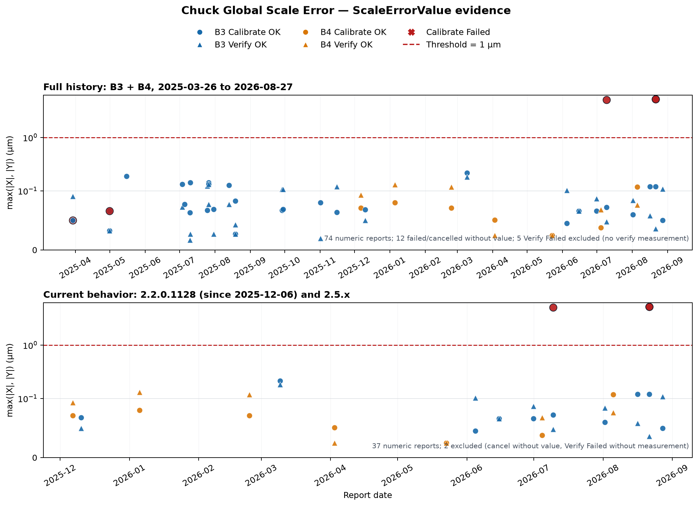

# Chuck Global Scale Error 校准方案验收

## 统计口径

本报告验收对象为[《Chuck Global Scale Error 校准方案》](校准方案.md)。

- **验收日期**：2026-09-07。
- **日志范围**：分析 B3、B4 的全部 91 份运行报告，时间范围 2025-03-26 至 2026-08-27，其中 B3 77 份、B4 14 份。B3 的 77 份含补充归档的 23 份日志（2025-03-26 至 2025-07-05 的早期记录与 2026-08-27 的记录）。早期 B3 报告未记录设备名，后期报告出现 DF70-B03 或 Vela80，因此早期 B3 记录不归入具体设备型号，结论以 B3/B4 日志范围表述。
- **版本口径**：日志实际出现 12 个软件版本，按全局比例是否改为累乘分为两类：当前行为版本为 2.2.0.1128、2.5.1.327、2.5.3.511 与 2.5.3.603；累乘前旧行为版本为 2.1.1.318、2.1.1.328、2.1.0.424、2.1.2.416、2.1.630.0、2.1.0.705、2.1.0.822 与 2.2.0.1015。
  - **部署时点**：按版本行为对照，全局比例改累乘的改动于 2025-12-05 提交，2025-12-06 起随 2.2.0.1128 部署（部署时点经版本行为对照核对，发布说明原记录为 2.5.0.0309）。日志结果字段的格式切换与该时点一致：2025-11-15 及以前的报告使用旧字段（`Applied Scale X/Y`，含 `Reslut Scale Y` 拼写），2025-12-06 起使用新字段（`Applied Scale XY`），佐证上述版本行为划分。
  - **当前行为直接证据**：39 份报告（B3 25 份、B4 14 份），由 2.2.0.1128 的 10 份（2025-12-06 至 2026-03-09，均晚于部署时点）、2.5.1.327 的 2 份、2.5.3.511 的 2 份与 2.5.3.603 的 25 份构成，其中含 17 次 Calibrate OK、17 次 Verify OK、3 次 Calibrate Failed、1 次 Verify Failed 与 1 次 Calibrate Cancel。
  - **旧行为补充**：其余 52 份 2025-11-15 及以前的报告均为累乘前旧行为版本，仅用于补充历史成功分布和失败边界，不用于证明当前实现的累乘方式。
  - **无运行报告版本**：版本对照表中的 2.5.0.0309、2.5.1.0320、2.5.2.0411、2.5.2.0413、2.5.3.0508 与 2.5.3.0601 在当前项目数据范围内没有运行报告，不作单独实测结论。
- **分析单位**：以一份运行报告为单位。连续值采用报告中最终记录的 `ScaleErrorValue`，以 `max(|X|, |Y|)` 汇总两轴误差；该汇总值小于 1 μm 等价于 X、Y 两个分量均严格小于 `(1,1) μm`。早期版本（2.1.1.318、2.1.1.328、2.1.0.424、2.1.2.416）以无括号旧格式（如 `Scale Error Value: 0.050,0.034`）记录同一字段，已按同一口径并入统计；2025-05-15、2025-07-05 两份自动校准报告的校准与验证在同一报告内完成，最终记录值按同规则取值。
- **数值口径**：Verify 为对已保存校准记录的单次重测，不计入校准迭代次数。5 份 Verify Failed 均在重测的测量阶段失败（2025-04-30 两份明场切换超时、2025-05-15 两份模板匹配失败、2026-08-27 一份获取校准结果失败），报告中出现的 `Scale Error Value` 是被验证校准记录的保存值而非验证实测值，因此全量仍无验证失败实测值样本。
- **阈值口径**：80 份带有可解析 Threshold 的报告中 79 份为 `(1,1) μm`，1 份（2025-03-29 失败记录）为 `(0,0) μm` 非生产配置，同会话随后改用 `(1,1) μm` 重试成功；其余 11 份在进入校准阶段前失败或取消的报告没有记录阈值。

## 日志统计与失败分析

全量 91 份运行报告的结果分布如下：

| 指标 | B3 | B4 | 合计 |
|------|---:|---:|---:|
| 运行报告 | 77 | 14 | 91 |
| Calibrate OK | 29 | 7 | 36 |
| Calibrate Failed | 16 | 0 | 16 |
| Calibrate Cancel | 1 | 0 | 1 |
| Verify OK | 26 | 7 | 33 |
| Verify Failed | 5 | 0 | 5 |

### 校准迭代轮次

迭代次数按每份 Calibrate 报告步骤结构中最后一次 `Calibration Times`（新格式）或 `Get Result :Times`（旧格式）记录的轮次统计；未出现该记录的报告记为"未进入迭代"。Verify 为单次重测，不计入校准迭代次数。

| Calibrate 结果 | 未进入迭代 | 1 轮 | 2 轮 | 3 轮 | 5 轮 | 合计 |
|----------------|-----------:|------:|------:|------:|------:|-----:|
| Calibrate OK | 0 | 0 | 20 | 2 | 14 | 36 |
| Calibrate Failed | 10 | 1 | 5 | 0 | 0 | 16 |
| Calibrate Cancel | 1 | 0 | 0 | 0 | 0 | 1 |
| 合计 | 11 | 1 | 25 | 2 | 14 | 53 |

当前行为的 21 份 Calibrate 报告中，20 份执行到第 2 轮（17 份成功、3 份在第二轮获取结果时失败），1 份取消报告未进入迭代。

其余历史版本的 32 份 Calibrate 报告中，19 份成功（14 份执行 5 轮、2 份执行 3 轮、3 份执行 2 轮），13 份失败——10 份失败于进入迭代前（P5、基础模板或定位阶段），1 份失败于第 1 轮，2 份失败于第 2 轮。第 2 轮失败的 2 份中：2025-03-29 一份按当时配置 `(0,0) μm` 判定失败（最终值 `(0.050,0.034) μm`），同会话随后改用 `(1,1) μm` 重试成功；2025-04-30 一份为校准已收敛后（`(-0.066,-0.045) μm`）后续环节失败的快照，与同会话 OK 快照成对。

### 失败与取消

全部失败与取消记录均未形成错误的已校准/已验证结论，按阶段归类如下：

- **P5 对齐与基础模板/定位阶段失败**（历史版本）：2025-03-26 至 2025-04-30 出现 P5 阶段反复重试后失败，以及基础模板/定位阶段失败；2025-07-03 两次、2025-08-13 一次为高倍基础模板/定位阶段失败。报告记录了明场打开失败、模板匹配偏移失败或获取匹配位置失败等信息。
- **Verify 测量阶段失败**（5 份）：2025-04-30 两份明场切换超时（`change mode wait in pos out time`）、2025-05-15 两份模板匹配失败（`Template Match To Offset Failed`）、2026-08-27 一份获取校准结果失败，均发生在测量阶段且未产生验证实测值。
- **迭代获取结果失败**（当前行为 3 份）：2026-07-09 一次、2026-08-21 两次在 Calibration 第二轮获取结果时失败，第一轮已记录的 Y 轴误差分别为 5.048 μm、5.205 μm、5.205 μm，均高于 `(1,1) μm`；失败记录未形成 Calibrate OK，随后同日成功记录完成校准与验证闭环。
- **无后续测量或取消**：2025-11-15 一次报告仅完成 P5、未产生后续测量值且无异常文本；2026-07-09 一次在第 1 步取消。
- **B4 情况**：B4 现有 14 份报告未出现失败或取消，且各次校准后均有 Verify OK。

## 实测值分布

同一测量阶段的有效数值按结果状态分组统计，保留状态标签用于比较正常与失败的重叠、间隔和误拒风险：

| 运行类型与结果 | 数值样本数 | `max(\|X\|,\|Y\|)` 范围（μm） | 中位数（μm） | 最大值（μm） |
|----------------|-----------:|---------------------------:|----------------:|-------------:|
| Calibrate OK | 36 | 0.025～0.215 | 0.069 | 0.215 |
| Verify OK | 33 | 0.017～0.182 | 0.076 | 0.182 |
| Calibrate Failed（有数值） | 5 | 0.050～5.205 | 5.048 | 5.205 |

5 份有数值失败中，3 份为当前行为的第二轮获取结果失败（5.048～5.205 μm）；2 份为旧版本记录（0.050 μm 与 0.066 μm），不属于 `(1,1) μm` 阈值下的校准测量失败（说明见「日志统计与失败分析」）。

图 1：全量实测数值记录及当前行为记录（2.2.0.1128 自 2025-12-06 起、2.5.1.327、2.5.3.511 与 2.5.3.603）的两轴最大误差分布。红色虚线为 `(1,1) μm` 对应的两轴最大误差阈值；红色叉号为 Calibrate Failed 的有数值记录（2025-03-29、2025-04-30 两份低值记录的说明见正文）。全量 74 份报告计入实测值，12 份失败或取消报告无数值，5 份 Verify Failed 未产生验证实测值、不计入；当前行为 39 份中 37 份计入实测值。

## 推荐阈值

推荐校准与验证阈值统一采用 `(1,1) μm`（X、Y 两轴），作为执行参考。理由如下：

- **沿用现行生产配置**：80 份带可解析 Threshold 的运行报告中 79 份实际配置为 `(1,1) μm`；唯一例外为 2025-03-29 一份失败记录的 `(0,0) μm` 非生产配置，该会话随后改用 `(1,1) μm` 重试成功，`(1,1) μm` 是日志中唯一持续使用的生产配置。另有 11 份进入校准阶段前失败或取消的报告未记录阈值。
- **日志实测分布支持**：全量 36 个 Calibrate OK 的两轴最大误差为 0.025～0.215 μm（中位数 0.069 μm），33 个 Verify OK 为 0.017～0.182 μm（中位数 0.076 μm）；3 个阈值判定失败为 5.048～5.205 μm。正常值上限（0.215 μm）与阈值判定失败值下限（5.048 μm）间隔约一个数量级，`(1,1) μm` 高于全部成功值且明显低于失败值，误拒风险低。
- **失败判定一致**：校准阶段的全部判定与当次配置阈值一致——成功记录的最终值均低于当次阈值，阈值判定失败的记录均超过当次阈值（含 `(0,0) μm` 配置的失败及其后的 `(1,1) μm` 重试成功）；未发现「数值超限仍判通过」或「校准数值达标仍判失败」的记录（2025-04-30 的 Failed 快照为校准收敛后后续环节失败，不构成校准判定反例）。

当前 5 份 Verify Failed 均无验证实测值样本；后续出现正常值贴近阈值、新失败值低于阈值或出现带实测值的 Verify Failed 时，按运行日志重新评估。

## 优点

1. **校准—验证闭环有充分运行证据。** 全量记录中有 36 次 Calibrate OK 和 33 次 Verify OK；当前行为证据 39 份报告有 17 次 Calibrate OK 与 17 次 Verify OK（2.2.0.1128 各 5 次、2.5.1.327 与 2.5.3.511 各 1 次、2.5.3.603 各 10 次），B3 的 2026-08-21、2026-08-27 与 B4 的 2026-08-05 均形成完整闭环。全部 36 个校准成功值和 33 个验证成功值均满足两轴误差严格小于 `(1,1) μm`。

2. **正常值分布稳定，且与阈值判定失败值有明显间隔。** 全量 Calibrate OK 的两轴最大误差不超过 0.215 μm，Verify OK 不超过 0.182 μm，两个最大值均出自当前行为证据（B3 2026-03-09）；新补充的 2025-03-26 至 2025-07-05 早期记录与 2026-08-27 记录均落在既有分布内。当前版本 2.5.3.603 的成功记录最大值为 0.120 μm（B3 2026-06 至 2026-08）与 0.118 μm（B4 2026-07 至 2026-08）；当前行为 3 个阈值判定失败值（5.048～5.205 μm，详见「日志统计与失败分析」）与全部成功值间隔约一个数量级。

3. **失败与取消记录覆盖了主要异常边界。** 失败涵盖 P5 对齐、基础模板/定位、迭代获取结果与验证测量等阶段（详见「日志统计与失败分析」），并包含取消与无后续测量记录；全部失败与取消均未形成错误的已校准/已验证结论。B4 在现有 14 份报告中未出现失败或取消，且各次校准后均有 Verify OK。

## 缺点及改进

1. **部分失败报告的根因记录仍不完整。** 2025-11-15 的 1 次失败报告没有异常文本，无法从现有记录确认具体原因；2025-04-30 的 1 份 Failed 快照内容止于校准收敛，未记录其后触发失败的环节信息；2026-07-09、2026-08-21 的 3 次校准失败与 2026-08-27 的验证失败仅记录 `Get Calibration Result Failed!`，未进一步区分具体方向、匹配对象或设备侧原因。建议后续报告至少记录失败阶段、方向、迭代次数、匹配得分、轴向结果和取消来源，避免仅凭顶层 Failed 判断原因。

2. **结果生效链条的独立证据不足。** 现有报告能证明软件产生了 AppliedScaleXY、完成了 Calibrate/Verify 判定，但没有控制器独立回读、掉电保持或下游重新加载的证据，也没有长期稳定性、重复性或外部标准件对照数据。建议后续补充控制器回读与恢复校验，并在设备或软件版本变化时重新核对。

3. **失败样本量有限，Verify Failed 仍无实测值样本。** 当前行为 3 个校准失败值均为 2.5.3.603、集中在 B3、同一类第二轮获取结果失败；5 份 Verify Failed 均在测量阶段失败、无验证实测值，因此仍无法由现有日志评价验证失败实测值与正常值的边界。2026-08-27 出现验证测量失败后约 1 分钟重测成功的记录，说明验证通过还依赖测量链路（明场切换、模板匹配、位置获取）的稳定性，而不仅是阈值判定；后续应持续观察正常值贴近阈值、新失败值低于阈值或出现带实测值的 Verify Failed 时的分布变化。

## 结论

验收结论：**通过（限定范围）**。

在 B3、B4 2025-03-26 至 2026-08-27 的 91 份运行记录中，Calibrate OK 36 份、Verify OK 33 份，通过理由如下：

- **判定符合方案要求**：全部成功记录的两轴 `ScaleErrorValue` 均严格小于 `(1,1) μm`；校准阶段失败判定与当次配置阈值一致，5 次 Verify Failed 均在测量阶段失败、未产生错误的已验证结论。
- **闭环证据充分**：当前行为证据 39 份报告形成 17 个校准—验证闭环（2.2.0.1128 自 2025-12-06 起、2.5.1.327、2.5.3.511、2.5.3.603），其中 B3 2026-08-21、2026-08-27 与 B4 2026-08-05 均为完整闭环。
- **阈值有区分间隔**：推荐校准与验证阈值 `(1,1) μm`，作为执行参考；正常值（成功两轴最大误差不超过 0.215 μm）与阈值判定失败值（不低于 5.048 μm）间隔约一个数量级。
- **失败与取消可辨识**：失败与取消记录覆盖 P5 对齐、基础模板/定位、迭代获取结果与验证测量等主要异常边界，未形成错误的已校准/已验证结果。

结论适用范围：B3、B4 在上述日志范围与版本范围内的运行记录；推荐校准与验证执行参考阈值为 `(1,1) μm`。
