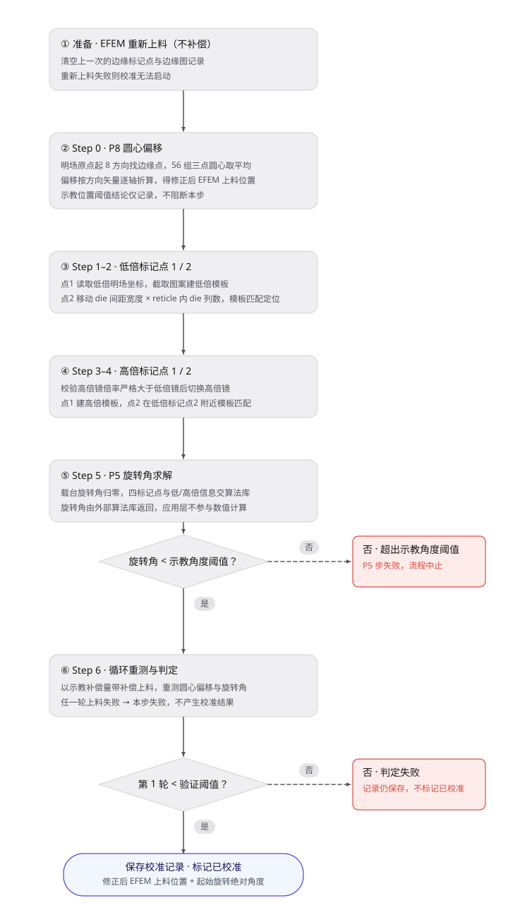
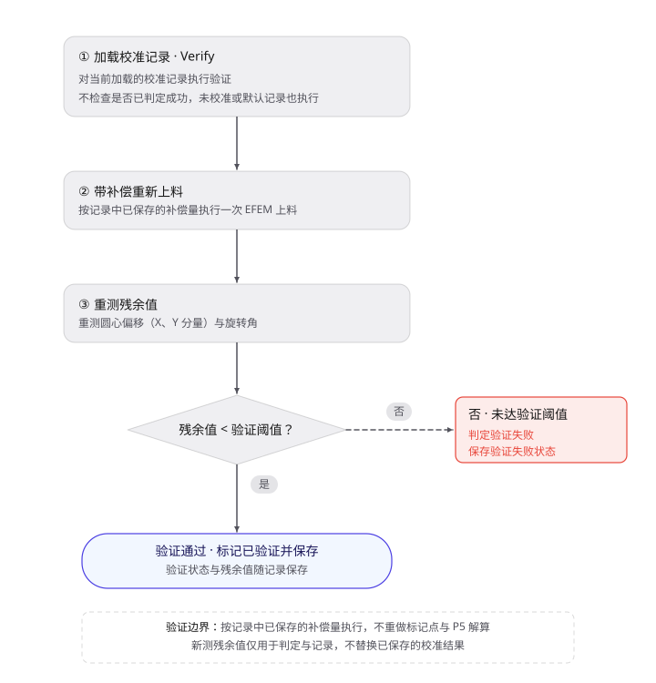

# Chuck Prealigner to Stage 校准方案

## 1. 校准的目的

检测设备通过 EFEM（设备前端模块）的 Prealigner 完成晶圆上下料：Prealigner 把晶圆从载具取出、找到缺口并粗定位后，放到Chuck上。由于 Prealigner 机械示教存在系统偏差，晶圆落台后其中心与Chuck中心不重合，产生位置偏移；同时，晶圆缺口（notch）朝向相对理想方向也存在旋转角偏差。

本校准测量 EFEM 上料动作的系统偏差，输出两项补偿量并下发给 Prealigner 使用：

- 修正后的 EFEM 上料载台位置（X、Y 两个坐标），用于消除放置后的中心偏移；
- 上料时Chuck的起始旋转绝对角度，用于消除放置后的旋转角偏差。

补偿生效后，每次 EFEM 上料时 Prealigner 都会按补偿量修正放置位置与起始角度，使晶圆以中心对齐、角度归正的状态落在Chuck上。

校准的测量对象是 ChuckModel 明场对准下晶圆上按已知 die 间距规则排布的重复图案，以及晶圆边缘轮廓。测量结果按高倍镜记录，保存为 Chuck Prealigner to Stage 校准记录。

## 2. 校准方法

### 2.1 校准原理

校准分两个相互独立的分量分别求解：中心偏移与旋转角。

**中心偏移采用 P8（8 点拟合圆）方法。** 三点可确定一个圆，故以晶圆大致中心（Chuck中心，即明场原点）为基准，先计算晶圆圆周上等分的 8 个方向并沿各方向找到晶圆边缘点，再从 8 个边缘点中任取 3 点确定一个圆心，共 C(8,3)=56 种组合，对 56 个圆心取平均得到晶圆中心，该中心相对Chuck中心的偏差即为圆心偏移。采用 8 点（而非最少 3 点）并对全部组合取平均，是为了抑制单个边缘点误差对圆心拟合的影响。

**旋转角采用 P5（双倍率对准）方法。** 晶圆上的 die 图案沿规则栅格重复，在低倍镜和高倍镜下各标记相邻两个 die 上同一图案的位置（低倍两点、高倍两点，共四个标记点），由四点的位置关系解算晶圆相对Chuck的旋转角。同一图案在相邻 die 上的两点连线方向代表晶圆的栅格取向，该取向相对Chuck坐标轴的夹角即旋转角偏差。旋转角的精确解算由外部算法库完成：应用层把四个标记点与低、高倍镜信息交给算法库的对准校验接口，接收其返回的旋转角，应用层不参与数值计算。

组合使用低倍镜与高倍镜完成标记。倍率越高，位置精度越高、视野越小，故先用低倍镜保证图案进入视场，再切高倍镜精确定位。具体分工如下：

- 先低倍定位：低倍镜视野大，便于在视场内找到有特征的图案，并确定相邻 die 的预期位置；
- 再高倍精确定位：高倍镜 μm/pixel 数值小、标记精度高，在同一图案处精细确定坐标。

本校准不依赖独立外部标准器，所用已知量均来自晶圆设计与既有校准：

- die 间距宽度与 reticle 内 die 列数用于确定低倍标记点2的预期位置（在 X 方向移动一个 reticle 宽度）；
- 晶圆半径是晶圆设计参数，界定有效的测量区域；
- 像素尺寸（PixelSize，单位 μm/pixel）把模板匹配得到的像素位移换算为载台位移；所用倍镜没有已验证的像素尺寸时，回退到相机像元 3.45 μm 除以放大倍率的理论值并记录警告。

判据分两级容差：示教阶段用示教位置阈值与示教角度阈值判断示教质量；最终判定与验证阶段用验证位置阈值与验证角度阈值判断补偿后残余偏差是否达标。两级容差分离，是因为示教阶段允许的原始偏差范围较大，而补偿后残余偏差的验收范围应更严格。

### 2.2 前置条件

- 已完成的依赖校准：PixelSize（模板匹配的位置换算）、Chuck相关校准（gantry、global scale、center and theta scale 等）。ChuckModel 明场对齐参数可用。

## 3. 校准步骤与数据处理

校准流程共 7 步：**圆心偏移 → 低倍标记点1 → 低倍标记点2 → 高倍标记点1 → 高倍标记点2 → P5（旋转角求解）→ 校准结果**。完成校准并保存后，在验证（Verify）流程中复核结果。

校准开始时，先清空上一次的边缘标记点与边缘图记录，并要求通过 EFEM 重新上料一次（不施加补偿），确保后续测量反映一次实际 EFEM 上料动作的原始偏差。重新上料失败则校准无法启动。

示教（Calibrate）主流程如下图所示：

### 3.1 Step 0：圆心偏移

1. 把载台移到明场原点（Chuck中心，即晶圆大致中心）。以该中心为基准，计算晶圆圆周上等分的 8 个方向，沿各方向找到 8 个晶圆边缘点。
2. 由 8 个边缘点拟合圆，得到晶圆中心，其相对Chuck中心的偏差记录为圆心偏移（X、Y 两个分量），并保存 8 张边缘点图像。
3. 读取当前 EFEM 上料载台的机械位置，按载台方向矢量将实测偏移折算后从该位置中扣除，得到修正后的 EFEM 上料载台位置。逐轴计算，记机械位置、方向矢量、圆心偏移分别为 E、D、O（各含 X、Y 分量）：

$$\text{修正后位置}_X = E_X - D_X \times O_X,\qquad \text{修正后位置}_Y = E_Y - D_Y \times O_Y$$

方向矢量的各分量通常为 ±1，由设备坐标系统给定，用于把明场坐标系下实测的圆心偏移折算为机器运动方向上的位移。
4. 用示教位置阈值判断本次实测偏移是否落在示教容差内，并把结论记入报告；该结论是示教质量提示，不阻断本步。

### 3.2 Step 1–2：低倍标记点

Step 1：读取当前低倍镜明场坐标作为低倍标记点1，在视场中心按设定的模板尺寸截取图案生成低倍模板，并记录该标记点的坐标与模板。

Step 2：低倍标记点2与标记点1是相邻 reticle 上图案相同的两个位置。按 die 间距宽度与 reticle 内 die 列数的乘积计算相邻 reticle 在 X 方向的距离，移动到该位置附近，用低倍标记点1的模板做一次模板匹配，精确定位后得到低倍标记点2。

### 3.3 Step 3–4：高倍标记点

Step 3：校验高倍镜倍率严格大于低倍镜后，切换到高倍镜，在低倍标记点1附近读取高倍精细坐标作为高倍标记点1，生成高倍模板并记录。

Step 4：高倍标记点2与标记点1是同一图案在高倍镜下的精细位置。在低倍标记点2附近用高倍标记点1的模板做一次模板匹配，精确定位后得到高倍标记点2并记录。

### 3.4 Step 5：P5（旋转角求解）

1. 把载台旋转角归零。
2. 用低倍、高倍共四个标记点执行对准校验，解算晶圆相对Chuck的旋转角并记录。对准校验由外部算法库完成：应用层仅传入四个标记点与低、高倍镜信息，接收算法库返回的旋转角，精确解算在算法库内部进行，应用层不参与数值计算。
3. 用示教角度阈值判断旋转角是否落在示教容差内，超出则本步失败；通过后将该旋转角记入校准结果项。

### 3.5 Step 6：校准结果

1. 以 Step 0 的圆心偏移与 Step 5 的旋转角作为示教补偿量，按重复次数循环执行：
   - 每轮通过 EFEM 按补偿量重新上料一次（上料时应用该补偿的位置与角度）；
   - 重新测量圆心偏移与旋转角，得到本轮补偿后的残余值，并逐轮收集。
2. 取第 1 轮重测的残余值进行判定：若圆心偏移 X、Y 分量的绝对值均小于验证位置阈值，且旋转角绝对值小于验证角度阈值，则判定校准成功并标记为已校准；否则判定失败。
3. 当重复次数不少于 3 时，对各轮圆心偏移的 X、Y 分量与旋转角做窗口为 3 的滑动平均并绘图展示，用于观察逐轮趋势，该结果不参与成败判定。
4. 保存校准记录：以修正后的 EFEM 上料载台位置与上料时Chuck的起始旋转绝对角度作为校准结果，按高倍镜关联保存，同时保存示教值与各轮重测残余值；保存成功后按上述判定标记是否已校准。
5. 循环中任一轮重新上料失败，本步即失败，不产生已校准结果。

### 3.6 Verify（验证）

验证流程如下图所示：

1. 对当前加载的校准记录执行验证；不检查该记录是否已判定成功，未校准或默认记录也会执行实际验证。
2. 按该记录的示教补偿量重新上料一次，并重新测量圆心偏移与旋转角，得到验证残余值。
3. 比较圆心偏移 X、Y 分量的绝对值是否均小于验证位置阈值，以及旋转角绝对值是否小于验证角度阈值；全部满足则标记验证通过并保存，否则判定失败。
4. 验证按所选记录中已保存的补偿量上料，新测得的残余值仅用于判定与记录，不替换已保存的校准结果。

### 3.7 校准结果

| 内容 | 说明 |
| ---- | ---- |
| 圆心偏移 | X、Y 分量，示教测得 |
| 旋转角 | 示教测得 |
| 修正后的 EFEM 上料载台位置 | 由 EFEM 上料位置按偏移折算 |
| 起始旋转绝对角度 | 校准后 EFEM 上料时Chuck起始角度 |
| 各轮重测值 | 按重复次数补偿后重测的圆心偏移与旋转角 |
| 校准结果 | 低倍/高倍镜信息、是否已校准、是否已验证 |
| Verify 结果 | 验证重测的圆心偏移、旋转角与判定状态 |

校准结果以修正后的 EFEM 上料载台位置与上料时Chuck的起始旋转绝对角度作为下游使用的补偿量，按高倍镜关联并保存。

## 4. 验收判定与异常处理

### 4.1 验收判据

| 项目 | 判据 |
| ---- | ---- |
| 校准流程 | 初始上料、圆心拟合、镜头选择、模板建立、模板匹配、Step 6 各轮重新上料均成功 |
| 示教角度 | P5 解算的旋转角绝对值小于示教角度阈值 |
| 校准判定 | 第 1 轮重测的圆心偏移 X、Y 分量绝对值均小于验证位置阈值，且旋转角绝对值小于验证角度阈值 |
| 校准保存 | 校准记录保存成功 |
| Verify 判定 | 验证重测的圆心偏移 X、Y 分量绝对值均小于验证位置阈值，且旋转角绝对值小于验证角度阈值 |
| Verify 保存 | 验证状态保存成功 |

### 4.2 异常处理

| 异常 | 行为与结果 |
| ---- | ---- |
| 初始重新上料失败 | 校准无法启动 |
| 边缘点不足或圆心拟合失败 | 圆心偏移步骤失败 |
| 模板生成失败 | 本步失败 |
| 模板匹配失败 | 本步失败；记录匹配失败与相关图像 |
| 像素尺寸缺失或未验证 | 不阻止匹配，使用理论像素尺寸并记录警告 |
| 示教旋转角超出示教角度阈值 | P5 步失败 |
| 补偿后重新上料失败 | 本步失败；循环中任一重新上料失败即失败 |
| 示教偏移或角度超出阈值（重新上料前检查） | 重新上料失败 |
| 校准判定未达标 | 判定失败，不标记为已校准 |
| Verify 数值超出验证阈值 | 保存验证失败状态 |
| 中途取消 | 报告标记为取消，流程停止 |

## 5. 记录与周期

### 5.1 记录内容

- 校准记录：低倍/高倍镜信息、圆心偏移、旋转角、修正后的 EFEM 上料载台位置、起始旋转绝对角度、各轮重测值、是否已校准和是否已验证。
- 执行参数：die 间距宽度、reticle 内 die 列数、晶圆半径、模板类型、低倍/高倍镜、示教位置/角度阈值、验证位置/角度阈值、重复次数。
- 图像文件：8 张晶圆边缘点图像、低倍与高倍模板、模板匹配结果图；匹配失败时保存错误图像及诊断信息。
- Verify 结果：验证重测的圆心偏移、旋转角与判定结果。
- HTML Calibrate / Verify 报告：记录镜头、结果和状态。

### 5.2 复校时机

未定义固定的日历周期，按设备状态和事件触发复校：

- EFEM Prealigner、上料机械臂或相关传动结构拆装、维修、调整后；
- 明场相机、低倍镜或高倍镜更换、调校后；
- Chuck相关校准（gantry、global scale、center and theta scale 等）或像素尺寸发生变化后；
- 配方参数（die 间距、晶圆尺寸、上料方式）变化后；
- 上料后晶圆中心或角度偏差超限，或 Verify 失败、已排除对焦、模板、图案位置和设备通信问题后。

每次复校应完成“校准保存 + Verify”闭环。仅完成示教而未保存校准记录，不能作为有效校准结果使用。

## 6. 当前状态与未来优化方向

- **当前状态**：已release，运行多次无异常。
- **优化方向**：
  - 校准成败只由第 1 轮重测值判定，其余轮次仅用于趋势展示；可考虑多轮综合判定的方式，提高对单次异常的鲁棒性。
  - P8 圆心拟合（8 点取 C(8,3)=56 组平均）在外部算法库内完成，报告只记录最终圆心，无法追溯各组合结果；如需诊断个别边缘点异常，可考虑补充中间量记录。