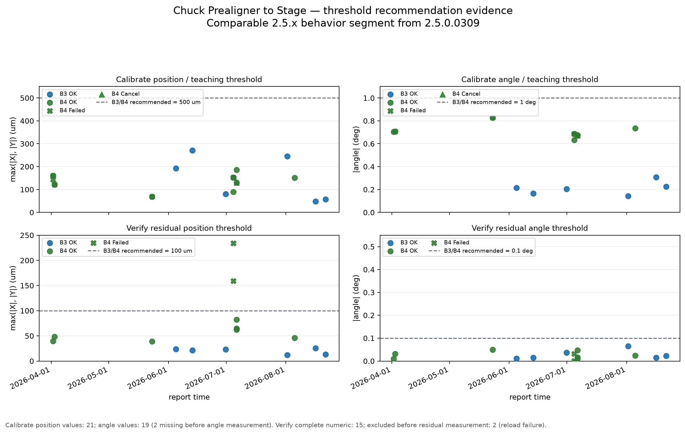

# Chuck Prealigner to Stage 校准方案验收

## 统计口径

- **验收日期**：首次验收于 2026-09-01 完成。
- **验收对象与日志范围**：DF70-B03和 DF70-B04，现有生产记录共 165 份，B3 83 份、B4 82 份，覆盖 2025-06-07 至 2026-08-21。
- **版本口径**：重点核对当前源码快照对应的 2.5.3.603 行为。按版本对照，2.5.0.0309 之后的 2.5.x 版本属于同一 Prealigner 行为段，可作为数值对比范围；更早版本仅用于补充失败边界。
- **分析单位**：状态与失败分类以报告为单位；数值分析以包含完整位置和角度的 Verify 报告为单位。部分报告包含此前重试内容，报告数不等于独立测量样本数，也不将报告状态比例直接作为设备良率。

全量报告状态如下：

| 设备 | Calibrate OK | Calibrate Failed | Calibrate Cancel | Verify OK | Verify Failed | 合计 |
|---|---:|---:|---:|---:|---:|---:|
| B3 | 26 | 15 | 0 | 24 | 18 | 83 |
| B4 | 18 | 36 | 1 | 15 | 12 | 82 |
| 合计 | 44 | 51 | 1 | 39 | 30 | 165 |

- **当前版本记录**：2.5.3.603 的直接记录为 26 份：B3 10 份（Calibrate 5 OK、Verify 5 OK），B4 16 份（Calibrate 5 OK、2 Failed、1 Cancel；Verify 4 OK、4 Failed）。B3 记录日期为 2026-06-04 至 2026-08-21，B4 记录日期为 2026-07-04 至 2026-08-05。
- **可比行为段记录**：按行为边界，2.5.0.0309 之后的 2.5.x 版本共有 17 份 Verify 记录，实际包含 2.5.1.320、2.5.1.327、2.5.3.511 和 2.5.3.603，其中 15 份有完整数值、2 份在重新上料阶段失败。日志中没有 2.5.0.0309 本身的记录；3.0.0.0 版本号虽更大，但属于更早的初始化版本，时间上早于该行为边界，不纳入本组。

## 失败原因

对 82 份非 OK 报告，按报告内可辨识的主要终态互斥归类，同一报告中的多个异常或重试不重复计数；无法从报告确定根因的记录单列，不强行推断。

| 主要终态 | 份数 | 日志证据表现 |
|---|---:|---|
| EFEM 重新上料失败 | 21 | `ReloadWafer Failed` 或 `Please Reload Wafer` |
| 标记点/模板匹配失败 | 16 | 明确记录 match site、搜索点或匹配分数失败 |
| P8 边缘取图/圆心测量异常 | 11 | `get image error`、索引越界或圆心测量调用异常 |
| P5 残余角异常 | 4 | 明确记录 residual angle 过大 |
| P5 示教角度阈值失败 | 4 | 明确记录 P5 结果超示教角度阈值 |
| 校准阶段失败，仅有步骤级线索 | 6 | 报告只保留步骤级失败标记，正文没有更具体根因 |
| Verify 数值判定失败 | 3 | 完整数值中至少一个位置分量超过验证阈值 |
| 校准结果保存失败 | 2 | 明确记录保存返回失败的异常 |
| 取消 | 1 | 报告明确标记为取消 |
| 未记录具体原因 | 14 | 只有 Failed 状态，没有可复核的终态原因 |
| 合计 | 82 |  |

## Verify 数值

全量记录中有 42 份 Verify 报告同时包含完整的圆心偏移、旋转角和验证阈值，其中 39 份 OK、3 份 Failed。逐份按方案规定的严格小于关系复算，状态与数值判定全部一致：OK 记录均满足位置和角度阈值，Failed 记录至少一个位置分量超限。

按可比行为段，有 15 份完整数值 Verify 记录和 2 份在重新上料阶段失败、未产生最终验证数值的报告，各版本分布如下：

| 可比版本 | B3 完整数值 Verify | B4 完整数值 Verify | 合计 |
|---|---:|---:|---:|
| 2.5.1.320 | 0 | 1 OK | 1 |
| 2.5.1.327 | 0 | 1 OK | 1 |
| 2.5.3.511 | 1 OK | 1 OK | 2 |
| 2.5.3.603 | 5 OK | 4 OK / 2 Failed | 11 |
| 合计 | 6 | 9 | 15 |

| 分组 | 完整数值报告 | 判定结果 | 最大位置分量 max(\|X\|,\|Y\|) | 最大角度绝对值 |
|---|---:|---|---:|---:|
| B3 | 6 | 6 OK | 59.40 μm | 0.065388° |
| B4 OK | 7 | 7 OK | 82.36 μm | 0.049068° |
| B4 Failed | 2 | 2 Failed | 234.05 μm | 0.031745° |

B4 的两份当前版本数值 Failed 均来自 2026-07-04，位置分别为 `(-158.97, -54.66) μm` 和 `(-234.05, -17.76) μm`，验证位置阈值为 100 μm，角度均未超 0.1°。另外两份同日 Verify 在 EFEM 重新上料阶段失败，没有位置或角度结果，未作为零值或通过样本计入。

## 阈值建议

以下建议针对 2.5.0.0309 之后的 2.5.x 可比行为段，判定关系仍按方案规定的严格小于（`<`）执行。校准阈值是补偿前的示教门槛，Verify 阈值是补偿后残余量的最终门槛，二者不应设置为同一层级。

| 设备 | 校准/示教位置阈值 | 校准/示教角度阈值 | Verify 位置阈值 | Verify 角度阈值 |
|---|---:|---:|---:|---:|
| B3 | **500 μm** | **1.0°** | **100 μm** | **0.1°** |
| B4 | **500 μm** | **1.0°** | **100 μm** | **0.1°** |

校准/示教阈值建议两台设备统一沿用 500 μm / 1.0°。可比行为段 21 份位置值、19 份角度值均在限内（B3 最大 270.43 μm / 0.306357°，B4 最大 185.36 μm / 0.827237°），B3 曾用的 300 μm / 0.7° 不作统一门槛。此建议仅沿用现行门槛。

Verify 阈值建议统一为 100 μm / 0.1°。可比行为段 15 份完整数值中，OK 最大位置 82.36 μm、最大角度 0.065388°，Failed 最小位置 158.97 μm，100 μm 落在两者之间。B4 曾用 0.5°，但失败都源于位置超限，角度没有放宽的必要，故统一取 0.1°。

图 1 上排展示补偿前校准/示教测量值与两台设备统一的 500 μm / 1.0°建议门槛，下排展示补偿后 Verify 残余值与统一的 100 μm / 0.1°建议门槛；点的颜色表示设备，形状保留报告状态。图中校准位置 21 份、校准角度 19 份，Verify 完整数值 15 份；缺少角度或 Verify 残余值的报告没有补成零值。

## 优点

1. **当前版本已有可复核的生产闭环证据。** B3 在 2026-06-04、2026-06-30、2026-08-01、2026-08-16 和 2026-08-21 均出现 Calibrate OK 后 Verify OK 的记录；B4 在 2026-07-06 和 2026-08-05 出现 Calibrate OK 与 Verify OK 的连续记录。B4 2026-07-06 的一次 5 轮重测中，五轮位置各分量均小于 100 μm、角度均小于 0.1°，日志还记录了位置滑动平均 `(-7.932, 27.329) μm` 和角度平均 `0.013659°`，支持补偿后残余量在该次运行内保持稳定。

2. **Verify 判定具有可复算性。** 可比行为段的 13 份 OK 数值记录全部在当次阈值内，2 份 B4 失败记录均因 X 方向超过当次位置阈值被拒绝；历史 42 份完整 Verify 数值也全部与报告状态一致，未发现"数值超限仍标记通过"或"数值满足仍标记失败"的记录。

3. **失败不会被统一吞并为成功。** 全量记录能区分重新上料、标记点匹配、P8 取图/圆心测量、P5 角度、保存和 Verify 数值等不同终态；当前版本中重新上料失败的 Verify 没有被当作零误差继续判定。

4. **方案对当前运行时配置边界已有如实说明。** B3 当前记录使用验证位置/角度阈值 100 μm/0.1°；B4 记录出现 100 μm/0.1° 与 100 μm/0.5° 两种配置，方案没有将其误写为统一的设备固定值。

## 缺点及改进

1. **失败追溯仍不完整。** 全量 82 份非 OK 报告中有 14 份没有可复核的具体根因；当前版本 B4 2026-07-04 还有两份 Calibrate Failed 报告，步骤树基本完成但未给出清晰的最终失败原因。建议每次运行写入唯一运行号、最终步骤、最终状态、异常类型和终态原因，并避免用累计重试内容覆盖当前运行的终态。

2. **Calibrate 与 Verify 的关联信息不足。** Calibrate 报告状态不能单独证明补偿已经验证生效：B4 2026-07-04 的校准后续出现位置超限 Verify 失败和重新上料失败；现有报告缺少稳定的校准记录标识及 `IsCalibrated`/`IsVerified` 最终字段，难以对每个报告建立严格的一对一闭环。建议记录保存后的校准记录标识、`IsCalibrated`、`IsVerified`、实际加载记录和对应 Verify 运行号；在完成 Calibrate 保存与 Verify 之前，不将 Calibrate-only 结果作为可用闭环。

3. **可比行为段的完整 Verify 数值样本有限。** 样本为 15 份，其中当前版本贡献 11 份、较早的同一行为段贡献 4 份；B3 主要是单轮记录，B4 只有一次 5 轮连续重测和一次 2 轮重测。这足以支持当前记录范围内的继续使用，更长周期的计量学性能及未覆盖的配方、倍镜组合、晶圆类型需在后续闭环中确认。建议在设备、配方、镜头、依赖校准或软件版本变化后重新观察 Calibrate + Verify 闭环，并持续收集失败前后的完整数值。

4. **P8/P9 圆心拟合的 56 组中间结果未进入验收记录。** 当前图 1 展示的是 56 组圆心的平均值，不能替代每次运行的拟合离散性证据。建议由圆心计算接口或日志补充每次运行的 56 个圆心（至少 `stdX`、`stdY`，并带运行号、单位和标准差口径），再增加按运行展示 std 的图；在此之前，不应据最终平均值判断拟合内部稳定性。

## 结论

验收结论：**通过（限定范围）**。

在 DF70-B03（Vela80）和 DF70-B04、ChuckModel 明场对准、当前记录覆盖的 5X→50X、D300 及 2.5.0.0309 之后的 2.5.x 软件行为范围内，现有生产日志支持该方案继续使用，通过理由如下：

- **判定可复算**：可比行为段的 15 份完整数值 Verify 报告中，13 份 OK 均满足当次位置与角度阈值，2 份 B4 失败记录均因 X 方向位置分量超出当次验证位置阈值（100 μm）被拦截；全量 42 份完整 Verify 数值与报告状态逐份复算也全部一致，未发现"数值超限仍标记通过"或"数值满足仍标记失败"的记录。
- **失败保持可辨识**：82 份非 OK 报告可按重新上料、标记点/模板匹配、P8 取图/圆心测量、P5 角度、保存和 Verify 数值等主要终态归类；重新上料失败的 Verify 未被当作零误差继续判定。
- **闭环证据充分**：当前版本 2.5.3.603 在 B3 有 2026-06-04、2026-06-30、2026-08-01、2026-08-16、2026-08-21 五次 Calibrate OK 后 Verify OK，B4 有 2026-07-06、2026-08-05 连续闭环；其中 B4 2026-07-06 的 5 轮重测各分量均小于 100 μm、角度均小于 0.1°。
- **阈值有区分间隔**：统一沿用校准/示教 500 μm / 1.0°、Verify 100 μm / 0.1°；可比行为段正常值均在其内（OK 最大位置分量 82.36 μm、最大角度绝对值 0.065388°），与失败值（最小位置分量 158.97 μm）之间保留可见区分间隔。

本结论适用于上述设备、对准方式、倍镜组合、晶圆类型与软件行为范围内的补偿主流程；只有完成"校准保存 + Verify"闭环的记录才视为已确认可用。后续出现正常 Verify 值接近阈值、新的失败值低于现行阈值，或设备、配方、依赖校准、镜头和软件版本发生变化时，补充闭环记录并重新评估。
