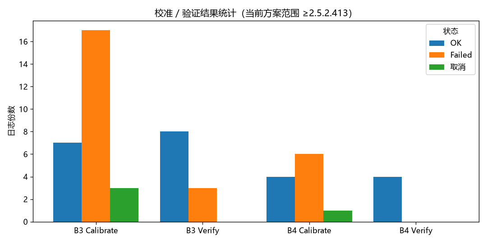
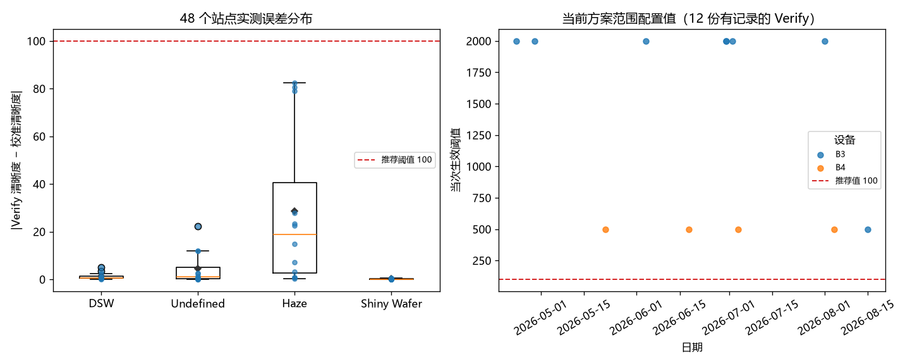
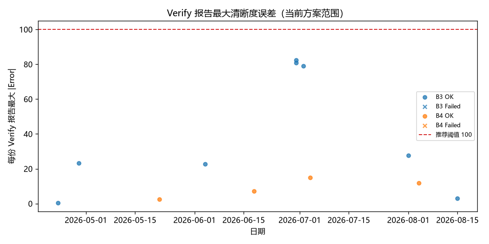
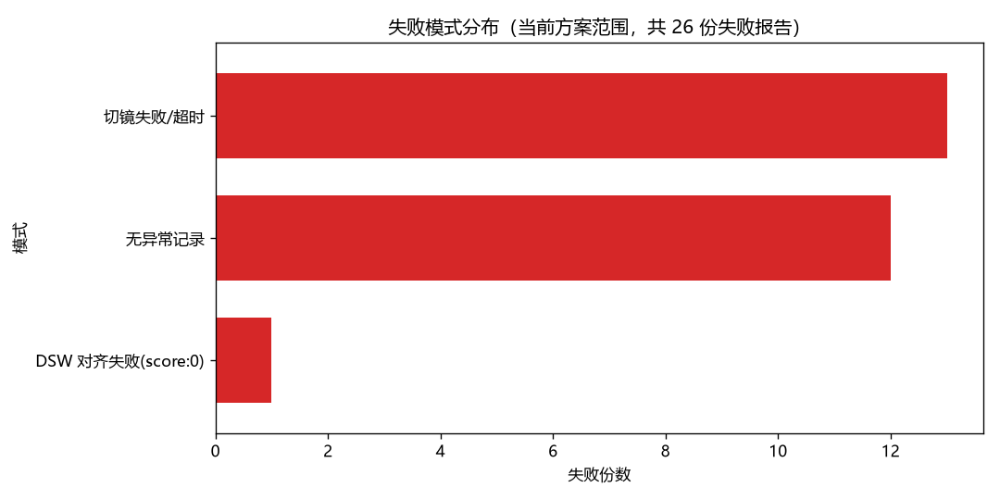

# Microscope CalChip 校准方案验收

## 统计口径

- **日志范围**：共 275 份 HTML 报告，DF70-B03（B3，后期名称为 Vela80）205 份、DF70-B04（B4）70 份，日期为 2025-07-05 至 2026-08-15。
- **当前行为范围**：以 2.5.2.0411 引入的 OM 曲线零点法、清晰度验证和 DSW 对齐为基线；直接证据取版本 2.5.2.413、2.5.3.511、2.5.3.603 的 53 份报告，B3 38 份、B4 15 份，均使用 50X。其余 222 份仅用于历史边界和失败演变，不混入当前结论。
- **结果统计**：

| 设备 | Calibrate OK | Calibrate Failed | Calibrate 取消 | Verify OK | Verify Failed |
|---|---:|---:|---:|---:|---:|
| DF70-B03 | 7 | 17 | 3 | 8 | 3 |
| DF70-B04 | 4 | 6 | 1 | 4 | 0 |
| **合计** | **11** | **23** | **4** | **12** | **3** |

*图 1 用于说明两台设备在当前行为范围内的成功、失败和取消覆盖。*

- **阈值证据**：12 份 Verify OK 记录了四种晶圆模型的完整误差，共 48 个实测值；3 份 Verify Failed 没有可解析的四站点误差。当前记录的 `Quality Threshold` 为 500（5 次）和 2000（7 次），但实际测量最大误差为 82.466，100 可覆盖 48/48 个实测值并保留 17.534 余量；按严格的 `|误差| < 阈值` 判定，12/12 份有数值 Verify OK 复算通过。`Quality Threshold = 100` 作为当前生产执行参考值，可直接采用。

*图 2 用于支撑 48 个实测误差、历史配置和 `Quality Threshold = 100` 执行参考之间的关系。*
- **版本边界**：旧版本字段和判定逻辑不同，不与当前分布合并；旧版本曾出现 2942.184 和 1868.367 的异常边界，不用于推导当前推荐值。

*图 3 用于说明当前与历史 Verify 误差的时间变化及 100 的适用边界。*

## 优点

1. **当前行为在两台设备上有重复运行证据。** 当前范围包含 11 次 Calibrate OK 和 12 次 Verify OK，覆盖 DF70-B03、DF70-B04 及三个当前行为版本；48 个有效站点误差全部小于 100。

2. **未发现错误放行证据。** 23 份 Calibrate Failed、3 份 Verify Failed 和 4 份取消报告均保留失败或取消状态；当前范围内未见失败结果形成完整“已校准已验证”状态。

## 缺点及改进

1. **失败原因和失败测量值记录不完整。** 当前范围 26 份失败报告中，13 份首个可识别异常为切镜失败/超时，1 份为 DSW 对齐失败，12 份没有可识别异常；这按首个可识别异常分类，不能把文本命中数相加为独立事件。3 份 Verify Failed 也没有四站点误差值。应记录失败阶段、异常文本、重试结果和已产生的数值字段。

   

   *图 4 用于支撑失败原因分类及“未记录具体原因”所占的证据边界。*

2. **DSW 对齐角度不参与 Verify 判定。** 当前逻辑只记录校准角度，不对复验角度差设置容差。应评估角度漂移与误定位风险，并补充可追溯字段。

3. **复校原因和计量学证据不足。** 日志未记录复校触发原因；现有证据也不能证明独立标准件精度、重复性、长期稳定性、测量不确定度或失败值与 100 之间的间隔。应记录复校原因、变更对象和前后验证结果；如需精度声明，另行建立标准件溯源和受控验证。

## 结论

**结论：通过。** 在 DF70-B03、DF70-B04、50X、版本 2.5.2.413 及以上的当前行为范围内，现有日志支持 CalChip 主流程继续使用，`Quality Threshold = 100` 可作为当前生产执行参考值直接采用。

本结论不外推到其他设备、倍镜、参数组合或旧版本，也不代表已完成计量学精度、重复性、长期稳定性、测量不确定度或失败值间隔验证。后续观察正常值接近 100、新 Failed 值低于 100、无数值失败重复出现、设备/版本变化或生产质量反馈，达到触发条件时重新评估。
