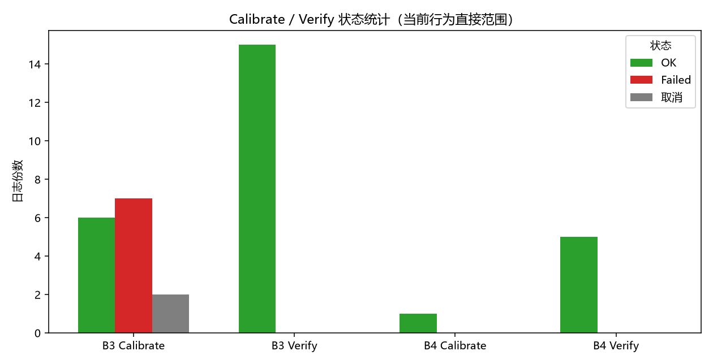
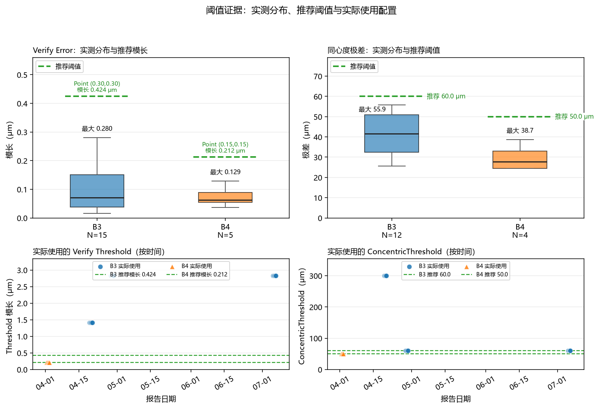

# Microscope Centricity 校准方案验收

## 统计口径

- **日志范围**：B3 125 份、B4 32 份，共 157 份 HTML 报告，日期为 2025-06-11 至 2026-07-06。按报告统计，不等于独立运行数。
- **当前行为范围**：版本 2.5.1.327、2.5.2.413、2.5.3.603，共 36 份；排除 3.0.0.0 初始化版本及更早版本。当前范围 Calibrate OK / Failed / Cancel = 7 / 7 / 2，Verify OK / Failed = 20 / 0。
- **实测值**：当前范围有 20 个 Verify Error 模长和 16 个同心度极差，均来自 OK 报告；没有可纳入当前分布的 Failed 数值。Verify 按欧氏模长严格小于阈值判定，同心度按极差小于等于阈值判定。

| 日志范围 | Calibrate OK | Calibrate Failed | Cancel | Verify OK | Verify Failed |
|---|---:|---:|---:|---:|---:|
| 全量 B3（125 份） | 17 | 28 | 5 | 60 | 15 |
| 全量 B4（32 份） | 4 | 8 | 0 | 19 | 1 |
| 当前行为（36 份） | 7 | 7 | 2 | 20 | 0 |

*图 1 用于说明全量日志与当前行为范围的成功、失败和取消覆盖。*

当前生产日志的执行参考如下；20 个 Verify Error 和 16 个同心度结果按对应设备参考值复算均通过。

| 项目 | B3 执行参考 | B4 执行参考 |
|---|---:|---:|
| Verify Threshold | `(0.30, 0.30)` | `(0.15, 0.15)` |
| ConcentricThreshold | 60 μm | 50 μm |

实际报告中的配置存在多档：B3 Verify 为 `(1,1)` 5 次、`(2,2)` 10 次，同心度为 60 μm 8 次、300 μm 4 次；B4 Verify 为 `(0.15,0.15)` 5 次，同心度为 50 μm 4 次。上述为当次记录，不等同于批准默认值。当前实测 Verify 模长最大值为 0.28018 μm，同心度极差最大值为 55.86519 μm。

*图 2 用于支撑两类实测值、设备执行参考和历史实际配置之间的关系；执行参考不等同于批准默认值。*

## 优点

1. **主流程已有多设备、多倍镜运行证据。** B4 2026-04-02 完成 100X、50X、10X-IR、10X、5X 校准并全部 Verify OK；B3 2026-04-20、2026-04-29、2026-07-06 也有多镜运行记录。

2. **当前实测结果均按判据通过。** 20 个 Verify Error 和 16 个同心度结果均满足对应设备的执行参考，未发现比较符反向、结果未保存或错误放行的直接证据。

## 缺点及改进

1. **失败和取消原因记录不足。** 当前 7 份 Calibrate Failed 中，4 份在匹配前或设置阶段结束，3 份产生部分匹配记录后结束，均缺少明确异常文本；2 份 Cancel 未记录取消来源。应结构化记录失败阶段、异常类型、重试次数、取消来源和最终原因。

2. **阈值来源和变更缺少追溯。** 实际配置存在 50、60、300 μm 及 `(0.15,0.15)`、`(1,1)`、`(2,2)` 多档，且当前没有 Failed 数值。应记录阈值来源、实际生效值和变更原因，并在采用执行参考后观察正常值接近阈值、新 Failed 值低于阈值等情况。

3. **长期和计量学证据仍不完整。** 现有日志不能证明长期稳定性、独立计量溯源、测量不确定度和下游任务加载；PixelSize 理论值回退、最高倍镜记录缺失等异常边界也未形成完整证据。需要时另行补充受控验证，不将本次验收结论外推为上述内容已验证。

## 结论

**结论：通过。** 当前行为范围的主流程、判据和结果保存已有日志支持继续使用；B3 执行参考为 Verify `(0.30,0.30)`、同心度 60 μm，B4 执行参考为 Verify `(0.15,0.15)`、同心度 50 μm，可在对应设备和当前范围内直接采用。

本结论不外推到其他版本、设备、镜头、Site、模板或配置；Failed / Cancel 不得作为已校准结果使用。出现设备、镜头、Site、模板、配置或版本变化，或正常值接近执行参考、新 Failed 值低于执行参考时，应重新评估。
