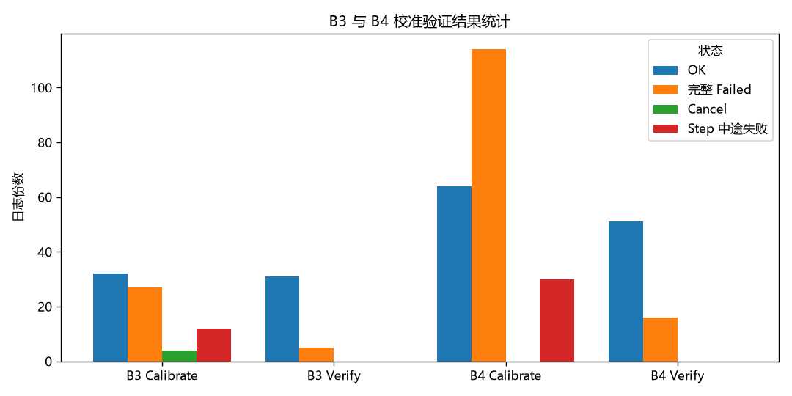
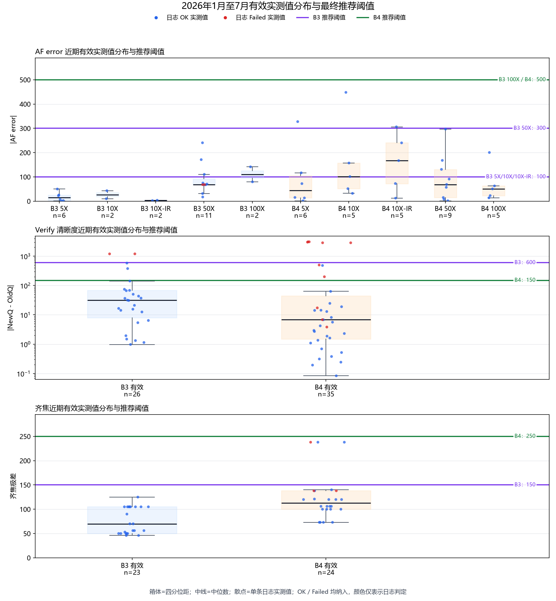
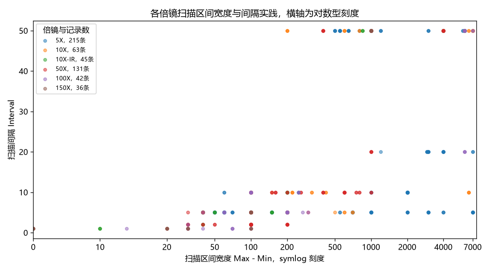
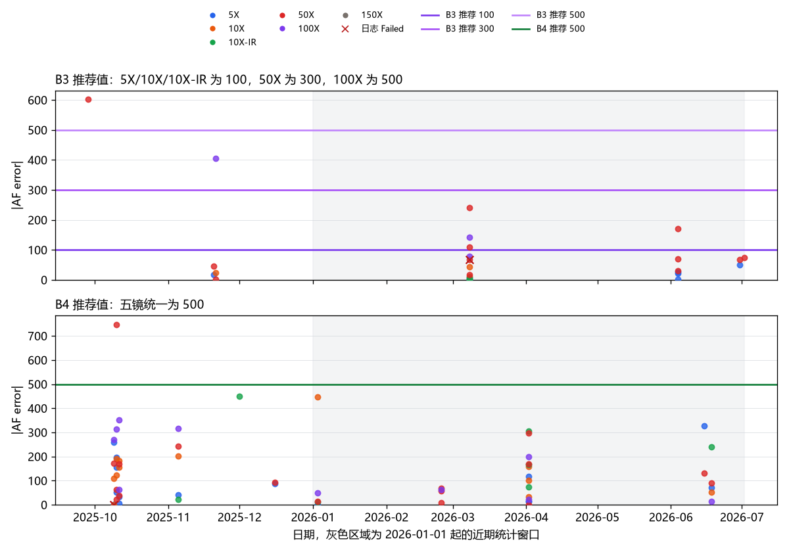
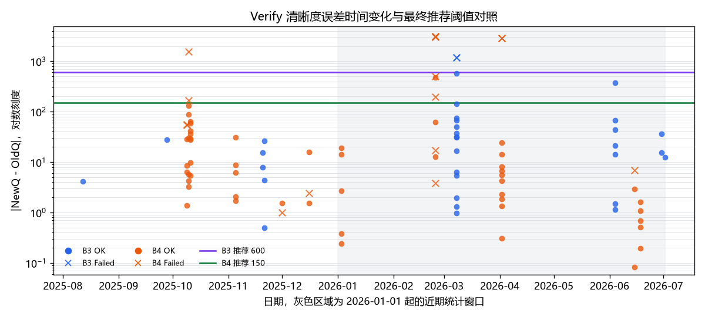
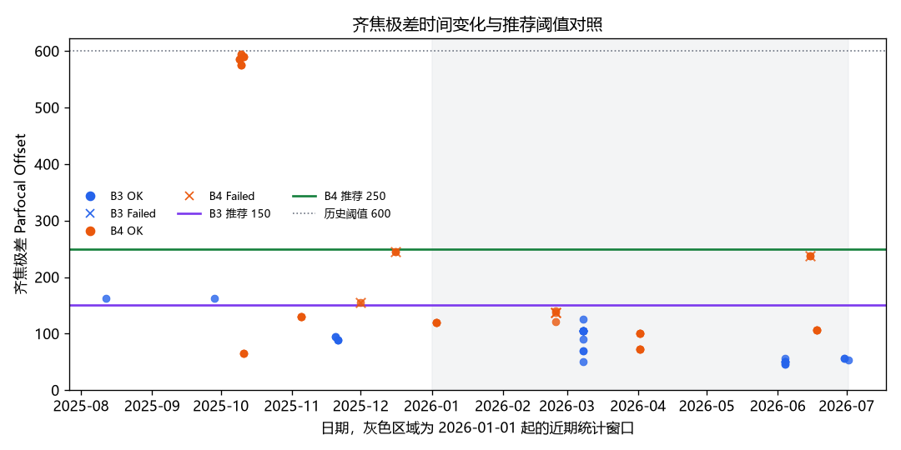
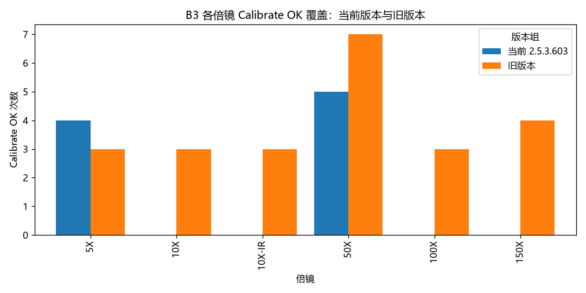

# Microscope Focus 校准方案验收

## 统计口径

- **日志范围**：B3 111 份、B4 275 份，共 386 份 HTML 报告，日期为 2025-05 至 2026-07，涉及 8 个软件版本。日志份数不等于独立样本数；同一文件可能包含多次重试和多个参数块。
- **状态统计**：完整校准、Step 中途失败和取消分开统计；Step Failed、Cancel 不并入完整 Failed。

| 日志类型 | 合计 | B3 | B4 |
|---|---:|---:|---:|
| Calibrate OK | 96 | 32 | 64 |
| Calibrate Failed | 141 | 27 | 114 |
| Calibrate Step Failed | 42 | 12 | 30 |
| Calibrate Cancel | 4 | 4 | 0 |
| Verify OK | 82 | 31 | 51 |
| Verify Failed | 21 | 5 | 16 |

*图 1 用于说明两台设备的历史状态覆盖，以及完整失败、Step Failed 和取消的区别。*

- **当前版本证据**：B4 在 2026-06-18、版本 2.5.3.603 完成五镜 Calibrate + Verify 闭环；B3 当前版本已有 5X、50X 成功记录，10X、10X-IR、100X 尚无成功记录。其他记录用于历史覆盖、阈值实测和异常边界分析。
- **阈值统计**：历史配置范围为 AF error 1—1000、Verify 50—1000、齐焦 50—600；推荐值依据含数值的生产测量分布，状态标签保留用于区分正常与失败。

*图 2 用于支撑三类推荐值对近期实测分布的覆盖关系；图中推荐线是执行参考，不是新增的计量限值。*

## 优点

1. **两台设备均有多倍镜成功记录。** B4 在 2025-11-05、2026-01-03、2026-04-02、2026-06-18，B3 在 2026-03-08 均出现五镜成功记录；B4 2026-06-18 还提供了当前版本的完整闭环。

2. **当前版本闭环结果可核对。** B4 2026-06-18 的 AF error（按 5X、10X、10X-IR、50X、100X）为 72.308、51.544、240.223、91.122、13.768；当次 Verify 清晰度误差最大约 1.617、齐焦极差为 106，阈值分别为 500、600、150，全部通过。

3. **扫描区间和间隔与倍镜差异相符。** 低倍镜通常使用更宽的扫描区间和更大的间隔，高倍镜使用更窄的区间和更小的间隔；B4 2026-06-18 记录了调整区间后重试并成功的过程。

   

   *图 3 用于说明不同倍镜的扫描参数实践与方案定性指引的一致性。*

## 缺点及改进

1. **失败原因和中断来源仍不完整。** 141 份完整 Calibrate Failed 中，95 份含至少一种明确异常文本，46 份未记录具体原因；主要类别包括 AF error 归零、图像/格式、ECS 设置、旧版数据校验和流程中断。另有 42 份 Step Failed、4 份 Cancel，不能与完整 Failed 混算。应记录失败阶段、原因代码、异常类型、重试结果、取消来源和最终状态。

2. **阈值历史配置差异较大。** 当前执行参考为：B3 AF error 5X/10X/10X-IR 为 100、50X 为 300、100X 为 500；B4 AF error 为 500；Verify 为 B3 600、B4 150；齐焦为 B3 150、B4 250。推荐值来自生产日志实测分布，可直接采用，但实际生效值仍以当次运行配置和日志为准；B4 存在 481.5 的历史 OK 单点，采用 Verify 150 后应观察误拒风险。

   

   *图 4 用于支撑 B3/B4 AF error 推荐值与历史实测分布的关系。*

   

   *图 5 用于支撑 B3/B4 Verify 推荐值、失败边界和误拒风险。*

   

   *图 6 用于支撑 B3/B4 齐焦推荐值与历史正常/异常极差的关系。*

3. **当前覆盖和计量学边界有限。** B3 当前版本尚未覆盖 10X、10X-IR、100X，相关参考值基于历史同物镜数据；现有证据也未确认 DSW 图案精度、Q 算法精度、长期稳定性、测量不确定度或独立溯源。应补充当前版本缺失倍镜的闭环记录；如需精度声明，另行建立计量学证据。

   

   *图 7 用于说明 B3 当前版本与历史版本在不同倍镜上的证据覆盖差异。*

## 结论

**结论：通过。** 现有生产日志支持 Microscope Focus 流程继续使用；上述三类阈值推荐值可直接作为 B3/B4 的生产执行参考，实际配置以当次运行记录为准。

本结论不把 B3 10X、10X-IR、100X 的历史参考值表述为当前版本已完成验证，也不外推 DSW/Q 算法精度、长期稳定性或测量不确定度。出现正常值接近推荐值、新 Failed 值低于推荐值、误拒增加、设备/物镜/版本变化或新的失败模式时，应重新评估。
