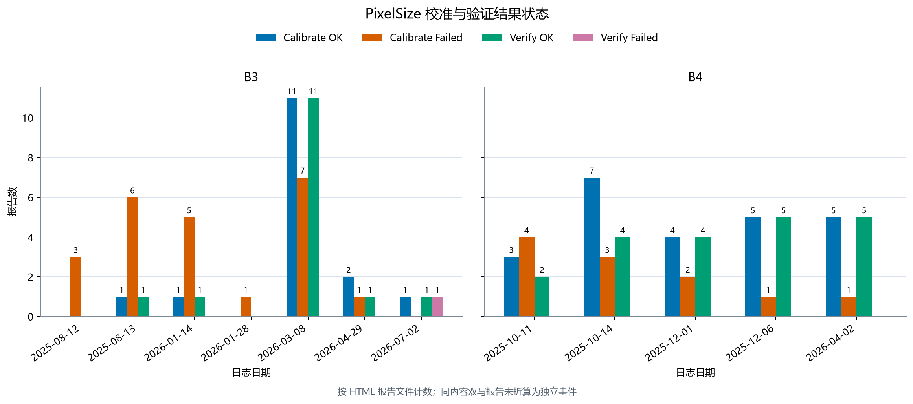
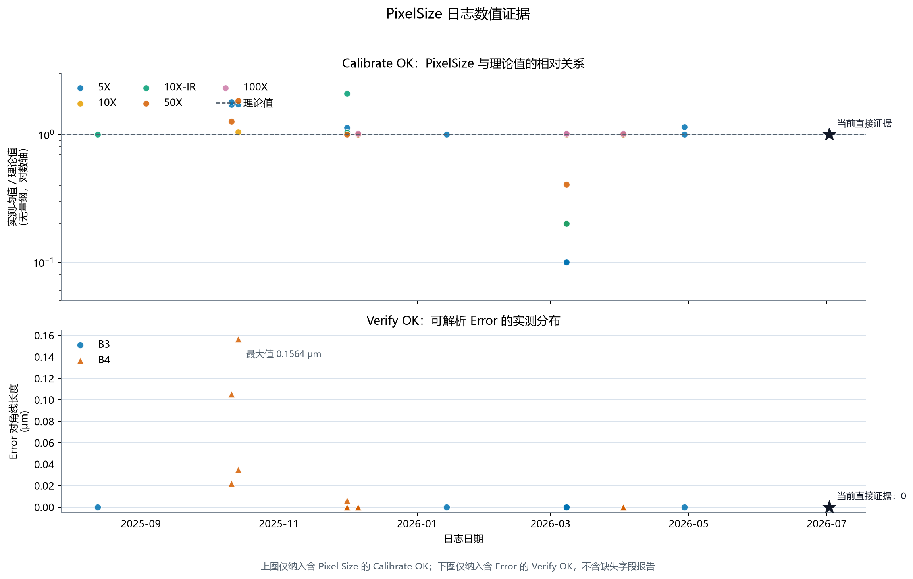
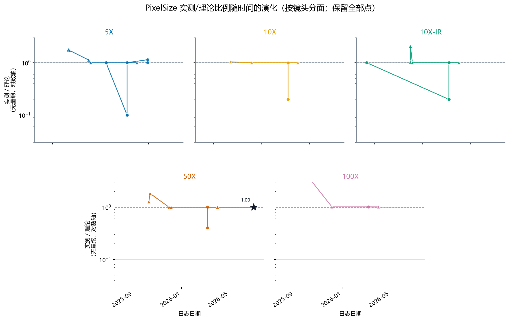

# Microscope PixelSize 校准方案验收

## 统计口径

- **验收日期**：2026-08-25。
- **日志范围**：归档清理后的 110 份 HTML 报告，B3/Vela80 与 B4 各 55 份，日期为 2025-08-12 至 2026-07-02。以下数量按报告统计，不等于独立运行数；同一事件的校准级与 Step 级双写按一次事件理解。
- **版本边界**：当前方案的直接证据仅取 B3/Vela80、DSW、50X、版本 2.5.3.603、2026-07-02 的校准与验证报告。其他版本仅用于说明历史覆盖和异常边界，不混入当前版本结论。
- **统计对象**：报告状态、报告中的 Pixel Size 和 Verify Error。40 份 Calibrate OK 中 37 份包含测量数据，35 份 Verify OK 中 33 份包含可解析的 Error；缺少数值的报告不补算为有效样本。现有报告不记录当次网格周期、`AngleThreshold`、`Threshold` 和成功时实际角度，本次不据此新增验收阈值。

| 设备 | Calibrate OK / Failed | Verify OK / Failed |
|---|---:|---:|
| B3/Vela80 | 16 / 23 | 15 / 1 |
| B4 | 24 / 11 | 20 / 0 |
| **合计** | **40 / 34** | **35 / 1** |

*图 1 用于说明全量日志的设备、日期和成功/失败覆盖；图中数量按报告统计，不等于独立运行数。*

## 优点

1. **当前版本已形成可运行的 50X 闭环。** B3/Vela80、DSW、2026-07-02、2.5.3.603 的 Calibrate OK 报告包含 10 次测量，结果均为 `{0.069, 0.069}` μm/pixel；理论值为 `3.45 ÷ 50 = 0.069` μm/pixel。同批 Verify OK 报告的 `Error` 为 `{0, 0}`。

   

   *图 2 用于支撑校准结果与理论值的比较，以及 Verify Error 的历史数值范围；星标表示当前版本直接证据。*

2. **历史日志覆盖范围较广。** B3、B4 的历史记录中均出现过 5X、10X、10X-IR、50X、100X 的校准与验证成功状态，可证明流程曾在多设备、多倍镜和多个历史版本上运行，但不替代当前版本的逐项复验。

3. **失败状态能够被保留和识别。** 当前版本的 Verify Failed 报告记录了 `GetPixelSize Error`，未发现失败结果被记录为 Verify OK 的证据。

## 缺点及改进

1. **当前版本的直接证据覆盖不足。** 版本 2.5.3.603 只有 B3/Vela80 的 50X 一次 Calibrate + Verify 闭环，没有 B4 或其他倍镜的同版本闭环证据。历史版本的成功记录不能直接证明当前版本适用于全部设备和倍镜。

   **改进：** 软件版本、设备、镜头、Site、网格或光路发生变化时，补充对应范围的当前版本 Calibrate + Verify 闭环，并在结论中按实际证据更新适用范围。

2. **网格周期和结果合理性存在风险。** B3 / 2026-03-08 的一组历史成功记录中，5X、10X、10X-IR 均为 `0.069`、50X 为 `0.028` μm/pixel，部分结果明显偏离 `3.45 ÷ 倍镜` 理论值但仍获得成功状态，说明周期选择或镜头关联错误可能造成“自洽通过”。现有报告无法追溯当次网格周期、阈值和实际角度。

   **改进：** 保留校准结果与理论值的核对，明显偏离时不得放行；同时在报告中记录网格周期、`AngleThreshold`、`Threshold` 和实际角度，并使 Verify 读取校准时使用的周期。

   

   *图 3 保留全部可解析点，用于展示不同镜头结果偏离理论值的量级；该比例图不是额外的合格限值。*

3. **失败原因和结果字段不完整。** 34 份 Calibrate Failed 中，6 份明确为角度超限，1 份为 Cal Chip Model 不支持，27 份没有足够的具体失败原因；另有 3 份 Calibrate OK 缺少重复测量数据、2 份 Verify OK 缺少可解析的 Error。

   **改进：** 结构化记录失败阶段、异常类型、重试次数、最终状态和已产生的测量值；统计时继续按事件去重，避免把报告双写当作独立运行。

## 结论

**结论：通过。** 现有日志支持 PixelSize 校准流程继续使用。直接证据限于 B3/Vela80、DSW、50X、2.5.3.603、2026-07-02；历史日志不外推为 B4、其他倍镜、其他 Site、其他网格周期或其他版本均已验证。

后续重点是补齐当前版本覆盖、完善运行参数和失败原因的日志追溯。出现设备、镜头、光路、网格或软件版本变化，Pixel Size 明显偏离理论值，或出现新的失败模式时，应重新评估。本次验收不覆盖标准网格计量溯源、长期稳定性和下游现场实际加载。
