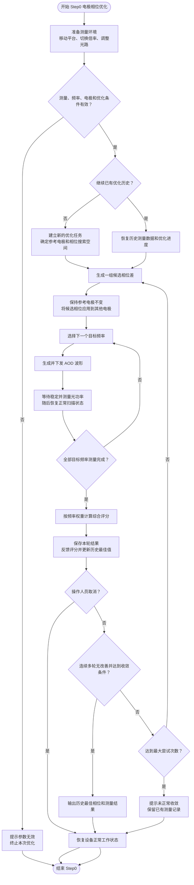

# AOD Waveform 电极偏移 Step0 业务与原理说明

## 1. 业务目的

Step0 用于寻找一组最优电极相位差，使 AOD 在多个目标频率下获得尽可能高且符合业务权重要求的综合光功率。

该步骤不直接确定最终的频率均匀性补偿，而是先完成电极之间的相位关系优化，为后续均匀性校准和波形生成提供基础相位配置。

## 2. 基本原理

### 2.1 相对相位

AOD 多电极共同工作时，光功率不仅受单个电极影响，也受电极之间相位关系影响。改变电极之间的相位差，会改变不同频率下的能量叠加效果。

相位优化关注的是电极之间的相对关系，而不是所有电极的绝对相位。通常选择一个电极作为参考电极并保持不变，其余电极相对于参考电极进行调整。因此，四个电极只需要三个独立相位差。

每个相位差都在一个完整相位周期内搜索。相位超过一个周期后会与周期内的某个位置等价，因此不需要无限扩大搜索范围。

### 2.2 多频点综合评价

一组相位在某个频率下表现最好，并不代表它在全部工作频率下都最好。因此，每次相位实验都要依次测量全部目标频率的光功率。

不同频率可以设置不同业务权重。所有频点测量完成后，使用加权平均得到本轮综合评分：

> 综合评分 = 各频点“权重 × 光功率”之和 ÷ 全部权重之和

综合评分越高，表示该组相位在当前业务关注的频率范围内整体表现越好。

### 2.3 贝叶斯优化

相位组合数量较多，逐点穷举会产生大量硬件测量，耗时较长。Step0 使用贝叶斯优化减少实验次数。

优化过程分为两个阶段：

1. 初始探索：先在相位空间内选取若干分散的组合进行测量，用于建立对相位与光功率关系的初步认识。
2. 迭代优化：根据已经测得的相位和评分，预测尚未测量区域的潜在收益，并在“尝试未知区域”和“靠近当前最优区域”之间取得平衡。

每完成一轮硬件测量，就把该轮综合评分反馈给优化器。优化器利用全部历史数据生成下一组候选相位，从而逐步逼近最优结果。

### 2.4 测量噪声

实际光功率测量会受到硬件波动、环境变化和等待时间等因素影响。优化器通过测量噪声参数表示对数据波动程度的估计：

- 噪声设置过小，可能把偶然波动误认为真实改善；
- 噪声设置过大，可能忽略真实的相位差异；
- 应根据设备重复测量的稳定性确定合适范围。

### 2.5 停止原则

Step0 使用两类停止条件：

- 收敛停止：初始探索结束后，如果连续多轮没有产生更好的结果，则认为优化已经趋于稳定，输出历史最优相位。
- 次数保护：如果始终没有满足收敛条件，但实验次数已达到最大允许值，则停止继续测量，避免无限循环。

操作人员也可以主动取消正在执行的优化。

## 3. 业务输入

### 3.1 测量条件

- 测量位置；
- 使用的光学倍率；
- AOD 偏移频率；
- 默认驱动幅值；
- 波形下发后的稳定等待时间。

### 3.2 频率条件

- 至少配置两个目标频率；
- 目标频率按从低到高排列；
- 每个目标频率配置对应的评价权重；
- 权重用于体现不同频率在最终结果中的重要程度。

### 3.3 电极条件

- 明确参与相位优化的电极；
- 明确作为相位基准的电极；
- 其余电极分别配置相对于基准电极的相位差。

### 3.4 优化条件

- 初始探索次数：决定优化开始阶段采集多少组基础数据；
- 测量噪声：描述光功率测量的不确定程度；
- 连续无改善阈值：决定何时判定优化收敛；
- 随机种子：用于在相同条件下复现实验顺序；
- 最大尝试次数：限制整轮优化允许执行的最大实验数量。

## 4. 业务执行逻辑

### 4.1 准备测量环境

1. 将平台移动到指定测量位置；
2. 切换到指定光学倍率；
3. 将影响光功率的可切换光学器件调整到测量状态；
4. 检查频率、电极、权重和优化条件是否完整有效。

如果条件不满足，则终止本次 Step0，并提示操作人员修正参数。

### 4.2 生成候选相位

优化器根据当前优化历史给出一组候选相位差：

- 新实验没有历史数据时，从初始探索开始；
- 已有有效历史数据时，在原有进度上继续优化；
- 候选相位与各非基准电极一一对应；
- 基准电极保持固定，不参与独立相位搜索。

### 4.3 执行一轮测量

将候选相位应用到电极后，依次遍历全部目标频率。每个频率执行以下业务动作：

1. 生成该频率对应的 AOD 波形；
2. 将波形下发到设备；
3. 切换到光功率测量状态；
4. 等待设备和光路稳定；
5. 读取并记录光功率；
6. 恢复正常扫描状态。

无论测量是否成功，都应保证设备最终恢复到安全的正常工作状态。

### 4.4 评价并反馈

全部目标频率测量完成后：

1. 根据频率权重计算本轮综合评分；
2. 保存本轮候选相位、各频点光功率和综合评分；
3. 将综合评分反馈给优化器；
4. 如果本轮评分优于历史最佳值，则更新历史最佳相位和最佳评分；
5. 更新频率—光功率趋势，用于操作人员观察优化过程。

### 4.5 判断是否结束

- 如果达到收敛条件，则结束优化并输出历史最佳相位；
- 如果达到最大尝试次数仍未收敛，则停止测量并提示优化未正常收敛；
- 如果尚未满足任一停止条件，则生成下一组候选相位，继续下一轮实验；
- 如果操作人员取消，则终止本次优化并恢复设备状态。

## 5. Step0 业务流程图

## 6. 业务输出

Step0 应输出并保留以下结果：

- 历史最佳电极相位差；
- 历史最佳综合评分；
- 每轮候选相位和综合评分；
- 每轮在各目标频率下的光功率；
- 频率—光功率趋势；
- 优化是否正常收敛；
- 实际完成的实验次数。

历史最佳相位将作为后续频率均匀性校准和最终 AOD 波形生成的基础配置。

## 7. 优化状态管理原则

优化历史应持续保存，使任务被中断后可以继续执行，避免重复已经完成的硬件测量。

当电极数量、参考电极、频率范围或关键优化条件发生变化时，原有历史数据不再适合继续使用，应由操作人员人工开始新的优化任务。重置前保留旧历史备份，便于追溯和恢复。

## 8. 业务验收标准

一次正常完成的 Step0 应满足：

- 所有目标频率均完成有效光功率测量；
- 每轮实验均能追溯到对应的电极相位；
- 综合评分使用配置的频率权重计算；
- 优化过程能够更新并保留历史最佳结果；
- 达到收敛条件后停止继续测量；
- 未收敛时能够受最大尝试次数保护；
- 正常结束、取消或测量失败后，设备均恢复到正常工作状态；
- 最终输出可直接作为下一阶段校准的输入。
