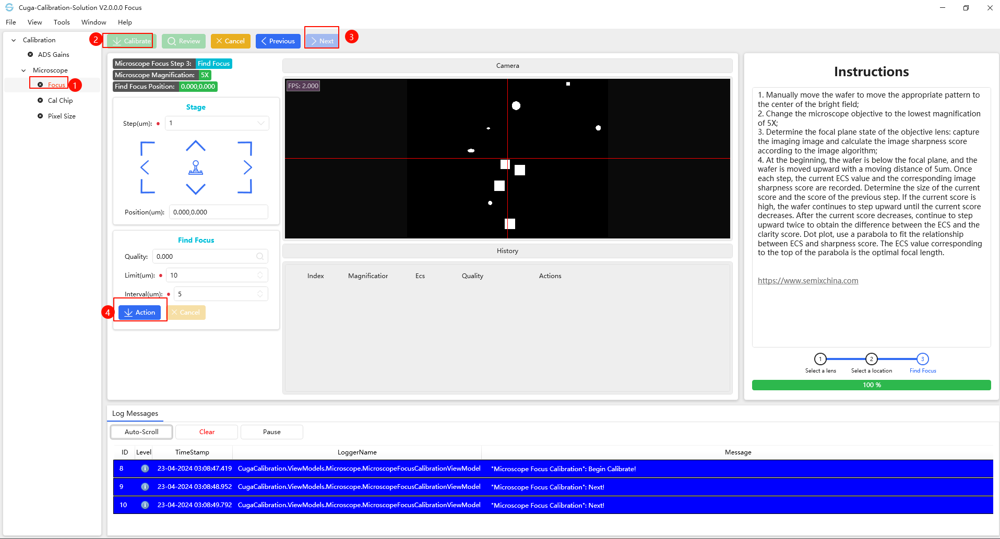
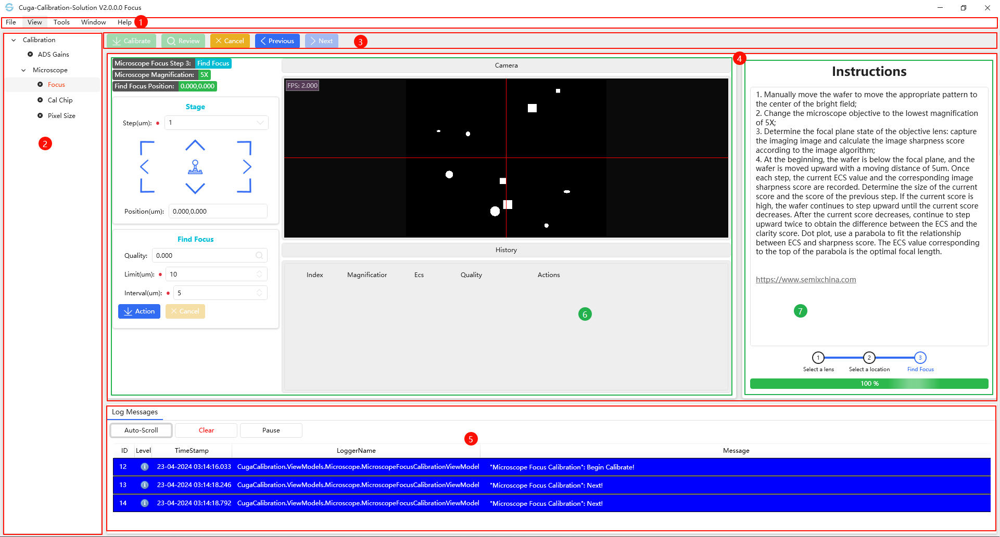
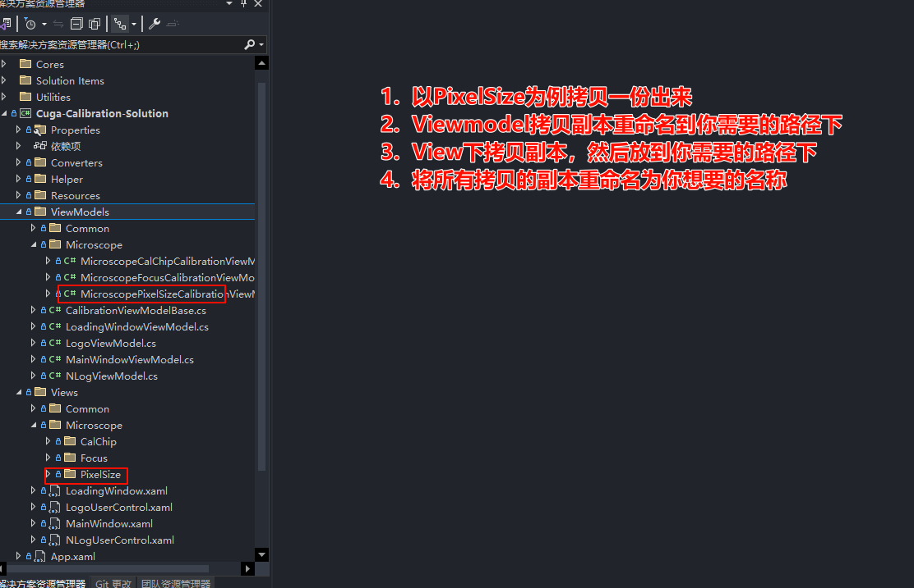
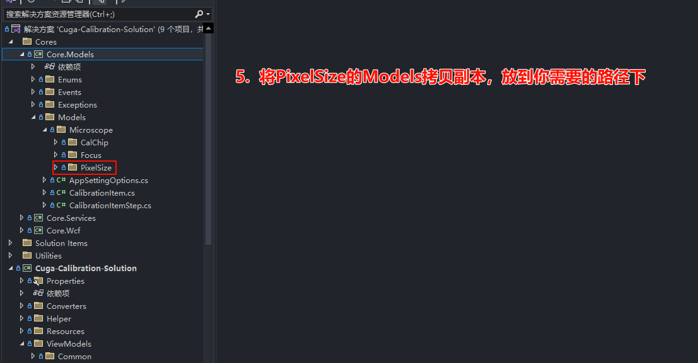

[TOC]

# 架构文档

## 1. 项目架构

---

### 1.1 Cuga-Calibration-Solution

---

```bash
Properties/launchSettings.json                                          # 项目启动文件：同asp.net core web api
Converters/                                                             # 存储和Cuga-Calibration-Solution相关（非通用）的Converter
Helper/ 																# 存储和Cuga-Calibration-Solution相关（非通用）Helper，比如常量
Resources/															    # 存储资源的（Resources/Images/：图片)（Resouces/*.xaml：资源文件）

ViewModels/ 															# 存储和界面绑定的ViewModels
ViewModels/LoadingWindowViewModel.cs									# 无需更改，首次加载界面ViewModel
ViewModels/LogoViewModel.cs												# 无需更改，Logo界面ViewModel
ViewModels/MainWindowViewModel.cs										# 无需更改，主窗体ViewModel
ViewModels/NLogViewModel.cs												# 无需更改，Log日志界面ViewModel
ViewModels/CalibrationViewModelBase.cs									# 无需更改，所有校准ViewModel基类
ViewModels/Common/														# 可以新建，所有和Cuga2.0交互的ViewModel（例如平移台、显微镜）
ViewModels/*/*/															# 可以新建，所有校准ViewModel继承自CalibrationViewModelBase.cs 
																		# 校准项目：格式：校准大类/校准小类/(例如/Microscope/Focus/*.cs)	

Views/ 																	# 界面
Views/LoadingWindow.xaml												# 无需更改，首次加载界面
Views/LogoUserControl.xaml												# 无需更改，Logo界面
Views/MainWindow.xaml													# 无需更改，主窗体
Views/NLogUserControl.xaml												# 无需更改，Log日志界面
Views/Common/															# 可以新建，所有和Cuga2.0交互的通用界面（例如平移台、显微镜）
Views/*/*/																# 可以新建，校准大类/校准小类/(例如/Microscope/Focus/)	
																		# 里面规定/*/*/Children/Review.xaml为复查界面
																		# /*/*/Children/Step0View.xaml ... /*/*/Children/Step5View.xaml 为校准步骤界面
																		# /*/*/*.xaml 为校准主窗体
																		
App.xaml 															    # 启动类, 里面可以设置合并资源添加IOC注入：例如如下方法中添加`private static void ConfigureServices(HostBuilderContext context, IServiceCollection services)`
																		# services.AddSingleton<MicroscopeFocusCalibrationViewModel>();
        																# services.AddSingleton<MicroscopeFocusCalibrationUserControl>();
        																
appsetting.*.json                                                       # 项目配置文件：同asp.net core web api 类似于WinformApp.config

Nlog.config																# 日志配置文件
```

### 1.2 Utilities

---

#### Net.Utilities 通用项目（与界面WPF无关，可以接入所有项目）

```bash
Properties/ 															# 项目通用的的多语言环境
Attributes/																# 通用的特性 [Localization]设置多语言环境
Enums/ 																	# 通用枚举
Helper/ 																# 所有通用帮助类（包含算法的、枚举的、文件的、IOC的、Object）
Models/																	# 所有通用模型类
LangVersionFixer.cs														# 高版本语言支持类（现在通过PolySharp解决）
```

#### Net.Utilities.Nlog（见http://192.168.0.28:8099/kaizhi.xuan/NlogMarkdownTest/-/blob/main/README.md）

#### Net.Utilities.WPF 通用WPF界面库（与界面WPF相关，但是与MVVM无关，接入所有WPF项目）

```bash
AttachedHelper/															# 通用附加属性帮助类
Behaviors/																# 通用Microsoft.Xaml.Behaviors.Wpf行为类
Converters/																# 通用的Converter
Enums/																	# 通用的枚举（包含所有自定义弹窗枚举）
Extensions/																# 通用的扩展类、xaml Markup扩展类
Helper/																	# 通用的界面帮助类（包含操作界面元素）
Triggers/																# 通用Microsoft.Xaml.Behaviors.Wpf触发器
```

#### Net.Utilities.WPF.MVVM 通用WPFMVVM界面库

```bash
AttachedHelper/															# 通用MVVM附加属性帮助类
Converters/																# 通用MVVM Converter
Providers/ 																# 通用MVVM IOC提供服务
Services/ 																# 通用MVVM IOC服务
ViewModels/																# 通用MVVM ViewModel基类、弹窗类
Views/ 																	# 通用弹窗
```

#### WPF.CanvasViewer Canvas项目

### 1.3 Solution Items

---

```bash
.csharpierrc.json														# https://csharpier.com/ 格式化工具配置项
Directory.Packages.props												# 中央包管理
README.md																# 项目架构文档
Settings.XamlStyler														# https://github.com/Xavalon/XamlStyler 格式化工具配置项
```


### 1.4 Cores

---

#### Core.Wcf （所有和CUGA 2.0交互的类）

```bash
Models/																	# 校准完成后序列化的类
																		# 格式：/校准大类/.cs(例如 /Microscope/CalibrationMicroscopeObj.cs)
Wcf/* 																	# 通过 SDK 风格的项目文件 Compile link引入所有调用CUGA2.0对外暴露的类
GlobalSuppressions.cs													# 屏蔽Wcf/*中不规范的警告
```

#### Core.Services（包装一层Core.Wcf项目提供给校准使用的服务）

```bash
Extensions/																# CUGA2.0 类的扩展类方法
Helper/																	# CUGA2.0 类的帮助类
Interfaces/																# 包装一层Core.Wcf项目提供给校准使用的服务
Interfaces/I*.cs														# IOC注入接口提供给校准使用的服务
Interfaces/Impl/*.cs													# IOC注入接口提供给校准使用的服务的【真】实现
Interfaces/Impl/Mock/*.cs												# IOC注入接口提供给校准使用的服务的【假】实现、用于测试
```

#### Core.Models（和Cuga-Calibration-Solution相关的模型类）

```
Enums/																	# 与校准相关的枚举 比如 显微镜倍率
Events/																	# 与校准相关的MVVM 中事件参数
Exceptions/																# 与校准相关的异常
Models/																	# 与校准界面相关的模型类（DTO) 
Models/*.cs																# 与校准界面相关的通用类：appserring.*.json配置类、校准项目类、校准步骤类、
Models/*/*/*.cs															# 与校准项目相关的DTO和cache以及界面相关类
																		# 规则：校准大类/校准小类/*.cs （Microscope/Focus/*.cs
```

## 2. IOC非常重要的Service和Provider

---

> App.xaml.cs

```csharp
private static void ConfigureServices(HostBuilderContext context, IServiceCollection services)
{
    services.Configure<AppSettingOptions>(context.Configuration.GetSection(AppSettingOptions.AppSetting)); 
    services.AddSingleton(_ => new Frame { NavigationUIVisibility /*不显示导航UI*/ = NavigationUIVisibility.Hidden });
    services.AddSingleton<string>(sp =>
                                  {
                                      var options = sp.GetRequiredService<IOptions<AppSettingOptions>>();
                                      return $"{options.Value.AppName} V{AssemblyHelper.AssemblyVersion}";
                                  });

    services.AddSingleton<MainWindowViewModel>();
    services.AddSingleton<MainWindow>();
    services.AddSingleton<LoadingWindowViewModel>();
    services.AddSingleton<LoadingWindow>();

    services.AddTransient<NLogViewModel>();
    services.AddTransient<NLogUserControl>();
    services.AddTransient<LogoViewModel>();
    services.AddTransient<LogoUserControl>();

    #region Caliburation

        services.AddTransient<ReviewViewModel>();
    services.AddTransient<StageViewModel>();
    services.AddTransient<MicroscopeViewModel>();
    services.AddTransient<AfViewModel>();

    services.AddSingleton<MicroscopeFocusCalibrationViewModel>();
    services.AddSingleton<MicroscopeFocusCalibrationUserControl>();
    services.AddSingleton<MicroscopeCalChipCalibrationViewModel>();
    services.AddSingleton<MicroscopeCalChipCalibrationUserControl>();
    services.AddSingleton<MicroscopePixelSizeCalibrationViewModel>();
    services.AddSingleton<MicroscopePixelSizeCalibrationUserControl>();

    #region Sevices

        services.AddSingleton<ICalibrationStageService, CalibrationStageServiceMock>();
    services.AddSingleton<ICalibrationReviewService, CalibrationReviewService>();
    services.AddSingleton<ICalibrationMicroscopeService, CalibrationMicroscopeServiceMock>();
    services.AddSingleton<ICalibrationAfService, CalibrationAfServiceMock>();
    services.AddSingleton<IAlgorithmService, AlgorithmServiceMock>();

    #endregion Sevices

        #endregion Caliburation

        services.AddSingleton<FileCache>(_ => new FileCache(ConstantsHelper.CugaCalibrationDirectory));
    services.AddSingleton<IDialogWindowProvider, DialogWindowProvider>();
    services.AddSingleton<IViewLocatorService, ViewLocatorService>();
    services.AddSingleton<INavigationService, NavigationService>();
    services.AddSingleton<IWindowManagerService, WindowManagerService>();

    services.AddSingleton<IMessenger, WeakReferenceMessenger>(); // 注册消息中心
    services.AddSingleton<ISynchronizationContextProvider>(_ => new SynchronizationContextProvider(new DispatcherSynchronizationContext(Current.Dispatcher))); // 注册主线程调度器的同步上下文
}
```

### 2.1 `services.Configure<AppSettingOptions>`

---

> 注入`appserring.*.json`的配置项，同**Asp.Net Core Web Api**


### 2.2 `services.AddSingleton<Frame>`、`services.AddSingleton<INavigationService, NavigationService>`

> 配合导航使用，此项目未使用到

### 2.3 `services.AddSingleton<string>`

> 项目名称：包含版本信息，一般用作Title

### 2.4 所有无需修改界面

```csharp
services.AddSingleton<MainWindowViewModel>();
services.AddSingleton<MainWindow>();
services.AddSingleton<LoadingWindowViewModel>();
services.AddSingleton<LoadingWindow>();

services.AddTransient<NLogViewModel>();
services.AddTransient<NLogUserControl>();
services.AddTransient<LogoViewModel>();
services.AddTransient<LogoUserControl>();
```

> 添加主窗体、加载窗体、日志界面、Logo界面

### 2.5 注入校准

```csharp
// 注入通用的CUGA模块：比如平移台
services.AddTransient<ReviewViewModel>();
services.AddTransient<StageViewModel>();
services.AddTransient<MicroscopeViewModel>();
services.AddTransient<AfViewModel>();

services.AddSingleton<MicroscopeFocusCalibrationViewModel>();
services.AddSingleton<MicroscopeFocusCalibrationUserControl>();
services.AddSingleton<MicroscopeCalChipCalibrationViewModel>();
services.AddSingleton<MicroscopeCalChipCalibrationUserControl>();
services.AddSingleton<MicroscopePixelSizeCalibrationViewModel>();
services.AddSingleton<MicroscopePixelSizeCalibrationUserControl>();
```

> 注入和校准的界面和校准业务ViewModels

### 2.6 注入Cuga服务

```csharp
#region Sevices

services.AddSingleton<ICalibrationStageService, CalibrationStageServiceMock>();
services.AddSingleton<ICalibrationReviewService, CalibrationReviewService>();
services.AddSingleton<ICalibrationMicroscopeService, CalibrationMicroscopeServiceMock>();
services.AddSingleton<ICalibrationAfService, CalibrationAfServiceMock>();
services.AddSingleton<IAlgorithmService, AlgorithmServiceMock>();

#endregion Sevices
```

> 注入校准使用到的服务：显微镜、平移台、算法、等

### 2.7 `services.AddSingleton<FileCache>`

> 校准的时候需要本地缓存后提供给其他模块使用类，至于怎么使用见FileCache.cs注释

### 2.8 `services.AddSingleton<IDialogWindowProvider, DialogWindowProvider>`

> 弹窗服务，至于怎么使用见IDialogWindowProvider接口注释

### 2.9 `services.AddSingleton<IViewLocatorService, ViewLocatorService>`

> 通过`View`定位`ViewModel`，通过`ViewModel`定位View服务，使用见接口注释

### 2.10 `services.AddSingleton<IWindowManagerService, WindowManagerService>`

> 窗口管理：弹窗、`Popup`等（通过`ViewModel`弹窗）服务

### 2.11 `services.AddSingleton<ISynchronizationContextProvider>`

> 同步上下文执行服务：有些更改需要回到界面主线程更新

## 3. IOC注入方式

---

### 3.1 构造注入

```csharp
public MainWindowViewModel(string applicationName, NLogViewModel nLogViewModel, LogoViewModel logoViewModel, IMessenger messenger, ILogger<MainWindowViewModel> logger, ISynchronizationContextProvider contextProvider, FileCache fileCache,
                           IDialogWindowProvider dialogWindowProvider, LoadingWindowViewModel loadingWindowViewModel, IWindowManagerService windowManagerService)
{

}
```

### 3.2 方法获取

1. 

> `CugaCalibration.App.xaml.cs` 通过全局的静态属性获取

```csharp
/// <summary>
/// 获取当前正在使用的实例 <see cref="App"/>, 这样就可以获取到AppHost等, 其实也相当于单例模式(全局一个App)
/// </summary>
public new static App Current => (App)Application.Current;

public static T? GetService<T>(string className) where T : class;

public static T GetService<T>() where T : class;

public static object GetService(Type type);
```

2. 

> `Net.Utilities.WPF.MVVM.Providers.MVVMLocatorProvider.cs`

```csharp
#region IOC

/// <summary>
/// IOC Type To Instance
/// </summary>
private static Func<Type, object>? DefaultIocObjectFactoryWithType { get; set; }

/// <summary>
/// Sets IOC Type To Instance.
/// </summary>
/// <param name="iocObjectFactoryWithType">IOC Type To Instance</param>
public static void SetDefaultIocObjectFactoryWithType(Func<Type, object> iocObjectFactoryWithType)
{
    DefaultIocObjectFactoryWithType = iocObjectFactoryWithType;
}

/// <summary>
/// Gets the service.
/// </summary>
/// <typeparam name="T">Service Type</typeparam>
/// <returns>service</returns>
public static T GetService<T>() where T : class
{
    return (T)GetService(typeof(T));
}

/// <summary>
/// Gets the service.
/// </summary>
/// <param name="type">service type</param>
/// <returns>service</returns>
/// <exception cref="ArgumentNullException">null exception</exception>
public static object GetService(Type type)
{
    if (DefaultIocObjectFactoryWithType is null) throw new ArgumentException($"{nameof(DefaultIocObjectFactoryWithType)} is null");

    return DefaultIocObjectFactoryWithType.Invoke(type);
}

#endregion IOC
```

## 4. View ViewModel Locator 、 Bind

---

### 4.1 Locator

1. 

> IOC注入方式`IViewLocatorService`

2. 

> `Net.Utilities.WPF.MVVM.Providers.MVVMLocatorProvider.cs`

```csharp
#region MVVM ViewModel And View

/// <summary>
/// ViewModel类型 to View类型
/// </summary>
/// <param name="viewModelType">ViewModel类型</param>
/// <returns>View类型</returns>
public static Type? ViewModelType2ViewType(Type? viewModelType)
{
    if ((viewModelType?.IsSubclassOf(typeof(ViewModelBase)) == true) == false) return null;

    return Assembly.GetAssembly(viewModelType)
        ?.GetTypes()
        .FirstOrDefault(t => t.Name.StartsWith(viewModelType.Name.Replace("ViewModel", string.Empty)));
}

/// <summary>
/// View类型 to ViewModel类型
/// </summary>
/// <param name="viewType">View类型</param>
/// <returns>ViewModel类型</returns>
public static Type? ViewType2ViewModelType(Type? viewType)
{
    if ((viewType?.IsSubclassOf(typeof(FrameworkElement)) == true) == false) return null;

    return Assembly.GetAssembly(viewType)
        ?.GetTypes()
        .FirstOrDefault(t => t.Name.StartsWith($"{viewType.Name.Replace("UserControl", string.Empty)}ViewModel"));
}

#endregion MVVM ViewModel And View
```

### 4.2 Bind View ViewModel

1. 

> `Net.Utilities.WPF.MVVM.AttachedHelper.AutoWireViewModelHelper` 自动 Bind
>
> `wpfMvvmAttachedHelper:AutoWireViewModelHelper.IsAutoWireViewModel="True"`

2. 

> `Net.Utilities.WPF.MVVM.Providers.MVVMLocatorProvider.cs`

```
/// <summary>
/// 将View与ViewModel数据上下文绑定
/// </summary>
/// <typeparam name="TVm">ViewModel类型</typeparam>
/// <param name="frameworkElement">View</param>
/// <param name="dataContext">ViewModel</param>
public static void Bind<TVm>(FrameworkElement frameworkElement, TVm dataContext) where TVm : ViewModelBase
{
frameworkElement.DataContext = dataContext;
if (dataContext is ViewModelBase viewModelBase && frameworkElement is Window or Popup) viewModelBase.Bind(frameworkElement);
}
```

## 5. 项目引入Nuget包

---

```xml
<Project>
	<PropertyGroup>
		<ManagePackageVersionsCentrally>true</ManagePackageVersionsCentrally>
	</PropertyGroup>
	<ItemGroup>
		<!-- System -->
		<PackageVersion Include="System.Drawing.Common" Version="8.0.3" />
		<PackageVersion Include="System.Threading.Channels" Version="8.0.0" />
		<PackageVersion Include="System.Reactive" Version="6.0.0" />
		<PackageVersion Include="System.Text.Json" Version="8.0.2" />
		<PackageVersion Include="System.ComponentModel.Annotations" Version="5.0.0" />
		<PackageVersion Include="PolySharp" Version="1.14.1" />
		<!-- IOC -->
		<PackageVersion Include="Microsoft.Extensions.Hosting" Version="8.0.0" />
		<PackageVersion Include="Microsoft.Extensions.Options" Version="8.0.2" />
		<PackageVersion Include="Microsoft.Extensions.DependencyInjection" Version="8.0.0" />
		<PackageVersion Include="Microsoft.Extensions.Logging.Abstractions" Version="8.0.1" />
		<!-- CommunityToolkit -->
		<PackageVersion Include="CommunityToolkit.Mvvm" Version="8.2.2" />
		<PackageVersion Include="CommunityToolkit.Common" Version="8.2.2" />
		<PackageVersion Include="CommunityToolkit.Diagnostics" Version="8.2.2" />
		<PackageVersion Include="CommunityToolkit.HighPerformance" Version="8.2.2" />
		<!-- WPF -->
		<PackageVersion Include="Microsoft.Xaml.Behaviors.Wpf" Version="1.1.77" />
		<PackageVersion Include="ValueConverters" Version="3.0.26" />
		<PackageVersion Include="HandyControl" Version="3.5.1" />
		<PackageVersion Include="Ookii.Dialogs.Wpf" Version="5.0.1" />
		<!-- Utilities -->
		<PackageVersion Include="Newtonsoft.Json" Version="13.0.3" />
		<PackageVersion Include="IndexRange" Version="1.0.3" />
		<PackageVersion Include="MiniExcel" Version="1.31.3" />
		<PackageVersion Include="Mapster" Version="7.3.0" />
		<!-- Log -->
		<PackageVersion Include="NLog" Version="5.2.8" />
		<PackageVersion Include="NLog.Schema" Version="5.2.8" />
		<PackageVersion Include="NLog.Web.AspNetCore" Version="5.3.8" />
		<PackageVersion Include="Sentinel.NLogViewer" Version="2.0.1" />
		<PackageVersion Include="Exceptionless.NLog" Version="6.0.4" />
		<!-- ORM -->
		<PackageVersion Include="SqlSugarCore" Version="5.1.4.137" />
		<PackageVersion Include="SqlSugar" Version="5.1.4.137" />
		<!-- Opencv -->
		<PackageVersion Include="OpenCvSharp4" Version="4.7.0.20230115" />
		<PackageVersion Include="OpenCvSharp4.runtime.win" Version="4.7.0.20230115" />
		<PackageVersion Include="OpenCvSharp4.WpfExtensions" Version="4.7.0.20230115" />
		<!-- Halcon -->
		<PackageVersion Include="MVTec.HalconDotNet" Version="22050.0.0" />
		<PackageVersion Include="MVTec.HalconDotNetXL" Version="22050.0.0" />
		<!-- 扩展库: 用作超大图片 -->
		<!-- Markdown -->
		<PackageVersion Include="Grynwald.MarkdownGenerator" Version="3.0.106" />
		<PackageVersion Include="Markdig" Version="0.37.0" />
	</ItemGroup>
</Project>
```

### 5.1 IOC

> `<PackageVersion Include="Microsoft.Extensions.DependencyInjection" Version="8.0.0" />`

### 5.2 Host exe载体

> `<PackageVersion Include="Microsoft.Extensions.Hosting" Version="8.0.0" />`

### 5.3 LOG

> 1. 使用的抽象类
>
> `<PackageVersion Include="Microsoft.Extensions.Logging.Abstractions" Version="8.0.1" />` 
>
> 2. 具体实现类：Nlog
>
> `<PackageVersion Include="NLog" Version="5.2.8" />
> <PackageVersion Include="NLog.Schema" Version="5.2.8" />
> <PackageVersion Include="NLog.Web.AspNetCore" Version="5.3.8" />
> <PackageVersion Include="Sentinel.NLogViewer" Version="2.0.1" />
> <PackageVersion Include="Exceptionless.NLog" Version="6.0.4" />`

### 5.4 MVVM

> `<PackageVersion Include="CommunityToolkit.Mvvm" Version="8.2.2" />`

### 5.5 Framework使用高版本语法

> `<PackageVersion Include="PolySharp" Version="1.14.1" />`

### 5.6 UI

> `<PackageVersion Include="HandyControl" Version="3.5.1" />` https://github.com/HandyOrg/HandyControl https://handyorg.github.io/handycontrol/
>
> `<PackageVersion Include="Microsoft.Xaml.Behaviors.Wpf" Version="1.1.77" />`

### 5.7 Reactive

> `<PackageVersion Include="System.Reactive" Version="6.0.0" />`

## 6. 校准基类解释

---

### 6.1. 必须重写Name，用于日志提示和显示，名称要有意义

```
/// <summary>
/// 校准名称
/// </summary>
public virtual string Name => string.Empty;
```

### 6.2. 如果需要日志图片存储位置, 重写

```
/// <summary>
/// 日志图片存储位置
/// </summary>
public virtual string ImageFileDirectory => string.Empty;
```

### 6.4 如果需要进度条重写

> 逻辑：当前所在步骤/总步骤数

```csharp
/// <summary>
/// 校准步骤进度
/// </summary>
public virtual double CalibrationProgress => CalibrationStepIndex < 0 ? 0 : (CalibrationStepIndex + 1d) / CalibrationStepList.Count * 100d;
```

### 6.5 需要设置的属性

#### 校准所在步骤

> 因为校准是一步一步的，所以这个标识当前步骤在哪

```csharp
/// <summary>
/// 校准步骤索引
/// </summary>
[ObservableProperty]
private int _calibrationStepIndex = -1;
```

#### 校准是否完成

> 校准是一步一步的，所以要看校准是否完成，完成后这个信号`true`

```cs
/// <summary>
/// 是否已校准完成
/// </summary>
[ObservableProperty]
private bool _isCalibrated;
```

#### 校准所有的步骤

> 因为校准是一步一步的，所有需要新增所有步骤: 注意有些步骤可以直接下一步，有些不行，所以有一个属性约束`StepIsNextEnable`

```csharp
/// <summary>
/// 校准步骤名称列表
/// </summary>
[ObservableProperty]
private List<CalibrationItemStep> _calibrationStepList = [];
```

```csharp
/// <summary>
/// 校准步骤
/// </summary>
public sealed partial class CalibrationItemStep(string stepName, bool stepIsNextEnable = false) : ObservableObject
{
    /// <summary>
    /// 步骤名称
    /// </summary>
    [ObservableProperty]
    private string _stepName = stepName;

    /// <summary>
    /// 下一步是否可用
    /// </summary>
    [ObservableProperty]
    private bool _stepIsNextEnable = stepIsNextEnable;

    /// <summary>
    /// 下一步是否可用默认值
    /// </summary>
    public bool DefaultIsNextEnable = stepIsNextEnable;
}
```

#### 校准界面状态：校准、复查、欢迎、加载

> 因为校准是一步一步的所以需要切换界面

```cs
/// <summary>
/// 界面状态
/// </summary>
[ObservableProperty]
private CalibrationItemViewEnum _viewEnum;
```

#### 界面切换原理

> 1. 主界面：`ViewEnum`通过修改`Visibility={Binding ViewEnum, Converter={StaticResource CalibrationItemViewEnumIsLoadingToVisibilityConverter}}`解决的
>
> 2. 下一步上一步切换是用：`CalibrationStepIndex`校准所在步骤控制解决`Visibility="{Binding CalibrationStepIndex, Converter={StaticResource IntIs0ToVisibilityConverter}}"`

```xaml
<Border Margin="5"
        Style="{StaticResource BorderRegion}"
        Effect="{StaticResource EffectShadow2}">
    <Grid>
        <StackPanel HorizontalAlignment="Center"
                    VerticalAlignment="Center"
                    Visibility="{Binding ViewEnum, Converter={StaticResource CalibrationItemViewEnumIsLoadingToVisibilityConverter}}">
            <hc:LoadingCircle Width="200"
                              Height="200"
                              Style="{StaticResource LoadingCircleLarge}" />
            <TextBlock Text="Loading calibration..." Style="{StaticResource TextBlockLargeBold}" />
        </StackPanel>
        <Grid Visibility="{Binding ViewEnum, Converter={StaticResource CalibrationItemViewEnumIsWelcomeToVisibilityConverter}}">
            <TextBlock Text="Welcome to calibration!" Style="{StaticResource TextBlockLargeBold}" />
        </Grid>
        <Grid Visibility="{Binding ViewEnum, Converter={StaticResource CalibrationItemViewEnumIsCalibrationToVisibilityConverter}}">
            <children:Step0View Visibility="{Binding CalibrationStepIndex, Converter={StaticResource IntIs0ToVisibilityConverter}}" />
            <children:Step1View Visibility="{Binding CalibrationStepIndex, Converter={StaticResource IntIs1ToVisibilityConverter}}" />
            <children:Step2View Visibility="{Binding CalibrationStepIndex, Converter={StaticResource IntIs2ToVisibilityConverter}}" />
        </Grid>
        <Grid Visibility="{Binding ViewEnum, Converter={StaticResource CalibrationItemViewEnumIsReviewToVisibilityConverter}}">
            <children:Review />
        </Grid>
    </Grid>
</Border>
```

### 6.6 `MainWindow`主界面功能按钮

1. `LoadAsync` 这个不是按钮直接操作：首次加载方法 可以重写`LoadingAsync` true成功 false失败 `cancellationToken`
2. `CalibrateAsync` 打开校准界面按钮 可以重写`CalibratingAsync` true成功 false失败
3. `ReviewAsync` 打开复查界面按钮  可以重写`ReviewingAsync` true成功 false失败
4. `CancelAsync` 关闭校准按钮  可以重写`CancelingAsync` true成功 false失败
5. `PreviousAsync` 上一步按钮  可以重写`PreviousingAsync` true成功 false失败
6. `NextAsync` 下一步按钮  可以重写`NextingAsync` true成功 false失败

### 6.7 校准界面实时刷新

> 重写下面方法，这边监控使用的是 响应式编程，开启关闭方便

```csharp
protected virtual void Monitor()
{
	CheckStatus();
}

var subscribe = Observable.Interval(TimeSpan.FromMilliseconds(MonitorMilliseconds)).Subscribe(_ =>
{
    StageViewModel.GetStagePosition();
    MicroscopeViewModel.GetMagnification();
    ReviewViewModel.GetBitmapSource();
});

cancellationToken.Register(subscribe.Dispose);
```

### 6.8 `MainWindow`主界面功能按钮状态更新

- `CheckStatus` 检查是否能够校准 用于报错弹窗
- `UpdateFailedStatus` 校准失败 功能按钮状态
- `UpdateLoadingStatus` 正在加载 功能按钮状态

- `UpdateWelcomeStatus` 欢迎界面 功能按钮状态

- `UpdateCalibrateStatus` 校准状态 功能按钮状态
- `UpdateReviewStatus` 复查状态 功能按钮状态
- `UpdatePreviousNextStatus` 正在校准状态，上一步下一步状态 功能按钮状态
- `UpdateDisableAll` 全部禁用 功能按钮状态

> `UpdatePreviousStatus` `UpdateNextStatus` 可以重写自定义上一步下一步按钮状态

### 6.9 开始校准

> 集成了html日志

- `protected async Task InvokeCalibrate(Func<protected async Task InvokeCalibrate(Func<Guid, Task<bool>> func), Task<bool>> func)` 其中`Guid`用来校准中记录html日志

- `InvokeCalibrate`包含了开始记录和结局记录html

- 校准中记录示例：

    ```csharp
    Logger.LogInformation("{@Name} Param: {@Markdown}{@Unique}", Name, new MarkdownQuoteList(new
    {
        MicroscopeMagnification = Cache.MicroscopeMagnificationEnum,
        Cache.FindFocusPosition,
        ImageFileDirectory = detectImageDirectory
    }), guid.LogMarkdown());
    ```

### 6.10 校准界面操作流程



1. 双击画面左侧[校准项目]菜单，画面显示[Welcome to calibration]。
2. 点击画面右侧[Calibrate]按钮开始进行校准。
3. 点击[Next]按钮进入校准画面
4. 点击[Action]按钮执行校准。
5. 校准执行完成之后，生成html和校准文件

| 组件名称       | 类型              | 位置                     | 功能                                                         |
| -------------- | ----------------- | ------------------------ | ------------------------------------------------------------ |
| Calibrtion     | 菜单              | 画面左侧                 | 双击后开始准备校准                                           |
| Calibrate      | 按钮              | 画面右上，菜单栏下       | 点击后开始校准                                               |
| Review         | 按钮              | 画面右上，菜单栏下       | 点击后显示最新的chuck角度偏移量和XY方向上的位置偏移量，提供给用户检查校准结果是否合格 |
| Cancel         | 按钮              | 画面右上，菜单栏下       | 点击后取消当前校准流程                                       |
| Previous       | 按钮              | 画面右上，菜单栏下       | 点击后返回校准流程的上一步                                   |
| Next           | Next按钮          | 画面右上，菜单栏下       | 点击后进入校准的下一步流程                                   |
| Action         | 按钮              | Next画面中               | 点击后开始执行校准                                           |
| Cancel         | 按钮              | Next画面中               | 点击后取消执行校准                                           |
| Instructions   | TextBlock文本块   | 画面右侧                 | 显示校准流程的详细步骤和相关介绍                             |
| StepProcessBar | StepBar步骤进度条 | 画面右侧，Instructions下 | 显示校准进度。                                               |
| LogMessage     | NLogUserControl   | 画面下侧                 | LogMessage实施显示                                           |



1. 主菜单区
2. 校准菜单区
3. 校准功能按钮区
4. 校准区
    6. 校准操作区
    7. 校准提示去
5. 日志区

## 7. 开发步骤

---

1. 拷贝View副本，修改为你需要的名称
2. 拷贝ViewModel副本，修改为你需要的名称
3. 拷贝Model模型副本，修改为你需要的名称
4. 在这个基础上再修改为你想要的界面样式和业务





### 注意事项

```csharp
public sealed partial class ChuckPrealignerObjDto : ObservableObject
{
    [ObservableProperty]
    private int _index;

    [ObservableProperty]
    private double _offsetX;

    [ObservableProperty]
    private double _offsetY;

    [ObservableProperty]
    private double _offsetAngle;

    // todo: 配置映射规则，防止空指针异常
    [ObservableProperty]
    private string _filePath = string.Empty;

    public ChuckPrealignerObjDto()
    {
    }

    public ChuckPrealignerObjDto(CalibrationPrealignerObj item)
    {
        item.Adapt(this);
    }

    public CalibrationPrealignerObj ToCalibrationPrealignerObj()
    {
        return this.Adapt(new CalibrationPrealignerObj());
    }
}
```

```csharp
using Core.Models.Enums;
using Cuga.Data.DataStruct.Stage;
using Semix.CoreLib;

namespace Core.Services.Interfaces;

public interface ICalibrationStageService
{
    /// <summary>
    /// 连接
    /// </summary>
    /// <returns>是否成功</returns>
    SxExecuteRet<bool> Connect();

    /// <summary>
    /// 启用/禁用物理摇杆
    /// </summary>
    /// <param name="enable">是否启用</param>
    /// <returns>启用是否成功</returns>
    SxExecuteRet<bool> ToggleEnableJoystick(bool enable);

    /// <summary>
    /// 获取平台当前位置
    /// </summary>
    /// <returns>当前位置</returns>
    SxExecuteRet<CgPoint> GetStagePosition();

    /// <summary>
    /// 移动平台
    /// </summary>
    /// <param name="cgPoint">相对距离</param>
    /// <returns>是否成功</returns>
    SxExecuteRet<bool> MoveRelativeStageXy(CgPoint cgPoint);

    /// <summary>
    /// 移动平台(步进的形式)
    /// </summary>
    /// <param name="cgPoint">点</param>
    /// <returns>是否成功</returns>
    SxExecuteRet<bool> MoveAbsoluteStageXy(CgPoint cgPoint);

    /// <summary>
    /// 获取晶圆中心坐标与Chuck Center坐标的偏移量
    /// </summary>
    /// <returns>当前晶圆中心坐标与Chuck Center坐标的偏移量</returns>
    SxExecuteRet<CgPoint> GetStageOffsetPosition();

    /// <summary>
    /// 获取晶圆中心偏移角度
    /// </summary>
    /// <returns>当前晶圆中心偏移角度</returns>
    SxExecuteRet<double> GetStageOffsetAngle();

    /// <summary>
    /// 晶圆中心偏移角度补偿至EFEM中的aligner
    /// </summary>
    /// <param name="angle">晶圆中心偏移角度</param>
    /// <returns>是否成功</returns>
    SxExecuteRet<bool> CompensationAngleToAligner(double angle);


    // todo: SxExecuteRet<bool> CompensationOffsetToAligner(double offsetX, double offsetY);

    /// <summary>
    /// 重新载入晶圆
    /// </summary>
    /// <returns>载入晶圆是否成功</returns>
    SxExecuteRet<bool> ReloadWafer();
}
```

```
using System;

namespace Core.Wcf.Models.Chuck
{
    //todo: 将chuck所有校准封装为一个对象
    /// <summary>
    /// Prealigner校准对象
    /// </summary>
    [Serializable]
    public sealed class CalibrationPrealignerObj
    {
        ///// <summary>
        ///// Prealigner校准对象列表
        ///// </summary>
        //public CalibrationPrealignerObj CalibrationPrealignerObj { get; set; } = new CalibrationPrealignerObj();

        /// <summary>
        /// Chuck Center X坐标偏移值
        /// </summary>
        public double OffsetX { get; set; }

        /// <summary>
        /// Chuck Center Y坐标偏移值
        /// </summary>
        public double OffsetY { get; set; }

         /// <summary>
        /// Chuck Center 偏移角度
        /// </summary>
        public double OffsetAngle { get; set; }

        /// <summary>
        /// 图像文件路径
        /// </summary>
        public string FilePath { get; set; }
    }
}
```

```
using Core.Models.Enums;
using Core.Models.Exceptions;
using Core.Models.Models;
using CugaCalibration.ViewModels.Microscope;
using CugaCalibration.ViewModels.Chuck;
using Net.Utilities.Models;
using System.Collections.ObjectModel;

namespace CugaCalibration.Helper;

public static class ConstantsHelper
{
    /// <summary>
    /// 软件文档路径
    /// </summary>
    public static readonly string CugaCalibrationDirectory = $"{Environment.GetFolderPath(Environment.SpecialFolder.MyDocuments)}\\Semix\\Cuga-Calibration";

    /// <summary>
    /// 校准项目
    /// </summary>
    public static readonly ObservableCollection<CalibrationItem> CalibrationItems =
    [
        new CalibrationItem
        {
            Id = "Calibration",
            Name = "Calibration",
            ViewModel = string.Empty,
            IsNeedCalibration = false,
            Children =
            [
                new CalibrationItem
                {
                    Id = "Calibration_ADSGains",
                    Name = "ADS Gains",
                    ViewModel = "AdsGainsViewModel"
                },
                new CalibrationItem
                {
                    Id = "Calibration_Microscope",
                    Name = "Microscope",
                    ViewModel = string.Empty,
                    IsNeedCalibration = false,
                    Children =
                    [
                        new CalibrationItem
                        {
                            Id = "Calibration_Microscope_Focus",
                            Name = "Focus",
                            ViewModel = nameof(MicroscopeFocusCalibrationViewModel)
                        },
                        new CalibrationItem
                        {
                            Id = "Calibration_Microscope_CalChip",
                            Name = "Cal Chip",
                            ViewModel = nameof(MicroscopeCalChipCalibrationViewModel)
                        },
                        new CalibrationItem
                        {
                            Id = "Calibration_Microscope_PixelSize",
                            Name = "Pixel Size",
                            ViewModel = nameof(MicroscopePixelSizeCalibrationViewModel)
                        }
                    ]
                },
                // todo : 改为Chuck二级菜单
                new CalibrationItem
                {
                    Id = "Calibration_Prealigner",
                    Name = "Prealigner",
                    ViewModel = nameof(ChuckPrealignerCalibrationViewModel)
                }
            ]
        }
    ];

    /// <summary>
    /// 校准PixelSize标准掩膜方块大小
    /// </summary>
    public static readonly Dictionary<MicroscopeMagnificationEnum, Size> CalibrationPixelSizeStandardMaskSquareSize = new()
    {
        { MicroscopeMagnificationEnum.Magnification5X, new Size(100, 100) },
        { MicroscopeMagnificationEnum.Magnification10X, new Size(50, 50) },
        { MicroscopeMagnificationEnum.Magnification50X, new Size(25, 25) },
        { MicroscopeMagnificationEnum.Magnification100X, new Size(10, 10) },
        { MicroscopeMagnificationEnum.Magnification150X, new Size(10, 10) }
    };

    /// <summary>
    /// 校准步长
    /// </summary>
    public static readonly double[] StageSteps = [1, 2, 5, 10, 20, 50, 100, 200, 500, 1000, 2000, 5000, 10000, 20000, 50000];

    /// <summary>
    /// 监控间隔
    /// </summary>
    public const int MonitorMilliseconds = 10;

    /// <summary>
    /// Fps监控间隔
    /// </summary>
    public const int FpsMonitorMilliseconds = 1000;

    #region 方法

    /// <summary>
    /// 根据视图模型查找校准项目
    /// </summary>
    /// <returns>校准项目</returns>
    public static CalibrationItem FindCalibrationItemByViewModel<TViewModel>()
    {
        return CalibrationItem.FindCalibrationItemByViewModel(CalibrationItems, typeof(TViewModel).Name) ?? throw new NullReferenceException(nameof(TViewModel), new CalibrationException(typeof(TViewModel).Name));
    }

    /// <summary>
    /// 根据视图模型查找校准项目
    /// </summary>
    /// <param name="viewModel">视图模型</param>
    /// <returns>校准项目</returns>
    public static CalibrationItem FindCalibrationItemByViewModel(string viewModel)
    {
        return CalibrationItem.FindCalibrationItemByViewModel(CalibrationItems, viewModel) ?? throw new NullReferenceException(nameof(viewModel), new CalibrationException(viewModel));
    }

    #endregion 方法
}

```

```
using CommunityToolkit.Mvvm.ComponentModel;
using CommunityToolkit.Mvvm.Input;
using CommunityToolkit.Mvvm.Messaging;
using Core.Models.Enums;
using Core.Models.Models;
using Core.Models.Models.Chuck.Prealigner;
using Core.Wcf.Models.Chuck;
using CugaCalibration.ViewModels.Common;
using Microsoft.Extensions.Logging;
using Net.Utilities.Helper.File;
using Net.Utilities.Helper.IOC.Providers;
using Net.Utilities.Nlog.Entities.Markdown;
using Net.Utilities.Nlog.Models;
using Net.Utilities.WPF.Enums;
using Net.Utilities.WPF.MVVM.Providers;
using System.Reactive.Linq;
using static CugaCalibration.Helper.ConstantsHelper;

namespace CugaCalibration.ViewModels.Chuck;

public sealed partial class ChuckPrealignerCalibrationViewModel : CalibrationViewModelBase
{
    #region IOC

    private readonly FileCache _fileCache;

    #endregion IOC

    #region 属性

    public override string Name => "Chuck Prealigner Calibration";

    #region ViewModels

    [ObservableProperty]
    private StageViewModel _stageViewModel;

    [ObservableProperty]
    private ReviewViewModel _reviewViewModel;

    [ObservableProperty]
    private MicroscopeViewModel _microscopeViewModel;

    [ObservableProperty]
    private AfViewModel _afViewModel;

    #endregion ViewModels

    #region 界面相关

    [ObservableProperty]
    private ChuckPrealignerObjDto _firstChuckPrealignerObjDto = new ();

    [ObservableProperty]
    private ChuckPrealignerObjDto _secondChuckPrealignerObjDto = new();

    #endregion 界面相关

    #region 缓存

    [ObservableProperty]
    private ChuckPrealignerCache _cache = new();

    [ObservableProperty]
    private CalibrationPrealignerObj _calibrationPrealignerObj = new();

    #endregion 缓存

    #endregion 属性

    public ChuckPrealignerCalibrationViewModel(IMessenger messenger, ILogger<ChuckPrealignerCalibrationViewModel> logger, IDialogWindowProvider dialogWindowProvider,
        StageViewModel stageViewModel, ReviewViewModel reviewViewModel, MicroscopeViewModel microscopeViewModel, AfViewModel afViewModel,
        FileCache fileCache) : base(messenger, logger, dialogWindowProvider)
    {
        _stageViewModel = stageViewModel;
        _reviewViewModel = reviewViewModel;
        _microscopeViewModel = microscopeViewModel;
        _afViewModel = afViewModel;
        _fileCache = fileCache;

        CalibrationStepList.AddRange([new CalibrationItemStep("Chuck position and angle calibration", true), new CalibrationItemStep("Validate Calibration result", true)]);

        Messenger.RegisterAll(this);
    }

    #region 控制校准业务重载

    protected override async Task<bool> LoadingAsync()
    {
        await Task.CompletedTask.ConfigureAwait(false);

        var tryGet = _fileCache.TryGet<CalibrationPrealignerObj>(out var prealignerCalibrationObj);
        CalibrationPrealignerObj = tryGet ? prealignerCalibrationObj : new CalibrationPrealignerObj();
        tryGet = _fileCache.TryGet<ChuckPrealignerCache>(out var cache);
        // todo: cache未使用可以删了
        FirstChuckPrealignerObjDto = new ChuckPrealignerObjDto(CalibrationPrealignerObj);
        SecondChuckPrealignerObjDto = new ChuckPrealignerObjDto(CalibrationPrealignerObj);
        return true;
    }

    protected override Task<bool> CalibratingAsync()
    {
        
        return Task.FromResult(AfViewModel.ToggleEnableEcs(true));
    }

    protected override Task<bool> ReviewingAsync()
    {
        
        // todo: 获取缓存
        var (isSuccessOfPositionReview, reviewPoint) = StageViewModel.GetStageOffsetPosition();
        var (isSuccessForOfAngleReview, reviewAngle) = StageViewModel.GetStageOffsetAngle();
        SecondChuckPrealignerObjDto = new ChuckPrealignerObjDto
        {
            OffsetX = reviewPoint.X,
            OffsetY = reviewPoint.Y,
            OffsetAngle = reviewAngle
        };
        var toggleEnableEcs = AfViewModel.ToggleEnableEcs(true);
        if (toggleEnableEcs == false) return Task.FromResult(false);
        return Task.FromResult(true);
    }

    protected override async Task<bool> NextingAsync()
    {
        await Task.CompletedTask.ConfigureAwait(false);

        switch (CalibrationStepIndex)
        {
            case 0:
                // todo: 保存第一遍累加
                
                return true;

            case 1:
                
                CalibrationPrealignerObj = SecondChuckPrealignerObjDto.ToCalibrationPrealignerObj();
                if (_fileCache.Set(CalibrationPrealignerObj) == false)
                {
                    DialogWindowProvider.ShowDialog("Save Failed!", DialogButtonsEnum.RetryCancel, DialogIconEnum.Warning);
                    return false;
                }

                IsCalibrated = CalibrationStepIndex == 1;
                ClearCalibrationTemp();
                return true;

            default:
                return false;
        }
    }

    #region 监控

    protected override void Monitor()
    {
        base.Monitor();

        var cancellationToken = CancellationTokenSource!.Token;
        ReviewViewModel.Monitor(cancellationToken);

        var subscribe = Observable.Interval(TimeSpan.FromMilliseconds(MonitorMilliseconds)).Subscribe(_ =>
        {
            StageViewModel.GetStagePosition();
            ReviewViewModel.GetBitmapSource();
        });

        cancellationToken.Register(subscribe.Dispose /*在适当的时候取消订阅*/); // CancellationTokenRegistration.Dispose() // 注册将被删除, 无CancellationTokenRegistration.Unregister()
    }

    #endregion 监控

    #endregion 控制校准业务重载

    #region 校准

    [RelayCommand(IncludeCancelCommand = true)]
    private async Task CalibrateActionAsync(CancellationToken cancellationToken)
    {
        await InvokeCalibrate(guid => Task.Run(() =>
        {
            switch (CalibrationStepIndex)
            {
                case 0:
                    // todo: 魔法值界面可以设置
                    var (isSuccessOfPositionStepOne, stepOnePoint) = StageViewModel.GetStageOffsetPosition();
                    FirstChuckPrealignerObjDto.OffsetX = stepOnePoint.X;
                    FirstChuckPrealignerObjDto.OffsetY = stepOnePoint.Y;
                    if (stepOnePoint.X > 300 || stepOnePoint.Y > 300)
                    {
                        CalibrationStepList[CalibrationStepIndex].StepIsNextEnable = false;
                        Logger.LogError("{@Name}: Chuck Prealigner calibration failed, please manually adjust EFEM. {@Markdown}{@Unique}", Name, new MarkdownQuoteList(new
                        {
                            OffsetX = stepOnePoint.X,
                            OffsetY = stepOnePoint.Y
                        }), guid.LogMarkdown());
                        DialogWindowProvider.ShowDialog(" Chuck Prealigner calibration failed, please manually adjust EFEM.", DialogButtonsEnum.OK, DialogIconEnum.Error);
                        return false;
                    }
                    var (isSuccessForOfAngleStepOne, stepOneAngle) = StageViewModel.GetStageOffsetAngle();
                    FirstChuckPrealignerObjDto.OffsetAngle = stepOneAngle;
                    StageViewModel.MoveRelativeStageXy(stepOnePoint);
                    StageViewModel.CompensationAngleToAligner(stepOneAngle);

                    Logger.LogInformation("{@Name} Chuck Prealigner calibration OK. {@Markdown}{@Unique}", Name, new MarkdownQuoteList(new
                    {
                        OffsetX = stepOnePoint.X,
                        OffsetY = stepOnePoint.Y,
                        OffsetAngle = stepOneAngle
                    }), guid.LogMarkdown());

                    break;

                case 1:
                    if (!StageViewModel.ReloadWafer())
                    {
                        CalibrationStepList[CalibrationStepIndex].StepIsNextEnable = false;
                        Logger.LogError("{@Name}: Reload wafer failed. {@Unique}", Name, guid.LogMarkdown());
                        DialogWindowProvider.ShowDialog("Reload wafer failed.", DialogButtonsEnum.OK, DialogIconEnum.Error);
                        return false;
                    }

                    var (isSuccessOfPositionStepTwo, stepTwoPoint) = StageViewModel.GetStageOffsetPosition();
                    var (isSuccessOfAngleStepTwo, stepTwoAngle) = StageViewModel.GetStageOffsetAngle();
                    SecondChuckPrealignerObjDto.OffsetX = stepTwoPoint.X;
                    SecondChuckPrealignerObjDto.OffsetY = stepTwoPoint.Y;
                    SecondChuckPrealignerObjDto.OffsetAngle = stepTwoAngle;
                    if (stepTwoPoint.X < -100 || stepTwoPoint.X > 100 || stepTwoPoint.Y < -100 || stepTwoPoint.Y > 100 || stepTwoAngle < -0.1 || stepTwoAngle > 0.1)
                    {
                        CalibrationStepList[CalibrationStepIndex].StepIsNextEnable = false;
                        Logger.LogError("{@Name}: Validate Chuck Prealigner calibration result failed. {@Markdown}{@Unique}", Name, new MarkdownQuoteList(new
                        {
                            OffsetX = stepTwoPoint.X,
                            OffsetY = stepTwoPoint.Y,
                            OffsetAngle = stepTwoAngle
                        }), guid.LogMarkdown());
                        DialogWindowProvider.ShowDialog("Validate Chuck Prealigner calibration failed.", DialogButtonsEnum.OK, DialogIconEnum.Error);
                        return false;
                    }
                    Logger.LogInformation("{@Name} Validate Chuck Prealigner calibration result OK. {@Markdown}{@Unique}", Name, new MarkdownQuoteList(new
                    {
                        OffsetX = stepTwoPoint.X,
                        OffsetY = stepTwoPoint.Y,
                        OffsetAngle = stepTwoAngle
                    }), guid.LogMarkdown());
                    break;

                default:
                    break;
            }
            return true;
        }, cancellationToken));
    }

    // todo: 删除：我是因为列表需要清空历史数据，你这个不需要，属性修改其实就是清空历史数据
    private void ClearCalibrationTemp()
    {
        FirstChuckPrealignerObjDto = new();
        SecondChuckPrealignerObjDto = new();
    }

    #endregion 校准
}

```

